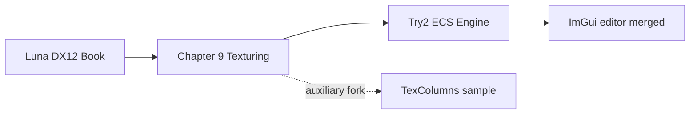

# Try2 — Project Overview

## Executive Summary

**Try2** is a Windows DirectX 12 game engine built as a single Visual Studio solution ([`Try2.sln`](../LSEngine/Chapter%209%20Texturing/Try2/Try2.sln)). It evolved from Frank Luna's *Introduction to 3D Game Programming with DirectX 12* coursework but now stands on its own architecture:

- **ECS** world powered by EnTT (`World`, components, systems)
- **Renderer adapter** — `IRenderAdapter` / `D3DRenderAdapter` isolates D3D12 from game logic
- **Deferred rendering** — geometry pass → lighting pass → resolve pass (`Try2/Shaders/`)
- **ECS lighting** — directional, point, and spot light components drive the deferred pass
- **Data-driven scenes** — JSON load via `SceneSerializer` with `DemoScene` fallback
- **Optional scene editor** — Dear ImGui + ImGuizmo in [`LSEngine/IMGUI_works/`](../LSEngine/IMGUI_works/), integrated through `ImGuiBridge`
- **Assimp** asset loading and a lightweight **physics** layer (AABB, gravity; Play mode only when editor is active)
- **Dev tooling** — **F5** reloads HLSL shaders at runtime

The **LSEngine** folder is the git repository. **Try2** (`Chapter 9 Texturing/Try2/`) is the active product; **`IMGUI_works/`** at the LSEngine root holds the editor (compiled into Try2); **Common/** supplies shared headers and assets; other chapter folders are historical samples.

---

## Project Lineage

| Stage | What it is | Relation to Try2 |
|-------|------------|-------------------|
| Luna foundation | `GameTimer`, `MathHelper`, `d3dx12.h` | **Compiled or included** into Try2 |
| Chapter 9 | Texturing chapter samples | Historical context |
| **Try2 core** | ECS + deferred pipeline | **Current product** (`Try2.sln`) |
| FromScratch merge | JSON scenes, lights, F5 reload | **Merged** into Try2 (`Engine`, `RenderSystem`, serializer) |
| ImGui / `FS_w_GUI` | WYSIWYG editor in `LSEngine/IMGUI_works/` | **Merged** — optional via `.imgui_on` |
| TexColumns | Monolithic `D3DApp` forward demo | **Not in Try2.sln**; `CustomBuffer.h` reused |
| Future | `RenderAPI::Vulkan` | Stub only in `Application.h` |

---

## The Try2 Application

### Solution and entry

| Property | Value |
|----------|-------|
| Solution | [`Try2.sln`](../LSEngine/Chapter%209%20Texturing/Try2/Try2.sln) — **one project only** |
| Project | `Try2.vcxproj` (includes `IMGUI_works` sources) |
| Entry | `main()` in `Try2.cpp` |
| App shell | `TestApp` → `Application` |
| Engine core | `Engine` + `World` + ECS systems |
| Editor API | `ImGuiBridge` only (see [Changes/IMGUI-Editor-System.md](../Changes/IMGUI-Editor-System.md)) |
| Subsystem | Console (hosts a Win32 render window) |
| C++ standard | C++20 |

`TestApp` overrides `Update`, `PhysicsUpdate`, and `Draw` and forwards each call to `Engine`. After `Initialize`, `Try2.cpp` calls `ImGuiBridge::SetEngine`.

### Frame loop (summary)

Try2.exe is built from **Chapter 9** sources plus **`LSEngine/IMGUI_works`** (bridge, panels, Dear ImGui, ImGuizmo). At runtime the engine and editor share one process:

1. Win32 messages → `InputState` (`MsgProc` forwards to ImGui only if context already exists — **no ImGui init on first message**)
2. `ImGuiBridge::ProcessInput` — **`~`** toggles visibility and triggers **lazy** DX12/ImGui setup when licensed (`.imgui_on` next to exe)
3. Fixed **60 Hz** physics steps — **skipped in Edit mode** (`Editor_IsPhysicsEnabled`)
4. `BeginFrame` → `Update` (camera, **F5** shader reload) → `Draw` (lights + meshes)
5. `ImGuiBridge::BeginFrame` → `RenderEditorUI` (panels in `IMGUI_works/src/Editor/`) → `RenderOverlay` (UI composited on command list)
6. `EndFrame` → present

### Capabilities

| Area | Features |
|------|----------|
| **Input** | Keyboard/mouse state; ImGui capture when UI visible |
| **ECS** | Transform, mesh, camera, tag, rigidbody, collider, **directional/point/spot lights** |
| **Assets** | Assimp meshes, procedural primitives, materials, textures |
| **Scenes** | Startup load `DemoScene.json`; runtime **File → Save/Load** via `Engine::SaveScene` / `LoadScene` |
| **Serialization** | `SceneSerializer` — entities, meshes, materials, lights |
| **Rendering** | Deferred G-buffer, ECS-driven lights, resolve, lazy GPU upload |
| **Physics** | Gravity, AABB collision; **collision count** per frame; **Play mode only** when editor licensed |
| **Editor UI** | Hierarchy (all entities), Inspector (incl. **lights**, disabled in Play), Viewport, Statistics (**FPS 1s avg**), **Legend / Help**, ImGuizmo; requires `.imgui_on` + **`~`** |
| **Editor I/O** | Save → `Scenes/EditorSave.json`; Play snapshot → `Scenes/EditorPlaySnapshot.json`; optional restore on Stop |
| **Dev tools** | **F5** — `D3DRenderAdapter::ReloadShaders()` |

---

## Other material in LSEngine

| Location | Role | Try2 relationship |
|----------|------|-------------------|
| [`LSEngine/IMGUI_works/`](../LSEngine/IMGUI_works/) | ImGui, ImGuizmo, editor panels | **Compiled into Try2** via `$(IMGUI_WORKS)` = `../../IMGUI_works` from Try2 |
| [`LSEngine/Common/`](../LSEngine/Common/) | Luna utilities + vendored headers | Partial: 3 `.cpp` compiled; entt/glm/assimp/nlohmann included |
| [`../../Common/obj/`](../LSEngine/Common/obj/) | Sample meshes | Runtime paths from scenes / `DemoScene` |
| [`../TexColumns/`](../LSEngine/Chapter%209%20Texturing/TexColumns/) | Luna sample | **Header only:** `CustomBuffer.h` |
| [`../../Shaders/`](../LSEngine/Shaders/) | Duplicate HLSL | Use **`Try2/Shaders/`** |
| `Common/d3dApp`, `Camera`, `model`, … | Other Luna code | Not linked by Try2 |

Deep dive on merge + editor: [Changes/README.md](../Changes/README.md).

---

## Work in Progress and Known Gaps

| Area | Status |
|------|--------|
| **Vulkan** | `RenderAPI::Vulkan` declared; only DX12 implemented |
| **Editor license** | UI disabled without `.imgui_on` next to executable |
| **Editor placeholders** | Undo, docking, offscreen viewport RT, asset/material panels (see [04-editor-additions.md](04-editor-additions.md)) |
| **Editor I/O** | Save/Load via `Scenes/EditorSave.json`; Play snapshot `Scenes/EditorPlaySnapshot.json` |
| **Editor debug** | Optional **Restore on Stop** (default off); **Restore Snapshot** button anytime |
| **Build paths** | `Try2.vcxproj` may hardcode include paths — prefer `$(SolutionDir)..\..\Common` |
| **CustomBuffer coupling** | Header from TexColumns; `CustomBuffer.cpp` not in vcxproj |
| **RenderSystem** | Unused `ResourceManager*` member |
| **Descriptor heaps** | Engine uses indices 0–899; ImGui allocates from 900–963 on shared CBV/SRV heap |

---

## How to Build

1. Open **`LSEngine/Chapter 9 Texturing/Try2/Try2.sln`** (not TexColumns).
2. Select **Debug | x64**.
3. Place **`assimp-vc143-mt.lib`** in `Try2/Libs/`.
4. Ensure **`LSEngine/IMGUI_works/`** exists (sibling of `Chapter 9 Texturing/`, not inside it) — required by vcxproj.
5. Fix **`AdditionalIncludeDirectories`** if needed for `LSEngine/Common`.
6. Run; working directory should resolve `Scenes/DemoScene.json` and mesh paths under `Common/obj/`.
7. To enable the editor: add **`.imgui_on`** beside `Try2.exe`, run, press **`~`**.

---

## Where to Read Next

- Technologies and patterns → [02-technologies-and-patterns.md](02-technologies-and-patterns.md)
- Structure, diagrams, file index → [03-code-structure.md](03-code-structure.md)
- Editor additions (items 1–10) → [04-editor-additions.md](04-editor-additions.md)
- Merge + ImGui base integration → [Changes/README.md](../Changes/README.md)
