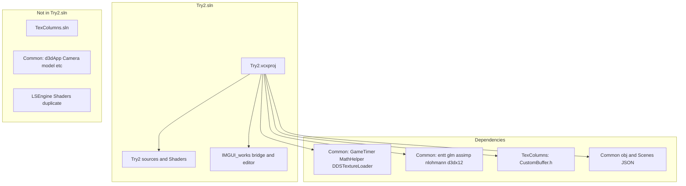
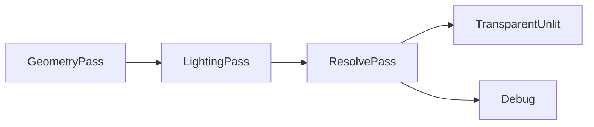

# Try2 — Technologies and Patterns

Technology stack, dependencies, and design patterns **as used by the Try2 project** ([`Try2.vcxproj`](../LSEngine/Chapter%209%20Texturing/Try2/Try2.vcxproj)). For modules and diagrams, see [03-code-structure.md](03-code-structure.md). For merge and editor depth, see [Changes/README.md](../Changes/README.md).

---

## Core Stack (Try2 Product)

| Category | Technology | Role in Try2 |
|----------|------------|--------------|
| Language | C++20 | ECS, STL containers, `std::unique_ptr` |
| Platform | Win32 API | Window, message pump, input in `Application` |
| Graphics API | Direct3D 12 | `D3DRenderAdapter` — device, queues, PSOs, descriptors |
| DXGI | DXGI 1.4 | Swap chain and back buffers |
| Shaders | HLSL + D3DCompile | **`Try2/Shaders/`**; **F5** hot-reload via `ReloadShaders()` |
| CPU math | GLM | ECS transforms, physics, lights, meshes |
| GPU constants | DirectXMath | `FrameRes.h` structs aligned with HLSL |
| ECS | EnTT | `World::registry`, system `view` iteration |
| Assets | Assimp + `assimp-vc143-mt.lib` | `ResourceManager::LoadMesh` |
| Serialization | nlohmann/json | `SceneSerializer` — scenes, materials, lights |
| UI | Dear ImGui + ImGuizmo | Editor in `LSEngine/IMGUI_works/`; DX12/Win32 backends |
| COM | WRL `ComPtr` | D3D12 resource lifetime |
| Build | MSBuild / VS 2022 | Single-project solution; `v143` / `v145` toolsets |

---

## Dependency Tiers

What [`Try2.vcxproj`](../LSEngine/Chapter%209%20Texturing/Try2/Try2.vcxproj) actually pulls in.

### Tier 1 — Try2-authored (compiled in project)

| Module | Responsibility |
|--------|----------------|
| `Application` | Win32 loop, input, physics timestep, ImGui hooks, renderer factory |
| `Engine` | System lists, scene load/save, F5 reload, physics gate, `GetRegistry` / `GetResources`, `SaveScene` / `LoadScene` |
| `World` | `entt::registry` wrapper |
| `Commons` | Components (incl. lights), `IRenderAdapter`, `ISystem`, `FrameContext` |
| `CameraControllerSystem` | FPS camera; respects `ImGuiBridge::WantsCaptureInput` |
| `PhysicsSystem` | Integration + collision; reports pairs via `PhysicsStats` |
| `RenderSystem` | Camera, **ECS lights** → `SetLights`, mesh draws |
| `ResourceManager` | CPU assets, Assimp |
| `D3DRenderAdapter` | D3D12 renderer, `ReloadShaders`, `GetImGuiBindings` |
| `FrameRes` / `d3dUtils` | CB rings, shader compile, helpers |
| `SceneFactory`, `DemoScene`, `SceneSerializer` | Level setup and JSON I/O |
| `Try2.cpp` | `main()`, `TestApp`, `ImGuiBridge::SetEngine` |

### Tier 1b — IMGUI_works (compiled via `$(IMGUI_WORKS)`)

Path: `$(SolutionDir)../../IMGUI_works` → [`LSEngine/IMGUI_works/`](../LSEngine/IMGUI_works/) (same git repo as Try2; not under Chapter 9).

| Module | Responsibility |
|--------|----------------|
| `ImGuiBridge` | **Only** public API Try2 should call for the editor |
| `ImGuiPlatform` | `.imgui_on` license gate, `~` toggle |
| `EditorContext` + panels | Hierarchy, Inspector, Viewport, Statistics, gizmo toolbar |
| `HierarchyPanel`, `InspectorPanel`, … | ECS UI reads/writes via `EditorContext` |
| `GizmoController` | `ImGuizmo::Manipulate` in Edit mode |
| `EditorSceneIO` | Save/Load, Play snapshot, optional restore on Stop |
| `LegendPanel` | Legend / Help, abbreviations, debug restore docs |
| ThirdParty imgui | Core + `imgui_impl_win32` + `imgui_impl_dx12` |
| ImGuizmo | Translate / rotate / scale gizmos |

Try2 must **not** include ImGui headers directly except through `ImGuiBridge.h`.

### Tier 2 — Compiled from `../../Common/`

| File | Role |
|------|------|
| `GameTimer.cpp` | Frame timing in `Application` |
| `MathHelper.cpp` | Matrices for GPU constant buffers |
| `DDSTextureLoader.cpp` | DDS texture upload in renderer |

### Tier 3 — Header-only from `../../Common/`

| Dependency | Used by |
|------------|---------|
| `entt/entt.hpp` | `World`, systems, editor |
| `glm/` | Components, physics, meshes, lights |
| `assimp/` | `ResourceManager` |
| `nlohmann/json.hpp` | `SceneSerializer` |
| `d3dx12.h` | `d3dUtils`, `D3DRenderAdapter` |

### Tier 4 — Auxiliary include (not in Try2.sln)

| File | Role |
|------|------|
| `../TexColumns/CustomBuffer.h` | G-buffer / render-target helper; used by `D3DRenderAdapter` |

`CustomBuffer.cpp` is **not** listed in `Try2.vcxproj` — known coupling risk.

### Not used by Try2 build

| Item | Note |
|------|------|
| `d3dApp`, `Camera`, `GeometryGenerator`, `model` | Other solutions only |
| `TexColumns.sln` | Separate auxiliary sample |
| `LSEngine/Shaders/` | Duplicate; authoritative set is **`Try2/Shaders/`** |

---

## Architectural Patterns (Try2)

### 1. Renderer adapter

`IRenderAdapter` ← `D3DRenderAdapter`. Systems never include `d3d12.h` directly. Extended with `SetLights` and `ReloadShaders`.

### 2. ECS system pipelines

| Pipeline | When | System |
|----------|------|--------|
| Update | Per visual frame | `CameraControllerSystem`; **F5** in `Engine::Update` |
| Physics | 1/60 s steps, **Play mode only** when editor active | `PhysicsSystem` |
| Render | Per visual frame | `RenderSystem` (camera, lights, meshes) |

### 3. Editor bridge (isolation)

All GUI code lives in [`LSEngine/IMGUI_works/`](../LSEngine/IMGUI_works/). Try2 (under Chapter 9) compiles it via `$(IMGUI_WORKS)` and calls `ImGuiBridge::*` only. Optional runtime via `.imgui_on` beside `Try2.exe`.

### 4. Edit vs Play

`EditorContext::mode` controls physics and component editing:

| Mode | Physics | Inspector / gizmo |
|------|---------|-------------------|
| **Edit** | Off | Full editing via `Editor_CanEditComponents()` |
| **Play** | On | Inspector disabled; gizmo skipped |

**Play** writes `Scenes/EditorPlaySnapshot.json` before simulating. **Stop** returns to Edit; reloads snapshot only if `restoreSceneOnStop` is true (default **false**). **Restore Snapshot** reloads the play file manually anytime.

### 5. Data-driven scenes

`Engine::Init` searches for `DemoScene.json`, loads via `SceneSerializer::Load(world, resourceManager, path)`, falls back to `DemoScene::Build` on miss or error.

### 6. ECS-driven lighting

Light components on entities → `RenderSystem` builds `SceneLightData` → `IRenderAdapter::SetLights` → pass constant buffers (caps: 1 directional, 2 point, 3 spot).

### 7. Frame context

`FrameContext` bundles `GameTimer`, `InputState`, and `physDT` for every `ISystem::Update` and editor panels.

### 8. Frame-in-flight

2 swap-chain buffers, 2 `FrameRes` slots, fence wait in `BeginFrame`. ImGui font/textures use descriptor indices **900–963** on the shared shader-visible heap (engine uses **0–899**).

### 9. Deferred G-buffer

Geometry → lighting → resolve; `LightingUtil.hlsl` shared with up to 16 GPU lights in pass CB (ECS caps are lower).

### 10. Lazy GPU upload

`ResourceManager` holds CPU meshes; `D3DRenderAdapter::UploadMesh` on first `DrawMesh`.

### 11. Fixed timestep physics

`Application::Run` — 60 Hz accumulator, max 5 steps per frame; gated when editor is in Edit mode.

### 12. ImGui overlay after 3D

Scene renders first; `RenderOverlay` draws UI on the same command list before present — see [Changes/IMGUI-Editor-System.md](../Changes/IMGUI-Editor-System.md).

### 13. Editor scene I/O

`EditorSceneIO` calls `Engine::SaveScene` / `LoadScene`, which delegate to `SceneSerializer`. File menu and Play/Stop use paths under `Scenes/` relative to the working directory.

### 14. Lazy ImGui initialization

With `.imgui_on` present, ImGui/DX12 font resources are **not** created until the user presses **`~`**. `WndProcHandler` only forwards messages after `g_Initialized` is true.

### 15. Edit-only component editing

`Editor_CanEditComponents()` returns true only in Edit mode. Inspector uses `ImGui::BeginDisabled` in Play; gizmo already skips when not in Edit.

### 16. Physics telemetry

`PhysicsStats` in `PhysicsCommons.h` counts colliding pairs per physics step. Statistics panel shows **Collisions (this frame)** and rolling **FPS (1s avg)**.

---

## Shader Pipeline (`Try2/Shaders/`)

Authoritative shader location. Seven HLSL files. **F5** recompiles PSOs without restarting.

| Shader | Role |
|--------|------|
| `LightingUtil.hlsl` | Shared lights, materials, Blinn-Phong / Fresnel |
| `GeometryPass.hlsl` | **G-buffer** — albedo, normal, world pos, roughness, velocity |
| `LightingPass.hlsl` | Fullscreen deferred lighting (uses ECS `SceneLightData`) |
| `ResolvePass.hlsl` | History blend, HDR adjust |
| `Default.hlsl` | Forward-style path (legacy / optional) |
| `TransparentUnlit.hlsl` | Transparent overlay |
| `Debug.hlsl` | Debug texture display |

---

## Design Observations

### Strengths

- Single-solution focus with editor in `LSEngine/IMGUI_works/` (same repo, outside Chapter 9)
- JSON scenes + ECS lights unify content and rendering
- Thin `ImGuiBridge` API limits coupling between engine and UI

### Coupling to address

| Item | Notes |
|------|-------|
| `CustomBuffer` in TexColumns | Move into `Try2/` or `Common/` |
| Hardcoded include paths | Use `$(SolutionDir)` macros for Common and IMGUI_works |
| `RenderAPI::Vulkan` stub | No backend yet |
| Unused `ResourceManager*` in `RenderSystem` | Minor cleanup |
| Shared descriptor heap | Documented split; avoid index collisions when adding engine SRVs |

---

## Related Documentation

- Project overview → [01-project-overview.md](01-project-overview.md)
- Code structure → [03-code-structure.md](03-code-structure.md)
- Editor additions → [04-editor-additions.md](04-editor-additions.md)
- Merge + ImGui (full) → [Changes/README.md](../Changes/README.md)
