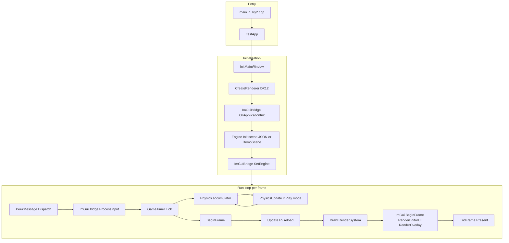
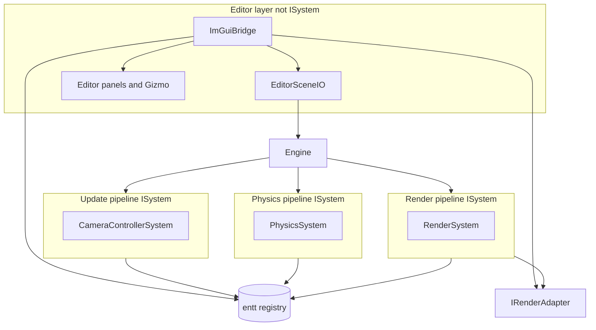
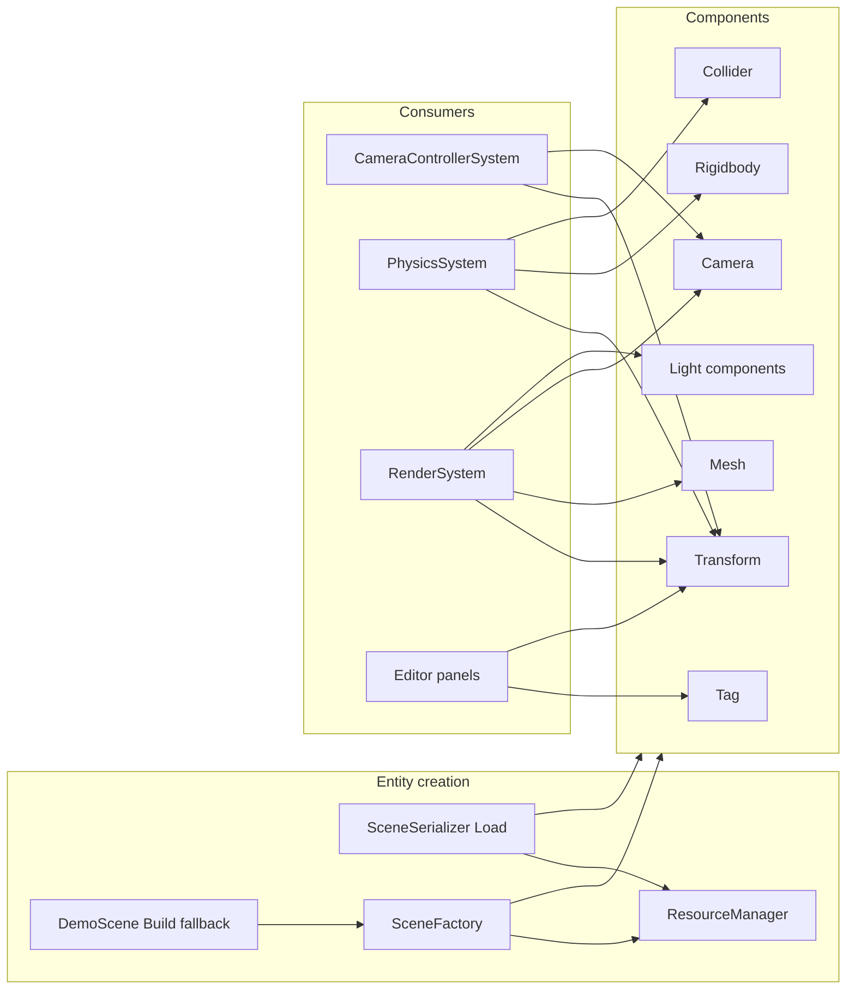
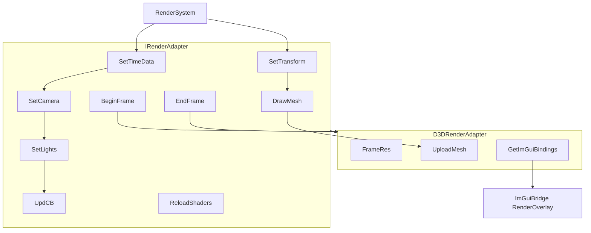
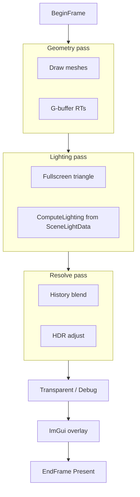
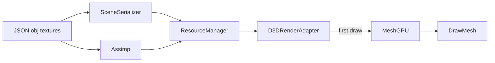
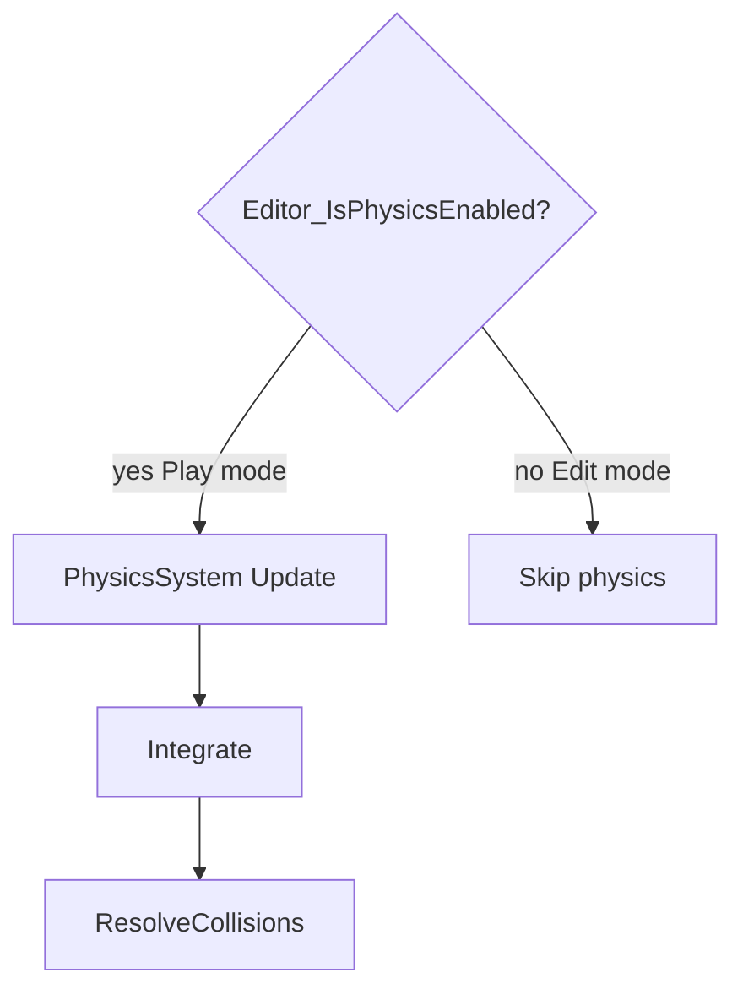
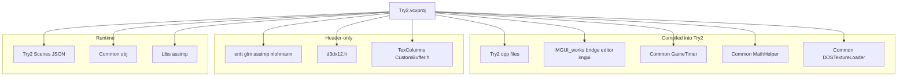
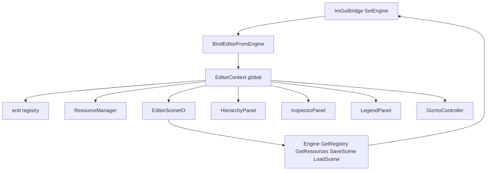
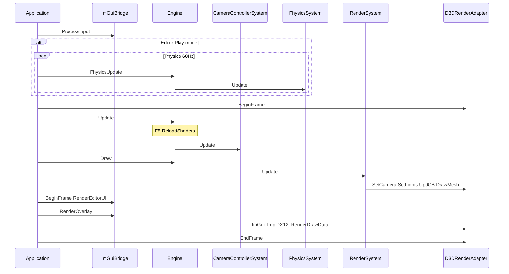

# Try2 — Code Structure

Structural reference for the **Try2** project: layout, modules, ECS, APIs, Mermaid diagrams, and a tiered source index. Scoped to [`Try2.sln`](../LSEngine/Chapter%209%20Texturing/Try2/Try2.sln) unless marked auxiliary.

- Overview → [01-project-overview.md](01-project-overview.md)
- Technologies → [02-technologies-and-patterns.md](02-technologies-and-patterns.md)
- Editor additions → [04-editor-additions.md](04-editor-additions.md)
- Merge + ImGui detail → [Changes/README.md](../Changes/README.md)

---

## Try2 Project Layout

```
LSEngine/                                 # Git repository root
├── IMGUI_works/                          # Editor + Dear ImGui + ImGuizmo (compiled into Try2)
│   ├── src/ImGuiBridge.*, ImGuiPlatform.*
│   ├── src/Editor/                      # Panels, EditorContext, Gizmo
│   └── ThirdParty/imgui, ImGuizmo
├── Common/                               # GameTimer, EnTT, GLM, obj assets
└── Chapter 9 Texturing/Try2/            # Product root — open Try2.sln here
    ├── Try2.sln
    ├── Try2.vcxproj                     # IMGUI_WORKS = ../../IMGUI_works
    ├── Try2.cpp, Application.*, Engine.*, ...
    ├── Scenes/DemoScene.json            # Default data-driven scene
    ├── Shaders/                         # Authoritative HLSL (7 files)
    ├── Libs/assimp-vc143-mt.lib
    │
    │  Compiled from ../../Common/:
    │    GameTimer, MathHelper, DDSTextureLoader
    │
    └── Header include from ../TexColumns/:
          CustomBuffer.h
```

**Runtime assets:** `../../Common/obj/`, scene JSON under `Scenes/`.

---

## Module Responsibility Table

### Try2-authored

| Module | Responsibility |
|--------|----------------|
| `Try2.cpp` / `TestApp` | Entry; `ImGuiBridge::SetEngine` after init |
| `Application` | Win32 loop, ImGui lifecycle, overlay after `Draw` |
| `Engine` | Systems, JSON scene load/save, F5 reload, physics gate, `SaveScene`/`LoadScene`, editor accessors |
| `World` | `entt::registry` holder |
| `Commons.h` | Components (incl. lights), `SceneLightData`, `IRenderAdapter` |
| `CameraControllerSystem` | FPS camera; skips when ImGui captures input |
| `PhysicsSystem` | Integrate + AABB collision; `PhysicsStats` counting |
| `RenderSystem` | Camera, **collect ECS lights**, draw meshes |
| `PhysicsCommons.h` | Collider math + `PhysicsStats` namespace |
| `ResourceManager` | CPU assets, Assimp |
| `D3DRenderAdapter` | D3D12, deferred passes, `ReloadShaders`, `GetImGuiBindings` |
| `FrameRes` / `d3dUtils` | CB rings, shader compile |
| `SceneFactory` / `DemoScene` | Entity recipes; procedural fallback level |
| `SceneSerializer` | JSON load/save with meshes, materials, lights |

### LSEngine/IMGUI_works (compiled into Try2)

| Module | Responsibility |
|--------|----------------|
| `ImGuiBridge` | Public API: init, frame, overlay, `WantsCaptureInput`, `SetEngine`; lazy init on `~` |
| `ImGuiPlatform` | `.imgui_on` check, `~` toggle |
| `EditorContext` | Registry/resources, selection, Edit/Play, `statusMessage`, `restoreSceneOnStop`, panel toggles |
| `EditorSceneIO` | File Save/Load, Play snapshot, `RestorePlaySnapshot` |
| `EditorUI` | Menu (File), toolbar (Play/Stop), status line, panel orchestration |
| `HierarchyPanel` | Lists **all** entities (tag, mesh, camera, lights, physics) |
| `InspectorPanel` | Transform, tag, mesh, rigidbody, collider, **lights**; disabled in Play |
| `ViewportPanel` | Viewport chrome (scene draws behind UI) |
| `StatisticsPanel` | FPS instant + 1s average, entity count, collision count |
| `LegendPanel` | Legend / Help — shortcuts, gizmo glossary, file paths |
| `GizmoController` | ImGuizmo manipulate in Edit mode |

### Linked from Common

| Module | Responsibility |
|--------|----------------|
| `GameTimer` | Frame timing |
| `MathHelper` | GPU matrices |
| `DDSTextureLoader` | DDS textures |

### Auxiliary header

| Module | Responsibility |
|--------|----------------|
| `CustomBuffer` (TexColumns) | G-buffer RT helpers in `D3DRenderAdapter` |

### Try2 hooks for editor (minimal surface)

| File | Hook |
|------|------|
| `Application.cpp` | `ImGuiBridge` init/shutdown/resize; loop overlay; `WndProc` forward |
| `Try2.cpp` | `SetEngine` |
| `Engine.cpp` | `Editor_IsPhysicsEnabled()` in `PhysicsUpdate`; `SaveScene`/`LoadScene` |
| `EditorSceneIO` (via menu) | Calls `Engine::SaveScene` / `LoadScene` |
| `CameraControllerSystem.cpp` | `WantsCaptureInput()` early out |
| `D3DRenderAdapter` | `Dx12ImGuiBindings`, descriptor sub-range for ImGui |

---

## ECS Components

| Component | Fields (summary) | Used by |
|-----------|------------------|---------|
| `TransformComponent` | `position`, `rotation`, `scale` | All systems; world matrix |
| `MeshComponent` | `meshID` | `RenderSystem` |
| `CameraComponent` | `fov`, planes, `aspectRatio`, cached matrices | Camera + render |
| `TagComponent` | `tag` | Serializer, Hierarchy panel |
| `RigidbodyComponent` | `type`, `velocity`, `mass`, `useGravity` | `PhysicsSystem`, Inspector |
| `ColliderComponent` | AABB/sphere, restitution, friction | `PhysicsSystem`, Inspector |
| `DirectionalLightComponent` | `color`, `intensity`, `direction`, `enabled` | `RenderSystem` |
| `PointLightComponent` | color, intensity, falloff, `enabled` | `RenderSystem` (needs `Transform`) |
| `SpotLightComponent` | color, direction, spot power, falloff, `enabled` | `RenderSystem` (needs `Transform`) |

**GPU caps** (`Commons.h`): `RenderDirectionalLightCount` = 1, `RenderPointLightCount` = 2, `RenderSpotLightCount` = 3.

### Typical entities

| Kind | Components |
|------|------------|
| Static floor | `Transform`, `Mesh`, `Tag`, `Rigidbody`(Static), `Collider` |
| Dynamic body | `Transform`, `Mesh`, `Tag`, `Rigidbody`(Dynamic), `Collider` |
| Camera | `Transform`, `Camera`, `Tag` |
| Directional light | `DirectionalLight` (optional `Tag`) |
| Point light | `Transform`, `PointLight`, `Tag` |
| Spot light | `Transform`, `SpotLight`, `Tag` |

---

## Diagram A — Try2 Application Lifecycle



---

## Diagram B — Try2 Engine Systems and Editor Layer



| Phase | Frequency | Component |
|-------|-----------|-----------|
| `Update` | 1× / frame | `CameraControllerSystem`; `Engine` handles F5 |
| `PhysicsUpdate` | 0–5× / 60 Hz | `PhysicsSystem` if `Editor_IsPhysicsEnabled()` |
| `Draw` | 1× / frame | `RenderSystem` |
| Editor UI | 1× / frame after `Draw` | `ImGuiBridge` → `Editor_*` |

---

## Diagram C — Try2 ECS Entity Flow



---

## Diagram D — Try2 Rendering Adapter Contract



| Method | Caller | Purpose |
|--------|--------|---------|
| `SetLights` | `RenderSystem` | Upload `SceneLightData` from ECS light views |
| `ReloadShaders` | `Engine::Update` on F5 | Rebuild PSOs from `Try2/Shaders/` |
| `GetImGuiBindings` | `ImGuiBridge` (lazy init) | Device, queue, command list, SRV heap slice |
| `BeginFrame` / `EndFrame` | `Application` | Frame sync and present |

---

## Diagram E — Try2 Deferred GPU Passes



---

## Diagram F — Try2 Resource Path



---

## Diagram G — Try2 Physics Loop



---

## Diagram H — Try2 Build Dependencies



---

## Diagram I — Editor and ECS Binding



---

## Per-Frame Sequence (Try2)



---

## Class and API Quick Reference

### Application and bridge

| Class / API | Key members |
|-------------|-------------|
| `Application` | `Run`, `Initialize`, `MsgProc`, ImGui hooks |
| `TestApp` | Delegates to `mEngine` |
| `ImGuiBridge` | `SetEngine`, `OnApplicationInit`, `RenderOverlay`, `WantsCaptureInput`, `IsLicensed` |

### Engine core

| Class | Key API |
|-------|---------|
| `Engine` | `Init`, `Update`, `PhysicsUpdate`, `Draw`, `GetRegistry`, `GetResources`, `GetWorld`, `SaveScene`, `LoadScene` |
| `World` | `registry` |
| `FrameContext` | `timer`, `input`, `physDT` |

### Systems

| Class | Role |
|-------|------|
| `CameraControllerSystem` | FPS camera; ImGui input gate |
| `PhysicsSystem` | Integrate + collisions |
| `RenderSystem` | Lights + camera + meshes |

### Editor (IMGUI_works)

| API | Role |
|-----|------|
| `Editor_SetContext` / `Editor_GetContext` | Global editor state |
| `Editor_IsPhysicsEnabled` | Play vs Edit |
| `Editor_CanEditComponents` | Edit-only Inspector/gizmo editing |
| `Editor_BeginFrame` / `Editor_RenderUI` | Panel pass |
| `Editor_RenderGizmo` | ImGuizmo |
| `Editor_DrawLegend` | Legend / Help window |
| `EditorSceneIO` | Save, Load, BeginPlay, EndPlay, RestorePlaySnapshot |

### Rendering

| Class | Key API |
|-------|---------|
| `IRenderAdapter` | `SetLights`, `ReloadShaders`, frame, draw |
| `D3DRenderAdapter` | `GetImGuiBindings`, `BuildPSOs`, `UploadMesh` |
| `Dx12ImGuiBindings` | POD GPU handles for ImGui backend |

---

## Source File Index

### Tier 1 — Try2 project sources

| File | Role |
|------|------|
| `Try2.cpp` | `main()`, `TestApp`, `SetEngine` |
| `Application.cpp/h` | Loop, Win32, ImGui integration |
| `Engine.cpp/h` | Systems, scene load/save, F5, physics gate |
| `PhysicsCommons.h` | Collider math, `PhysicsStats` |
| `World.cpp/h` | Registry |
| `Commons.cpp/h` | Components, lights, interfaces |
| `CameraControllerSystem.cpp/h` | Camera + ImGui capture |
| `PhysicsSystem.cpp/h` | Physics |
| `RenderSystem.cpp/h` | Lights, camera, draws |
| `ResourceManager.cpp/h` | Assets |
| `D3DRenderAdapter.cpp/h` | Renderer, ImGui bindings, reload |
| `FrameRes.cpp/h`, `d3dUtils.cpp/h` | GPU helpers |
| `SceneFactory.cpp/h`, `DemoScene.cpp/h` | Level setup |
| `SceneSerializer.cpp/h` | JSON I/O |

**Data:** `Scenes/DemoScene.json`

**Shaders:** `Try2/Shaders/` (7 HLSL files)

### Tier 1b — IMGUI_works (compiled by Try2)

| File | Role |
|------|------|
| `src/ImGuiBridge.cpp/h` | Public API |
| `src/ImGuiPlatform.cpp/h` | License + toggle |
| `src/Editor/EditorContext.cpp/h` | Editor state, `statusMessage`, `restoreSceneOnStop` |
| `src/Editor/EditorSceneIO.cpp/h` | Save/Load/Play snapshot I/O |
| `src/Editor/EditorUI.cpp` | Menu, toolbar, status |
| `src/Editor/HierarchyPanel.cpp` | All-entity list |
| `src/Editor/InspectorPanel.cpp` | Components + lights |
| `src/Editor/ViewportPanel.cpp` | Viewport UI |
| `src/Editor/StatisticsPanel.cpp` | FPS avg, collisions |
| `src/Editor/LegendPanel.cpp` | Legend / Help |
| `src/Editor/GizmoController.cpp` | ImGuizmo |
| ThirdParty | imgui core + backends, ImGuizmo (not listed file-by-file) |

### Tier 2 — Common (compiled)

| File | Role |
|------|------|
| `GameTimer.cpp/h` | Timing |
| `MathHelper.cpp/h` | Matrices |
| `DDSTextureLoader.cpp/h` | DDS |

### Tier 3 — Auxiliary

| Item | Note |
|------|------|
| `TexColumns/CustomBuffer.*` | Header used; `.cpp` not in vcxproj |
| `TexColumns.sln` | Not the product build |
| `LSEngine/Shaders/` | Duplicate of `Try2/Shaders/` |

---

## Key Functions (Try2)

| Subsystem | Functions |
|-----------|-----------|
| `Engine::Init` | Register systems; `SceneSerializer::Load` or `DemoScene::Build` |
| `Engine::Update` | Run update systems; **F5** → `ReloadShaders()` |
| `Engine::PhysicsUpdate` | No-op in Edit mode when editor licensed |
| `Engine::SaveScene` / `LoadScene` | Runtime JSON I/O for editor File menu |
| `RenderSystem::Update` | Gather light views → `SetLights`; draw meshes |
| `SceneSerializer::Load` | Deserialize world + shared `ResourceManager` |
| `EditorSceneIO::BeginPlay` | Snapshot to `EditorPlaySnapshot.json`, mode = Play |
| `PhysicsStats::AddCollision` | Increment per colliding pair in physics |
| `ImGuiBridge::SetEngine` | Bind registry/resources to `EditorContext` |

---

## Reading Order (Try2 contributors)

1. `Try2.cpp`
2. `Application.cpp` — loop, ImGui overlay order
3. `Engine.cpp` — scene load, F5, physics gate
4. `RenderSystem.h` — ECS lights
5. `D3DRenderAdapter.cpp` — deferred passes, ImGui bindings
6. [`IMGUI_works/src/ImGuiBridge.h`](../LSEngine/IMGUI_works/src/ImGuiBridge.h) — editor API surface
7. [04-editor-additions.md](04-editor-additions.md) — save/load, Play snapshot, stats, lazy init
8. [Changes/IMGUI-Editor-System.md](../Changes/IMGUI-Editor-System.md) — base ImGui integration
9. `Try2/Shaders/GeometryPass.hlsl` + `LightingPass.hlsl`
