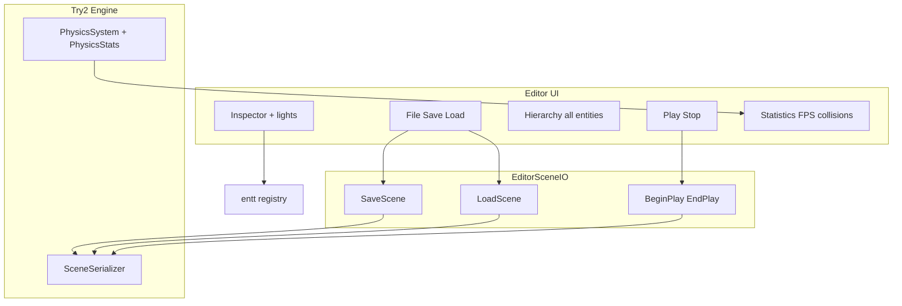
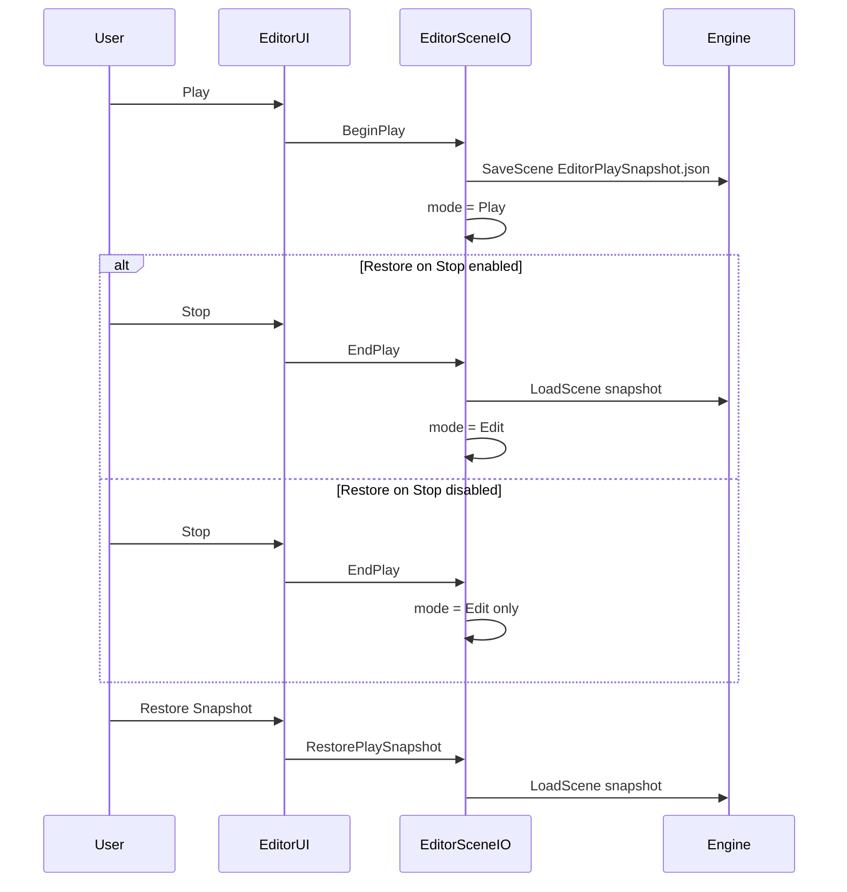
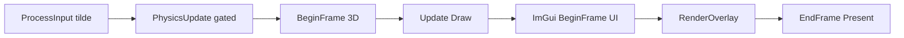

# Editor Additions (Items 1–10)

Documentation for the ten post-review editor improvements. Plan source: [Tasks/Editor-Additions-Plan.md](../Tasks/Editor-Additions-Plan.md).

---

## Summary

| # | Feature | Status |
|---|---------|--------|
| 1 | File → Save / Load | Done — `Scenes/EditorSave.json` |
| 2 | Play snapshot / Stop restore | Done — `Scenes/EditorPlaySnapshot.json` |
| 3 | Inspector + gizmo locked in Play | Done |
| 4 | Inspector light components | Done |
| 5 | Collision count in Statistics | Done |
| 6 | FPS 1-second average | Done |
| 7 | Lazy ImGui init (visible only) | Done |
| 8 | Hierarchy lists all entities | Done |
| 9 | Legend / Help window + expanded labels | Done |
| 10 | Debug: optional restore on Stop + Restore Snapshot button | Done |

---

## Architecture after changes

---

## 1. File → Save / Load

**Menu:** File → Save Scene / Load Scene (paths shown in menu label).

**Paths:** `Scenes/EditorSave.json` (relative to process working directory, same convention as startup scene load in [`Engine.cpp`](../LSEngine/Chapter%209%20Texturing/Try2/Engine.cpp)).

**Implementation:**

| Piece | Location |
|-------|----------|
| Engine API | [`Engine::SaveScene` / `LoadScene`](../LSEngine/Chapter%209%20Texturing/Try2/Engine.h) |
| Serializer | [`SceneSerializer::Save` / `Load`](../LSEngine/Chapter%209%20Texturing/Try2/SceneSerializer.h) |
| UI wiring | [`EditorSceneIO::SaveScene` / `LoadScene`](../LSEngine/IMGUI_works/src/Editor/EditorSceneIO.cpp) |
| Menu | [`EditorUI.cpp`](../LSEngine/IMGUI_works/src/Editor/EditorUI.cpp) |

Load clears the registry then reloads with the live `ResourceManager` so mesh IDs stay valid.

**Note:** Save serializes entities that have both `TagComponent` and `TransformComponent` (serializer contract). Untagged props may not appear in JSON.

**Status line:** Toolbar shows `EditorContext::statusMessage` after save/load errors or success.

---

## 2. Play snapshot, Stop, and restore controls

| Step | Action |
|------|--------|
| **Play** | Writes [`Scenes/EditorPlaySnapshot.json`](../LSEngine/IMGUI_works/src/Editor/EditorSceneIO.h) then sets `EditorMode::Play` |
| **Stop** | Always returns to `Edit`. Loads snapshot **only if** `EditorContext::restoreSceneOnStop` is true (default **false**) |
| **Restore Snapshot** | [`EditorSceneIO::RestorePlaySnapshot`](../LSEngine/IMGUI_works/src/Editor/EditorSceneIO.cpp) — manual reload; works in Play or Edit |

### Debug UI

| Control | Location |
|---------|----------|
| **Restore scene on Stop** | Debug menu checkbox; Play toolbar checkbox (`restoreSceneOnStop`) |
| **Restore Play Snapshot Now** | Debug menu item |
| **Restore Snapshot** | Play-mode toolbar button |

Field: [`EditorContext::restoreSceneOnStop`](../LSEngine/IMGUI_works/src/Editor/EditorContext.h) — default `false`.

---

## 3. Edit-only component editing

**Helper:** `Editor_CanEditComponents()` in [`EditorContext.cpp`](../LSEngine/IMGUI_works/src/Editor/EditorContext.cpp) — true only in `Edit` mode.

| UI | Play behavior |
|----|----------------|
| **Inspector** | `ImGui::BeginDisabled()` + hint text |
| **Gizmo** | Already skipped when `mode != Edit` ([`GizmoController.cpp`](../LSEngine/IMGUI_works/src/Editor/GizmoController.cpp)) |

Physics still runs in Play when editor is licensed ([`Editor_IsPhysicsEnabled`](../LSEngine/IMGUI_works/src/Editor/EditorContext.cpp)).

---

## 4. Inspector — light components

Editable when selected and in Edit mode:

| Component | Fields |
|-----------|--------|
| `DirectionalLightComponent` | enabled, color, intensity, direction |
| `PointLightComponent` | enabled, color, intensity, falloff start/end |
| `SpotLightComponent` | enabled, color, intensity, direction, falloff, spot power |

See [`InspectorPanel.cpp`](../LSEngine/IMGUI_works/src/Editor/InspectorPanel.cpp). Live preview: [`RenderSystem`](../LSEngine/Chapter%209%20Texturing/Try2/RenderSystem.h) collects ECS lights each frame.

---

## 5. Collision statistics

**API:** `PhysicsStats` in [`PhysicsCommons.h`](../LSEngine/Chapter%209%20Texturing/Try2/PhysicsCommons.h):

- `ResetFrameCollisionCount()` — start of `PhysicsSystem::Update`
- `AddCollision()` — each colliding pair in `ResolveCollisions`
- `GetFrameCollisionCount()` — displayed in Statistics panel

**Display:** `Collisions (this frame): N` in [`StatisticsPanel.cpp`](../LSEngine/IMGUI_works/src/Editor/StatisticsPanel.cpp).

Count is pairs processed per physics step (may exceed “unique contacts” if multiple substeps).

---

## 6. FPS — 1 second average

[`StatisticsPanel.cpp`](../LSEngine/IMGUI_works/src/Editor/StatisticsPanel.cpp) keeps a rolling window of `DeltaTime` samples (~1 s total). Shows:

- **FPS (instant)** — `1 / dt`
- **FPS (1s avg)** — `sampleCount / totalSeconds` over the window

Matches TaskIMGUI step 8 intent (smoothed FPS).

---

## 7. Lazy ImGui initialization

**Before:** `WndProcHandler` called `EnsureInitialized()` whenever `.imgui_on` existed — ImGui started on first Windows message even if UI hidden.

**After** ([`ImGuiBridge.cpp`](../LSEngine/IMGUI_works/src/ImGuiBridge.cpp)):

| Event | Behavior |
|-------|----------|
| `WndProcHandler` | Forwards to ImGui only if `g_Initialized` |
| `ProcessInput` (`~` on) | Sets visible + `EnsureInitialized()` |
| `BeginFrame` | Still calls `EnsureInitialized()` as fallback |

No ImGui context or DX12 font upload until user opens overlay with `~`.

---

## 8. Hierarchy — all entities

[`HierarchyPanel.cpp`](../LSEngine/IMGUI_works/src/Editor/HierarchyPanel.cpp) builds a unique set from views:

- Tag, Transform, Mesh, Camera  
- Directional / Point / Spot light  
- Rigidbody, Collider  

**Labels:** tag name, or role name (“Camera”, “Point Light”, …), or `Entity {id}`.

Entity count shown at top of panel. Statistics panel uses the same union for total entity count.

---

## Frame loop (unchanged order)

---

## Files changed (index)

### Try2 (`LSEngine/Chapter 9 Texturing/Try2/`)

| File | Change |
|------|--------|
| `Engine.h` / `Engine.cpp` | `SaveScene`, `LoadScene` |
| `PhysicsCommons.h` | `PhysicsStats` namespace |
| `PhysicsSystem.cpp` | Reset/count collisions |
| `Try2.vcxproj` | `EditorSceneIO.cpp` compile |

### LSEngine/IMGUI_works

| File | Change |
|------|--------|
| `Editor/EditorSceneIO.h` / `.cpp` | **New** — save/load/play snapshot |
| `Editor/EditorContext.h` / `.cpp` | `statusMessage`, `Editor_CanEditComponents` |
| `Editor/EditorUI.cpp` | Menu, Play/Stop, status |
| `Editor/InspectorPanel.cpp` | Lights, disabled in Play |
| `Editor/HierarchyPanel.cpp` | All-entity list |
| `Editor/StatisticsPanel.cpp` | FPS avg, collisions |
| `ImGuiBridge.cpp` | Lazy init |

### Docs

| File | Change |
|------|--------|
| `Tasks/Editor-Additions-Plan.md` | Plan (this work) |
| `Overview/04-editor-additions.md` | This document |

---

## How to verify (manual)

1. Build Debug | x64; place `.imgui_on` next to `Try2.exe`.
2. Press `~` — UI appears (no ImGui before `~`).
3. **File → Save** — check `Scenes/EditorSave.json` under cwd (often project dir or `x64/Debug`).
4. Move an entity; **Load** — transform reverts to saved file.
5. **Play** — physics runs; edit Inspector (disabled).
6. **Stop** — scene matches pre-Play snapshot.
7. Select a light entity — edit color/intensity in Inspector.
8. **Statistics** — collision count > 0 when objects overlap in Play; FPS avg stabilizes.

---

## 10. Debug restore controls (optional Stop restore)

See §2 above. Use when you want to keep physics results after Stop but still be able to reload the pre-Play file manually.

---

## 9. Legend window and expanded labels

**Window:** `Legend / Help` (on by default; View menu toggle).

**File:** [`LegendPanel.cpp`](../LSEngine/IMGUI_works/src/Editor/LegendPanel.cpp)

**Sections:**

- Quick start (`.imgui_on`, `~`, selection)
- Edit vs Play and snapshot behavior
- View menu window descriptions
- Gizmo toolbar (Translate / Rotate / Scale / Local space) with tooltips
- File menu paths
- Abbreviations table (ECS, FPS, WYSIWYG, PLACEHOLDER, …)
- Inspector field glossary

**Label updates:** Scene Hierarchy, Inspector — Component Properties, Viewport — 3D Preview Info, Statistics — Performance, full gizmo button names, toolbar mode indicator.

---

## Remaining gaps (not in items 1–8)

| Item | Notes |
|------|-------|
| ImGui docking | Requires docking-enabled ImGui branch |
| Viewport render-to-texture | Offscreen RT for embedded view |
| Undo/redo, asset browser, material editor | Still PLACEHOLDER windows |
| Play restore when snapshot file missing | Shows error in status line |
| GPU memory stat | PLACEHOLDER |
| Hierarchy parenting | Needs `HierarchyComponent` |

See also [Changes/IMGUI-Editor-System.md](../Changes/IMGUI-Editor-System.md) for base integration.
