# Try2 Engine — Total Overview

A single merged reference for the **Try2** DirectX 12 engine ([`Try2.sln`](../LSEngine/Chapter%209%20Texturing/Try2/Try2.sln)). This document combines [README.md](README.md), [01-project-overview.md](01-project-overview.md), [02-technologies-and-patterns.md](02-technologies-and-patterns.md), [03-code-structure.md](03-code-structure.md), and condensed [04-editor-additions.md](04-editor-additions.md).

For deeper post-merge and ImGui detail, see [Changes/README.md](../Changes/README.md).

---

## Contents

### Front matter

| Section | Description |
|---------|-------------|
| [Document map](#document-map) | How this file relates to split Overview docs and Changes |
| [Scope](#scope) | In scope vs out of scope for Try2 documentation |
| [Build quick start](#build-quick-start) | Open solution, deps, optional `.imgui_on` editor |

### Part 1 — Project overview

| Section | Description |
|---------|-------------|
| [Executive summary](#executive-summary) | What Try2 is: ECS, deferred rendering, editor, JSON scenes |
| [Project lineage](#project-lineage) | Luna → Try2; merged FromScratch and ImGui branches |
| [The Try2 application](#the-try2-application) | Solution, entry point, frame loop, capability matrix |
| [Other material in LSEngine](#other-material-in-lsengine) | IMGUI_works, Common, TexColumns, duplicate shaders |
| [Work in progress and known gaps](#work-in-progress-and-known-gaps) | Vulkan stub, editor gaps, coupling issues |
| [How to build](#how-to-build) | Step-by-step build and run instructions |

### Part 2 — Technologies and patterns

| Section | Description |
|---------|-------------|
| [Core stack](#core-stack-try2-product) | C++20, D3D12, EnTT, Assimp, ImGui, nlohmann/json |
| [Dependency tiers](#dependency-tiers) | Try2, IMGUI_works, Common compiled/headers, auxiliary |
| [Architectural patterns](#architectural-patterns-try2) | Adapter, ECS pipelines, editor bridge, Edit/Play, lighting |
| [Shader pipeline](#shader-pipeline-try2shaders) | Seven HLSL files and GPU pass flow |
| [Design observations](#design-observations) | Strengths and technical debt |

### Part 3 — Code structure

| Section | Description |
|---------|-------------|
| [Try2 project layout](#try2-project-layout) | Directory tree: Try2, IMGUI_works, Common, Scenes |
| [Module responsibility table](#module-responsibility-table) | Every major module and editor hook files |
| [ECS components](#ecs-components) | Transform, mesh, camera, lights, physics, tags |
| [Diagrams A–I](#diagram-a--try2-application-lifecycle) | Lifecycle, systems, ECS, rendering, physics, build, editor binding |
| [Per-frame sequence](#per-frame-sequence-try2) | Sequence diagram for one frame |
| [Class and API quick reference](#class-and-api-quick-reference) | Application, Engine, systems, editor, renderer |
| [Source file index](#source-file-index) | Tiered file list: Try2, IMGUI_works, Common, auxiliary |
| [Key functions](#key-functions-try2) | Engine, RenderSystem, serializer, EditorSceneIO, ImGuiBridge |
| [Reading order](#reading-order-try2-contributors) | Suggested onboarding path through the codebase |

### Part 4 — Editor additions

| Section | Description |
|---------|-------------|
| [Summary](#summary) | Items 1–10 status table |
| [Architecture](#architecture) | EditorSceneIO → Engine → serializer flow |
| [Key behavior](#key-behavior) | Lazy init, save/load, Play snapshot, Inspector, stats |
| [Remaining gaps](#remaining-gaps) | Docking, viewport RT, undo, placeholders |

---

## Document map

| Resource | Use when |
|----------|----------|
| **This file (`TotalOverview.md`)** | Full architecture in one place |
| [README.md](README.md) | Short index to split docs |
| [01-project-overview.md](01-project-overview.md) | Narrative only |
| [02-technologies-and-patterns.md](02-technologies-and-patterns.md) | Stack and patterns only |
| [03-code-structure.md](03-code-structure.md) | Diagrams and file index only |
| [04-editor-additions.md](04-editor-additions.md) | Editor items 1–10 — verification and file paths |
| [Changes/README.md](../Changes/README.md) | Merge commit details, ImGui internals |

---

## Scope

| In scope | Out of scope |
|----------|--------------|
| **Product:** [`Try2/`](../LSEngine/Chapter%209%20Texturing/Try2/) and [`Try2.sln`](../LSEngine/Chapter%209%20Texturing/Try2/Try2.sln) | TexColumns application (`TexColumns.sln`) |
| **GUI (compiled):** [`LSEngine/IMGUI_works/`](../LSEngine/IMGUI_works/) via `Try2.vcxproj` | Full Dear ImGui / ImGuizmo vendor internals |
| **Scenes:** [`Try2/Scenes/`](../LSEngine/Chapter%209%20Texturing/Try2/Scenes/) (e.g. `DemoScene.json`) | |
| **Compiled deps:** `../../Common/` — `GameTimer`, `MathHelper`, `DDSTextureLoader` | Unused Luna modules in Common (`d3dApp`, `Camera`, `model`, …) |
| **Header deps:** EnTT, GLM, Assimp, nlohmann, `d3dx12.h` | Vendored library internals |
| **Auxiliary include:** `../TexColumns/CustomBuffer.h` | Duplicate `LSEngine/Shaders/` tree |

---

## Build quick start

1. Open **`LSEngine/Chapter 9 Texturing/Try2/Try2.sln`** in Visual Studio 2022.
2. Configuration: **Debug | x64**.
3. Ensure `Try2/Libs/assimp-vc143-mt.lib` is present.
4. Ensure **`LSEngine/IMGUI_works/`** exists (LSEngine repo root, sibling of `Chapter 9 Texturing/`).
5. Set `AdditionalIncludeDirectories` to `$(SolutionDir)..\..\Common` if the hardcoded path in `Try2.vcxproj` does not match your machine.
6. **Optional editor:** create **`.imgui_on`** beside `Try2.exe`. Press **`~`** to toggle the UI (lazy ImGui init).

---

# Part 1 — Project Overview

## Executive Summary

**Try2** is a Windows DirectX 12 game engine built as a single Visual Studio solution ([`Try2.sln`](../LSEngine/Chapter%209%20Texturing/Try2/Try2.sln)). It evolved from Frank Luna's *Introduction to 3D Game Programming with DirectX 12* coursework but now stands on its own architecture:

- **ECS** world powered by EnTT (`World`, components, systems)
- **Renderer adapter** — `IRenderAdapter` / `D3DRenderAdapter` isolates D3D12 from game logic
- **Deferred rendering** — geometry pass → lighting pass → resolve pass (`Try2/Shaders/`)
- **ECS lighting** — directional, point, and spot light components drive the deferred pass
- **Data-driven scenes** — JSON load via `SceneSerializer` with `DemoScene` fallback
- **Optional scene editor** — Dear ImGui + ImGuizmo in [`LSEngine/IMGUI_works/`](../LSEngine/IMGUI_works/), integrated through `ImGuiBridge`
- **Assimp** asset loading and a lightweight **physics** layer (AABB, gravity; Play mode only when editor is active)
- **Dev tooling** — **F5** reloads HLSL shaders at runtime

The **LSEngine** folder is the git repository. **Try2** (`Chapter 9 Texturing/Try2/`) is the active product; **`IMGUI_works/`** at the LSEngine root holds the editor (compiled into Try2); **Common/** supplies shared headers and assets; other chapter folders are historical samples.

---

## Project Lineage

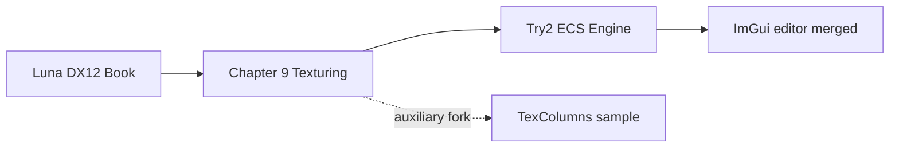

| Stage | What it is | Relation to Try2 |
|-------|------------|-------------------|
| Luna foundation | `GameTimer`, `MathHelper`, `d3dx12.h` | **Compiled or included** into Try2 |
| Chapter 9 | Texturing chapter samples | Historical context |
| **Try2 core** | ECS + deferred pipeline | **Current product** (`Try2.sln`) |
| FromScratch merge | JSON scenes, lights, F5 reload | **Merged** into Try2 (`Engine`, `RenderSystem`, serializer) |
| ImGui / `FS_w_GUI` | WYSIWYG editor in `LSEngine/IMGUI_works/` | **Merged** — optional via `.imgui_on` |
| TexColumns | Monolithic `D3DApp` forward demo | **Not in Try2.sln**; `CustomBuffer.h` reused |
| Future | `RenderAPI::Vulkan` | Stub only in `Application.h` |

---

## The Try2 Application

### Solution and entry

| Property | Value |
|----------|-------|
| Solution | [`Try2.sln`](../LSEngine/Chapter%209%20Texturing/Try2/Try2.sln) — **one project only** |
| Project | `Try2.vcxproj` (includes `IMGUI_works` sources) |
| Entry | `main()` in `Try2.cpp` |
| App shell | `TestApp` → `Application` |
| Engine core | `Engine` + `World` + ECS systems |
| Editor API | `ImGuiBridge` only (see [Changes/IMGUI-Editor-System.md](../Changes/IMGUI-Editor-System.md)) |
| Subsystem | Console (hosts a Win32 render window) |
| C++ standard | C++20 |

`TestApp` overrides `Update`, `PhysicsUpdate`, and `Draw` and forwards each call to `Engine`. After `Initialize`, `Try2.cpp` calls `ImGuiBridge::SetEngine`.

### Frame loop (summary)

Try2.exe is built from **Chapter 9** sources plus **`LSEngine/IMGUI_works`** (bridge, panels, Dear ImGui, ImGuizmo). At runtime the engine and editor share one process:

1. Win32 messages → `InputState` (`MsgProc` forwards to ImGui only if context already exists — **no ImGui init on first message**)
2. `ImGuiBridge::ProcessInput` — **`~`** toggles visibility and triggers **lazy** DX12/ImGui setup when licensed (`.imgui_on` next to exe)
3. Fixed **60 Hz** physics steps — **skipped in Edit mode** (`Editor_IsPhysicsEnabled`)
4. `BeginFrame` → `Update` (camera, **F5** shader reload) → `Draw` (lights + meshes)
5. `ImGuiBridge::BeginFrame` → `RenderEditorUI` (panels in `IMGUI_works/src/Editor/`) → `RenderOverlay` (UI composited on command list)
6. `EndFrame` → present

### Capabilities

| Area | Features |
|------|----------|
| **Input** | Keyboard/mouse state; ImGui capture when UI visible |
| **ECS** | Transform, mesh, camera, tag, rigidbody, collider, **directional/point/spot lights** |
| **Assets** | Assimp meshes, procedural primitives, materials, textures |
| **Scenes** | Startup load `DemoScene.json`; runtime **File → Save/Load** via `Engine::SaveScene` / `LoadScene` |
| **Serialization** | `SceneSerializer` — entities, meshes, materials, lights |
| **Rendering** | Deferred G-buffer, ECS-driven lights, resolve, lazy GPU upload |
| **Physics** | Gravity, AABB collision; **collision count** per frame; **Play mode only** when editor licensed |
| **Editor UI** | Hierarchy (all entities), Inspector (incl. **lights**, disabled in Play), Viewport, Statistics (**FPS 1s avg**), **Legend / Help**, ImGuizmo; requires `.imgui_on` + **`~`** |
| **Editor I/O** | Save → `Scenes/EditorSave.json`; Play snapshot → `Scenes/EditorPlaySnapshot.json`; optional restore on Stop |
| **Dev tools** | **F5** — `D3DRenderAdapter::ReloadShaders()` |

---

## Other material in LSEngine

| Location | Role | Try2 relationship |
|----------|------|-------------------|
| [`LSEngine/IMGUI_works/`](../LSEngine/IMGUI_works/) | ImGui, ImGuizmo, editor panels | **Compiled into Try2** via `$(IMGUI_WORKS)` = `../../IMGUI_works` from Try2 |
| [`LSEngine/Common/`](../LSEngine/Common/) | Luna utilities + vendored headers | Partial: 3 `.cpp` compiled; entt/glm/assimp/nlohmann included |
| [`../../Common/obj/`](../LSEngine/Common/obj/) | Sample meshes | Runtime paths from scenes / `DemoScene` |
| [`../TexColumns/`](../LSEngine/Chapter%209%20Texturing/TexColumns/) | Luna sample | **Header only:** `CustomBuffer.h` |
| [`../../Shaders/`](../LSEngine/Shaders/) | Duplicate HLSL | Use **`Try2/Shaders/`** |
| `Common/d3dApp`, `Camera`, `model`, … | Other Luna code | Not linked by Try2 |

Deep dive on merge + editor: [Changes/README.md](../Changes/README.md).

---

## Work in Progress and Known Gaps

| Area | Status |
|------|--------|
| **Vulkan** | `RenderAPI::Vulkan` declared; only DX12 implemented |
| **Editor license** | UI disabled without `.imgui_on` next to executable |
| **Editor placeholders** | Undo, docking, offscreen viewport RT, asset/material panels (see [04-editor-additions.md](04-editor-additions.md)) |
| **Editor I/O** | Save/Load via `Scenes/EditorSave.json`; Play snapshot `Scenes/EditorPlaySnapshot.json` |
| **Editor debug** | Optional **Restore on Stop** (default off); **Restore Snapshot** button anytime |
| **Build paths** | `Try2.vcxproj` may hardcode include paths — prefer `$(SolutionDir)..\..\Common` |
| **CustomBuffer coupling** | Header from TexColumns; `CustomBuffer.cpp` not in vcxproj |
| **RenderSystem** | Unused `ResourceManager*` member |
| **Descriptor heaps** | Engine uses indices 0–899; ImGui allocates from 900–963 on shared CBV/SRV heap |

---

## How to Build

1. Open **`LSEngine/Chapter 9 Texturing/Try2/Try2.sln`** (not TexColumns).
2. Select **Debug | x64**.
3. Place **`assimp-vc143-mt.lib`** in `Try2/Libs/`.
4. Ensure **`LSEngine/IMGUI_works/`** exists (sibling of `Chapter 9 Texturing/`, not inside it) — required by vcxproj.
5. Fix **`AdditionalIncludeDirectories`** if needed for `LSEngine/Common`.
6. Run; working directory should resolve `Scenes/DemoScene.json` and mesh paths under `Common/obj/`.
7. To enable the editor: add **`.imgui_on`** beside `Try2.exe`, run, press **`~`**.

---

## Where to Read Next

- Technologies and patterns → [02-technologies-and-patterns.md](02-technologies-and-patterns.md)
- Structure, diagrams, file index → [03-code-structure.md](03-code-structure.md)
- Editor additions (items 1–10) → [04-editor-additions.md](04-editor-additions.md)
- Merge + ImGui base integration → [Changes/README.md](../Changes/README.md)

---

# Part 2 — Technologies and Patterns

Technology stack, dependencies, and design patterns **as used by the Try2 project** ([`Try2.vcxproj`](../LSEngine/Chapter%209%20Texturing/Try2/Try2.vcxproj)). For modules and diagrams, see [03-code-structure.md](03-code-structure.md). For merge and editor depth, see [Changes/README.md](../Changes/README.md).

---

## Core Stack (Try2 Product)

| Category | Technology | Role in Try2 |
|----------|------------|--------------|
| Language | C++20 | ECS, STL containers, `std::unique_ptr` |
| Platform | Win32 API | Window, message pump, input in `Application` |
| Graphics API | Direct3D 12 | `D3DRenderAdapter` — device, queues, PSOs, descriptors |
| DXGI | DXGI 1.4 | Swap chain and back buffers |
| Shaders | HLSL + D3DCompile | **`Try2/Shaders/`**; **F5** hot-reload via `ReloadShaders()` |
| CPU math | GLM | ECS transforms, physics, lights, meshes |
| GPU constants | DirectXMath | `FrameRes.h` structs aligned with HLSL |
| ECS | EnTT | `World::registry`, system `view` iteration |
| Assets | Assimp + `assimp-vc143-mt.lib` | `ResourceManager::LoadMesh` |
| Serialization | nlohmann/json | `SceneSerializer` — scenes, materials, lights |
| UI | Dear ImGui + ImGuizmo | Editor in `LSEngine/IMGUI_works/`; DX12/Win32 backends |
| COM | WRL `ComPtr` | D3D12 resource lifetime |
| Build | MSBuild / VS 2022 | Single-project solution; `v143` / `v145` toolsets |

---

## Dependency Tiers

What [`Try2.vcxproj`](../LSEngine/Chapter%209%20Texturing/Try2/Try2.vcxproj) actually pulls in.

### Tier 1 — Try2-authored (compiled in project)

| Module | Responsibility |
|--------|----------------|
| `Application` | Win32 loop, input, physics timestep, ImGui hooks, renderer factory |
| `Engine` | System lists, scene load/save, F5 reload, physics gate, `GetRegistry` / `GetResources`, `SaveScene` / `LoadScene` |
| `World` | `entt::registry` wrapper |
| `Commons` | Components (incl. lights), `IRenderAdapter`, `ISystem`, `FrameContext` |
| `CameraControllerSystem` | FPS camera; respects `ImGuiBridge::WantsCaptureInput` |
| `PhysicsSystem` | Integration + collision; reports pairs via `PhysicsStats` |
| `RenderSystem` | Camera, **ECS lights** → `SetLights`, mesh draws |
| `ResourceManager` | CPU assets, Assimp |
| `D3DRenderAdapter` | D3D12 renderer, `ReloadShaders`, `GetImGuiBindings` |
| `FrameRes` / `d3dUtils` | CB rings, shader compile, helpers |
| `SceneFactory`, `DemoScene`, `SceneSerializer` | Level setup and JSON I/O |
| `Try2.cpp` | `main()`, `TestApp`, `ImGuiBridge::SetEngine` |

### Tier 1b — IMGUI_works (compiled via `$(IMGUI_WORKS)`)

Path: `$(SolutionDir)../../IMGUI_works` → [`LSEngine/IMGUI_works/`](../LSEngine/IMGUI_works/) (same git repo as Try2; not under Chapter 9).

| Module | Responsibility |
|--------|----------------|
| `ImGuiBridge` | **Only** public API Try2 should call for the editor |
| `ImGuiPlatform` | `.imgui_on` license gate, `~` toggle |
| `EditorContext` + panels | Hierarchy, Inspector, Viewport, Statistics, gizmo toolbar |
| `HierarchyPanel`, `InspectorPanel`, … | ECS UI reads/writes via `EditorContext` |
| `GizmoController` | `ImGuizmo::Manipulate` in Edit mode |
| `EditorSceneIO` | Save/Load, Play snapshot, optional restore on Stop |
| `LegendPanel` | Legend / Help, abbreviations, debug restore docs |
| ThirdParty imgui | Core + `imgui_impl_win32` + `imgui_impl_dx12` |
| ImGuizmo | Translate / rotate / scale gizmos |

Try2 must **not** include ImGui headers directly except through `ImGuiBridge.h`.

### Tier 2 — Compiled from `../../Common/`

| File | Role |
|------|------|
| `GameTimer.cpp` | Frame timing in `Application` |
| `MathHelper.cpp` | Matrices for GPU constant buffers |
| `DDSTextureLoader.cpp` | DDS texture upload in renderer |

### Tier 3 — Header-only from `../../Common/`

| Dependency | Used by |
|------------|---------|
| `entt/entt.hpp` | `World`, systems, editor |
| `glm/` | Components, physics, meshes, lights |
| `assimp/` | `ResourceManager` |
| `nlohmann/json.hpp` | `SceneSerializer` |
| `d3dx12.h` | `d3dUtils`, `D3DRenderAdapter` |

### Tier 4 — Auxiliary include (not in Try2.sln)

| File | Role |
|------|------|
| `../TexColumns/CustomBuffer.h` | G-buffer / render-target helper; used by `D3DRenderAdapter` |

`CustomBuffer.cpp` is **not** listed in `Try2.vcxproj` — known coupling risk.

### Not used by Try2 build

| Item | Note |
|------|------|
| `d3dApp`, `Camera`, `GeometryGenerator`, `model` | Other solutions only |
| `TexColumns.sln` | Separate auxiliary sample |
| `LSEngine/Shaders/` | Duplicate; authoritative set is **`Try2/Shaders/`** |

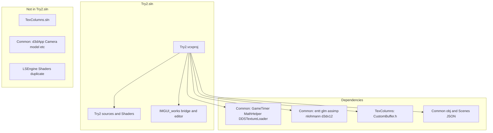

---

## Architectural Patterns (Try2)

### 1. Renderer adapter

`IRenderAdapter` ← `D3DRenderAdapter`. Systems never include `d3d12.h` directly. Extended with `SetLights` and `ReloadShaders`.

### 2. ECS system pipelines

| Pipeline | When | System |
|----------|------|--------|
| Update | Per visual frame | `CameraControllerSystem`; **F5** in `Engine::Update` |
| Physics | 1/60 s steps, **Play mode only** when editor active | `PhysicsSystem` |
| Render | Per visual frame | `RenderSystem` (camera, lights, meshes) |

### 3. Editor bridge (isolation)

All GUI code lives in [`LSEngine/IMGUI_works/`](../LSEngine/IMGUI_works/). Try2 (under Chapter 9) compiles it via `$(IMGUI_WORKS)` and calls `ImGuiBridge::*` only. Optional runtime via `.imgui_on` beside `Try2.exe`.

### 4. Edit vs Play

`EditorContext::mode` controls physics and component editing:

| Mode | Physics | Inspector / gizmo |
|------|---------|-------------------|
| **Edit** | Off | Full editing via `Editor_CanEditComponents()` |
| **Play** | On | Inspector disabled; gizmo skipped |

**Play** writes `Scenes/EditorPlaySnapshot.json` before simulating. **Stop** returns to Edit; reloads snapshot only if `restoreSceneOnStop` is true (default **false**). **Restore Snapshot** reloads the play file manually anytime.

### 5. Data-driven scenes

`Engine::Init` searches for `DemoScene.json`, loads via `SceneSerializer::Load(world, resourceManager, path)`, falls back to `DemoScene::Build` on miss or error.

### 6. ECS-driven lighting

Light components on entities → `RenderSystem` builds `SceneLightData` → `IRenderAdapter::SetLights` → pass constant buffers (caps: 1 directional, 2 point, 3 spot).

### 7. Frame context

`FrameContext` bundles `GameTimer`, `InputState`, and `physDT` for every `ISystem::Update` and editor panels.

### 8. Frame-in-flight

2 swap-chain buffers, 2 `FrameRes` slots, fence wait in `BeginFrame`. ImGui font/textures use descriptor indices **900–963** on the shared shader-visible heap (engine uses **0–899**).

### 9. Deferred G-buffer

Geometry → lighting → resolve; `LightingUtil.hlsl` shared with up to 16 GPU lights in pass CB (ECS caps are lower).

### 10. Lazy GPU upload

`ResourceManager` holds CPU meshes; `D3DRenderAdapter::UploadMesh` on first `DrawMesh`.

### 11. Fixed timestep physics

`Application::Run` — 60 Hz accumulator, max 5 steps per frame; gated when editor is in Edit mode.

### 12. ImGui overlay after 3D

Scene renders first; `RenderOverlay` draws UI on the same command list before present — see [Changes/IMGUI-Editor-System.md](../Changes/IMGUI-Editor-System.md).

### 13. Editor scene I/O

`EditorSceneIO` calls `Engine::SaveScene` / `LoadScene`, which delegate to `SceneSerializer`. File menu and Play/Stop use paths under `Scenes/` relative to the working directory.

### 14. Lazy ImGui initialization

With `.imgui_on` present, ImGui/DX12 font resources are **not** created until the user presses **`~`**. `WndProcHandler` only forwards messages after `g_Initialized` is true.

### 15. Edit-only component editing

`Editor_CanEditComponents()` returns true only in Edit mode. Inspector uses `ImGui::BeginDisabled` in Play; gizmo already skips when not in Edit.

### 16. Physics telemetry

`PhysicsStats` in `PhysicsCommons.h` counts colliding pairs per physics step. Statistics panel shows **Collisions (this frame)** and rolling **FPS (1s avg)**.

---

## Shader Pipeline (`Try2/Shaders/`)

Authoritative shader location. Seven HLSL files. **F5** recompiles PSOs without restarting.

| Shader | Role |
|--------|------|
| `LightingUtil.hlsl` | Shared lights, materials, Blinn-Phong / Fresnel |
| `GeometryPass.hlsl` | **G-buffer** — albedo, normal, world pos, roughness, velocity |
| `LightingPass.hlsl` | Fullscreen deferred lighting (uses ECS `SceneLightData`) |
| `ResolvePass.hlsl` | History blend, HDR adjust |
| `Default.hlsl` | Forward-style path (legacy / optional) |
| `TransparentUnlit.hlsl` | Transparent overlay |
| `Debug.hlsl` | Debug texture display |

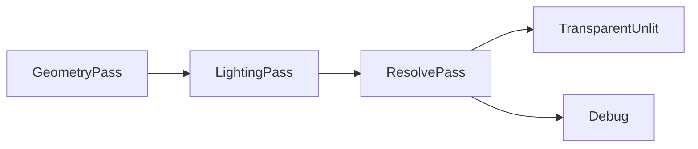

---

## Design Observations

### Strengths

- Single-solution focus with editor in `LSEngine/IMGUI_works/` (same repo, outside Chapter 9)
- JSON scenes + ECS lights unify content and rendering
- Thin `ImGuiBridge` API limits coupling between engine and UI

### Coupling to address

| Item | Notes |
|------|-------|
| `CustomBuffer` in TexColumns | Move into `Try2/` or `Common/` |
| Hardcoded include paths | Use `$(SolutionDir)` macros for Common and IMGUI_works |
| `RenderAPI::Vulkan` stub | No backend yet |
| Unused `ResourceManager*` in `RenderSystem` | Minor cleanup |
| Shared descriptor heap | Documented split; avoid index collisions when adding engine SRVs |

---

## Related Documentation

- Project overview → [01-project-overview.md](01-project-overview.md)
- Code structure → [03-code-structure.md](03-code-structure.md)
- Editor additions → [04-editor-additions.md](04-editor-additions.md)
- Merge + ImGui (full) → [Changes/README.md](../Changes/README.md)

---

# Part 3 — Code Structure

Structural reference for the **Try2** project: layout, modules, ECS, APIs, Mermaid diagrams, and a tiered source index. Scoped to [`Try2.sln`](../LSEngine/Chapter%209%20Texturing/Try2/Try2.sln) unless marked auxiliary.

- Overview → [01-project-overview.md](01-project-overview.md)
- Technologies → [02-technologies-and-patterns.md](02-technologies-and-patterns.md)
- Editor additions → [04-editor-additions.md](04-editor-additions.md)
- Merge + ImGui detail → [Changes/README.md](../Changes/README.md)

---

## Try2 Project Layout

```
LSEngine/                                 # Git repository root
├── IMGUI_works/                          # Editor + Dear ImGui + ImGuizmo (compiled into Try2)
│   ├── src/ImGuiBridge.*, ImGuiPlatform.*
│   ├── src/Editor/                      # Panels, EditorContext, Gizmo
│   └── ThirdParty/imgui, ImGuizmo
├── Common/                               # GameTimer, EnTT, GLM, obj assets
└── Chapter 9 Texturing/Try2/            # Product root — open Try2.sln here
    ├── Try2.sln
    ├── Try2.vcxproj                     # IMGUI_WORKS = ../../IMGUI_works
    ├── Try2.cpp, Application.*, Engine.*, ...
    ├── Scenes/DemoScene.json            # Default data-driven scene
    ├── Shaders/                         # Authoritative HLSL (7 files)
    ├── Libs/assimp-vc143-mt.lib
    │
    │  Compiled from ../../Common/:
    │    GameTimer, MathHelper, DDSTextureLoader
    │
    └── Header include from ../TexColumns/:
          CustomBuffer.h
```

**Runtime assets:** `../../Common/obj/`, scene JSON under `Scenes/`.

---

## Module Responsibility Table

### Try2-authored

| Module | Responsibility |
|--------|----------------|
| `Try2.cpp` / `TestApp` | Entry; `ImGuiBridge::SetEngine` after init |
| `Application` | Win32 loop, ImGui lifecycle, overlay after `Draw` |
| `Engine` | Systems, JSON scene load/save, F5 reload, physics gate, `SaveScene`/`LoadScene`, editor accessors |
| `World` | `entt::registry` holder |
| `Commons.h` | Components (incl. lights), `SceneLightData`, `IRenderAdapter` |
| `CameraControllerSystem` | FPS camera; skips when ImGui captures input |
| `PhysicsSystem` | Integrate + AABB collision; `PhysicsStats` counting |
| `RenderSystem` | Camera, **collect ECS lights**, draw meshes |
| `PhysicsCommons.h` | Collider math + `PhysicsStats` namespace |
| `ResourceManager` | CPU assets, Assimp |
| `D3DRenderAdapter` | D3D12, deferred passes, `ReloadShaders`, `GetImGuiBindings` |
| `FrameRes` / `d3dUtils` | CB rings, shader compile |
| `SceneFactory` / `DemoScene` | Entity recipes; procedural fallback level |
| `SceneSerializer` | JSON load/save with meshes, materials, lights |

### LSEngine/IMGUI_works (compiled into Try2)

| Module | Responsibility |
|--------|----------------|
| `ImGuiBridge` | Public API: init, frame, overlay, `WantsCaptureInput`, `SetEngine`; lazy init on `~` |
| `ImGuiPlatform` | `.imgui_on` check, `~` toggle |
| `EditorContext` | Registry/resources, selection, Edit/Play, `statusMessage`, `restoreSceneOnStop`, panel toggles |
| `EditorSceneIO` | File Save/Load, Play snapshot, `RestorePlaySnapshot` |
| `EditorUI` | Menu (File), toolbar (Play/Stop), status line, panel orchestration |
| `HierarchyPanel` | Lists **all** entities (tag, mesh, camera, lights, physics) |
| `InspectorPanel` | Transform, tag, mesh, rigidbody, collider, **lights**; disabled in Play |
| `ViewportPanel` | Viewport chrome (scene draws behind UI) |
| `StatisticsPanel` | FPS instant + 1s average, entity count, collision count |
| `LegendPanel` | Legend / Help — shortcuts, gizmo glossary, file paths |
| `GizmoController` | ImGuizmo manipulate in Edit mode |

### Linked from Common

| Module | Responsibility |
|--------|----------------|
| `GameTimer` | Frame timing |
| `MathHelper` | GPU matrices |
| `DDSTextureLoader` | DDS textures |

### Auxiliary header

| Module | Responsibility |
|--------|----------------|
| `CustomBuffer` (TexColumns) | G-buffer RT helpers in `D3DRenderAdapter` |

### Try2 hooks for editor (minimal surface)

| File | Hook |
|------|------|
| `Application.cpp` | `ImGuiBridge` init/shutdown/resize; loop overlay; `WndProc` forward |
| `Try2.cpp` | `SetEngine` |
| `Engine.cpp` | `Editor_IsPhysicsEnabled()` in `PhysicsUpdate`; `SaveScene`/`LoadScene` |
| `EditorSceneIO` (via menu) | Calls `Engine::SaveScene` / `LoadScene` |
| `CameraControllerSystem.cpp` | `WantsCaptureInput()` early out |
| `D3DRenderAdapter` | `Dx12ImGuiBindings`, descriptor sub-range for ImGui |

---

## ECS Components

| Component | Fields (summary) | Used by |
|-----------|------------------|---------|
| `TransformComponent` | `position`, `rotation`, `scale` | All systems; world matrix |
| `MeshComponent` | `meshID` | `RenderSystem` |
| `CameraComponent` | `fov`, planes, `aspectRatio`, cached matrices | Camera + render |
| `TagComponent` | `tag` | Serializer, Hierarchy panel |
| `RigidbodyComponent` | `type`, `velocity`, `mass`, `useGravity` | `PhysicsSystem`, Inspector |
| `ColliderComponent` | AABB/sphere, restitution, friction | `PhysicsSystem`, Inspector |
| `DirectionalLightComponent` | `color`, `intensity`, `direction`, `enabled` | `RenderSystem` |
| `PointLightComponent` | color, intensity, falloff, `enabled` | `RenderSystem` (needs `Transform`) |
| `SpotLightComponent` | color, direction, spot power, falloff, `enabled` | `RenderSystem` (needs `Transform`) |

**GPU caps** (`Commons.h`): `RenderDirectionalLightCount` = 1, `RenderPointLightCount` = 2, `RenderSpotLightCount` = 3.

### Typical entities

| Kind | Components |
|------|------------|
| Static floor | `Transform`, `Mesh`, `Tag`, `Rigidbody`(Static), `Collider` |
| Dynamic body | `Transform`, `Mesh`, `Tag`, `Rigidbody`(Dynamic), `Collider` |
| Camera | `Transform`, `Camera`, `Tag` |
| Directional light | `DirectionalLight` (optional `Tag`) |
| Point light | `Transform`, `PointLight`, `Tag` |
| Spot light | `Transform`, `SpotLight`, `Tag` |

---

## Diagram A — Try2 Application Lifecycle

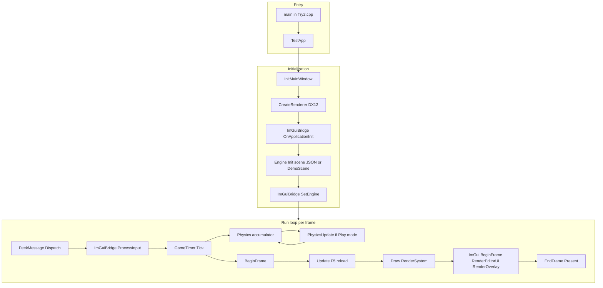

---

## Diagram B — Try2 Engine Systems and Editor Layer

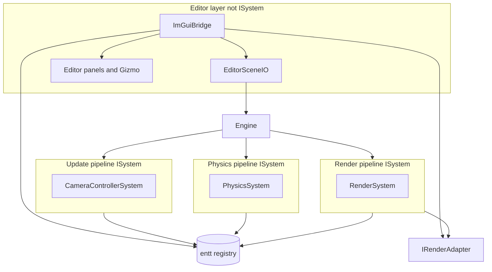

| Phase | Frequency | Component |
|-------|-----------|-----------|
| `Update` | 1× / frame | `CameraControllerSystem`; `Engine` handles F5 |
| `PhysicsUpdate` | 0–5× / 60 Hz | `PhysicsSystem` if `Editor_IsPhysicsEnabled()` |
| `Draw` | 1× / frame | `RenderSystem` |
| Editor UI | 1× / frame after `Draw` | `ImGuiBridge` → `Editor_*` |

---

## Diagram C — Try2 ECS Entity Flow

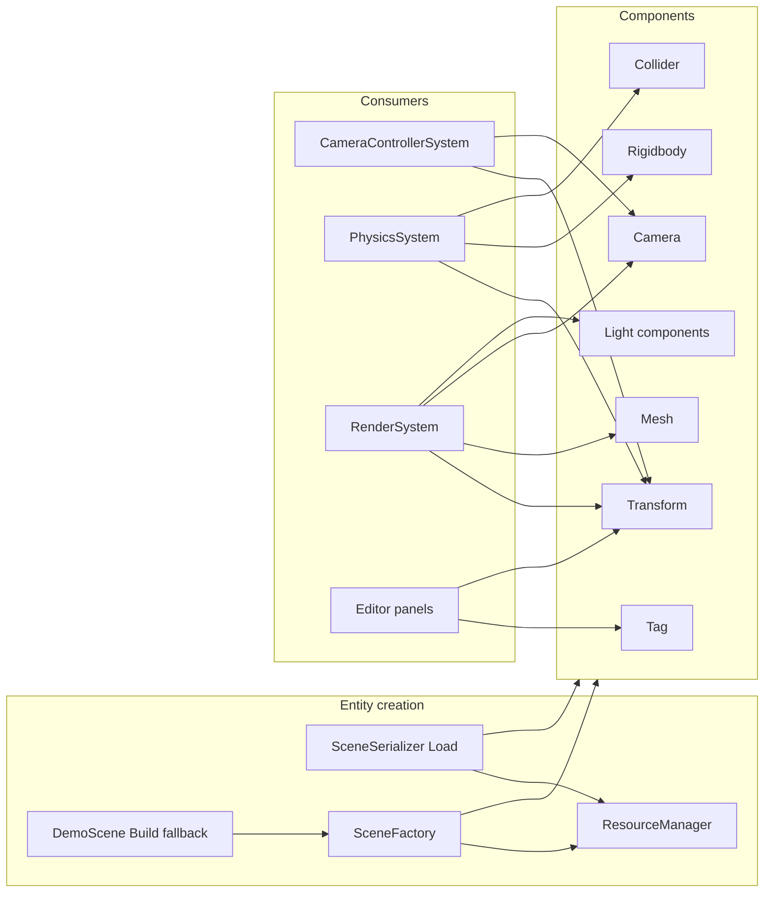

---

## Diagram D — Try2 Rendering Adapter Contract

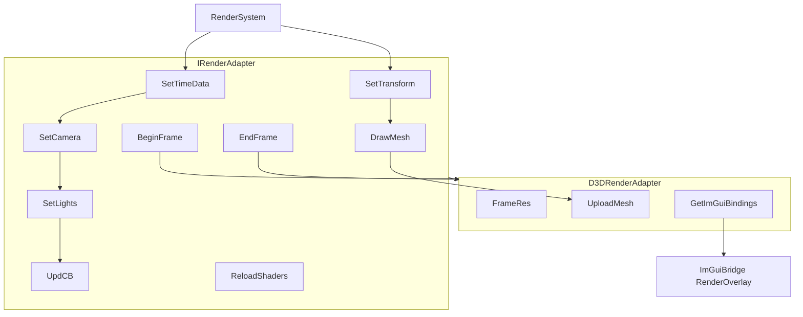

| Method | Caller | Purpose |
|--------|--------|---------|
| `SetLights` | `RenderSystem` | Upload `SceneLightData` from ECS light views |
| `ReloadShaders` | `Engine::Update` on F5 | Rebuild PSOs from `Try2/Shaders/` |
| `GetImGuiBindings` | `ImGuiBridge` (lazy init) | Device, queue, command list, SRV heap slice |
| `BeginFrame` / `EndFrame` | `Application` | Frame sync and present |

---

## Diagram E — Try2 Deferred GPU Passes

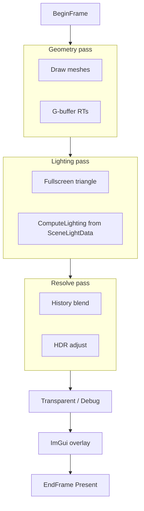

---

## Diagram F — Try2 Resource Path

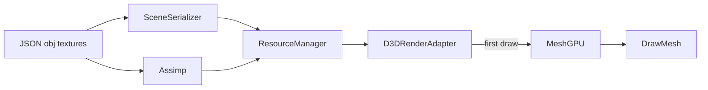

---

## Diagram G — Try2 Physics Loop

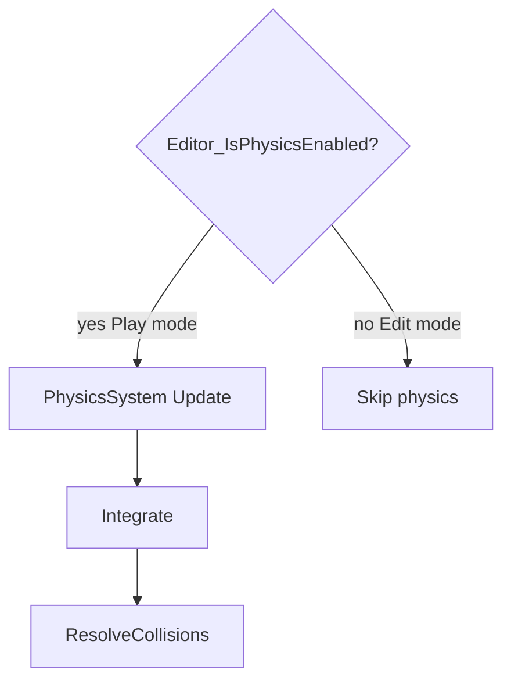

---

## Diagram H — Try2 Build Dependencies

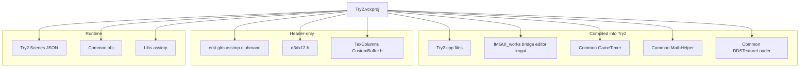

---

## Diagram I — Editor and ECS Binding

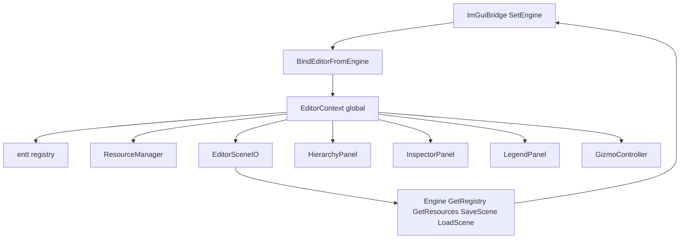

---

## Per-Frame Sequence (Try2)

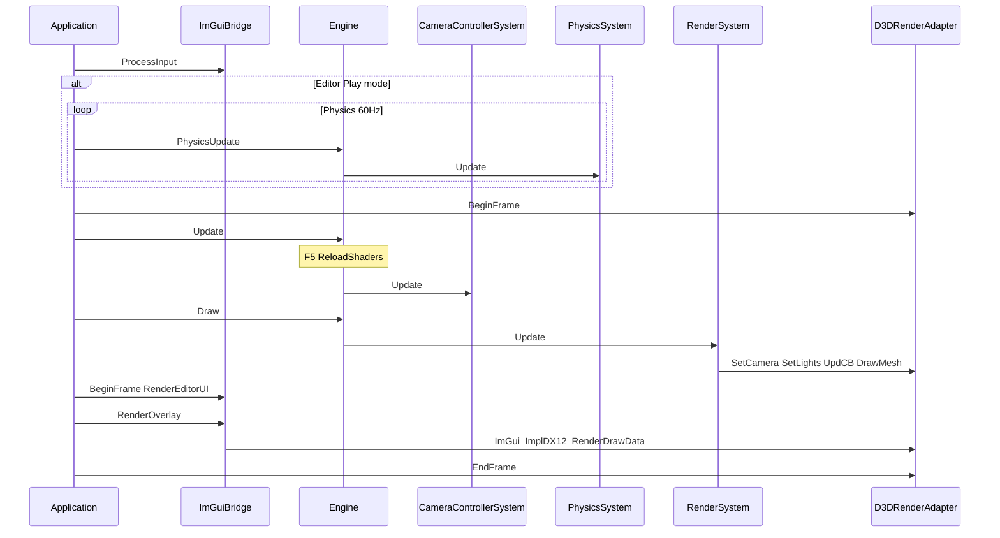

---

## Class and API Quick Reference

### Application and bridge

| Class / API | Key members |
|-------------|-------------|
| `Application` | `Run`, `Initialize`, `MsgProc`, ImGui hooks |
| `TestApp` | Delegates to `mEngine` |
| `ImGuiBridge` | `SetEngine`, `OnApplicationInit`, `RenderOverlay`, `WantsCaptureInput`, `IsLicensed` |

### Engine core

| Class | Key API |
|-------|---------|
| `Engine` | `Init`, `Update`, `PhysicsUpdate`, `Draw`, `GetRegistry`, `GetResources`, `GetWorld`, `SaveScene`, `LoadScene` |
| `World` | `registry` |
| `FrameContext` | `timer`, `input`, `physDT` |

### Systems

| Class | Role |
|-------|------|
| `CameraControllerSystem` | FPS camera; ImGui input gate |
| `PhysicsSystem` | Integrate + collisions |
| `RenderSystem` | Lights + camera + meshes |

### Editor (IMGUI_works)

| API | Role |
|-----|------|
| `Editor_SetContext` / `Editor_GetContext` | Global editor state |
| `Editor_IsPhysicsEnabled` | Play vs Edit |
| `Editor_CanEditComponents` | Edit-only Inspector/gizmo editing |
| `Editor_BeginFrame` / `Editor_RenderUI` | Panel pass |
| `Editor_RenderGizmo` | ImGuizmo |
| `Editor_DrawLegend` | Legend / Help window |
| `EditorSceneIO` | Save, Load, BeginPlay, EndPlay, RestorePlaySnapshot |

### Rendering

| Class | Key API |
|-------|---------|
| `IRenderAdapter` | `SetLights`, `ReloadShaders`, frame, draw |
| `D3DRenderAdapter` | `GetImGuiBindings`, `BuildPSOs`, `UploadMesh` |
| `Dx12ImGuiBindings` | POD GPU handles for ImGui backend |

---

## Source File Index

### Tier 1 — Try2 project sources

| File | Role |
|------|------|
| `Try2.cpp` | `main()`, `TestApp`, `SetEngine` |
| `Application.cpp/h` | Loop, Win32, ImGui integration |
| `Engine.cpp/h` | Systems, scene load/save, F5, physics gate |
| `PhysicsCommons.h` | Collider math, `PhysicsStats` |
| `World.cpp/h` | Registry |
| `Commons.cpp/h` | Components, lights, interfaces |
| `CameraControllerSystem.cpp/h` | Camera + ImGui capture |
| `PhysicsSystem.cpp/h` | Physics |
| `RenderSystem.cpp/h` | Lights, camera, draws |
| `ResourceManager.cpp/h` | Assets |
| `D3DRenderAdapter.cpp/h` | Renderer, ImGui bindings, reload |
| `FrameRes.cpp/h`, `d3dUtils.cpp/h` | GPU helpers |
| `SceneFactory.cpp/h`, `DemoScene.cpp/h` | Level setup |
| `SceneSerializer.cpp/h` | JSON I/O |

**Data:** `Scenes/DemoScene.json`

**Shaders:** `Try2/Shaders/` (7 HLSL files)

### Tier 1b — IMGUI_works (compiled by Try2)

| File | Role |
|------|------|
| `src/ImGuiBridge.cpp/h` | Public API |
| `src/ImGuiPlatform.cpp/h` | License + toggle |
| `src/Editor/EditorContext.cpp/h` | Editor state, `statusMessage`, `restoreSceneOnStop` |
| `src/Editor/EditorSceneIO.cpp/h` | Save/Load/Play snapshot I/O |
| `src/Editor/EditorUI.cpp` | Menu, toolbar, status |
| `src/Editor/HierarchyPanel.cpp` | All-entity list |
| `src/Editor/InspectorPanel.cpp` | Components + lights |
| `src/Editor/ViewportPanel.cpp` | Viewport UI |
| `src/Editor/StatisticsPanel.cpp` | FPS avg, collisions |
| `src/Editor/LegendPanel.cpp` | Legend / Help |
| `src/Editor/GizmoController.cpp` | ImGuizmo |
| ThirdParty | imgui core + backends, ImGuizmo (not listed file-by-file) |

### Tier 2 — Common (compiled)

| File | Role |
|------|------|
| `GameTimer.cpp/h` | Timing |
| `MathHelper.cpp/h` | Matrices |
| `DDSTextureLoader.cpp/h` | DDS |

### Tier 3 — Auxiliary

| Item | Note |
|------|------|
| `TexColumns/CustomBuffer.*` | Header used; `.cpp` not in vcxproj |
| `TexColumns.sln` | Not the product build |
| `LSEngine/Shaders/` | Duplicate of `Try2/Shaders/` |

---

## Key Functions (Try2)

| Subsystem | Functions |
|-----------|-----------|
| `Engine::Init` | Register systems; `SceneSerializer::Load` or `DemoScene::Build` |
| `Engine::Update` | Run update systems; **F5** → `ReloadShaders()` |
| `Engine::PhysicsUpdate` | No-op in Edit mode when editor licensed |
| `Engine::SaveScene` / `LoadScene` | Runtime JSON I/O for editor File menu |
| `RenderSystem::Update` | Gather light views → `SetLights`; draw meshes |
| `SceneSerializer::Load` | Deserialize world + shared `ResourceManager` |
| `EditorSceneIO::BeginPlay` | Snapshot to `EditorPlaySnapshot.json`, mode = Play |
| `PhysicsStats::AddCollision` | Increment per colliding pair in physics |
| `ImGuiBridge::SetEngine` | Bind registry/resources to `EditorContext` |

---

## Reading Order (Try2 contributors)

1. `Try2.cpp`
2. `Application.cpp` — loop, ImGui overlay order
3. `Engine.cpp` — scene load, F5, physics gate
4. `RenderSystem.h` — ECS lights
5. `D3DRenderAdapter.cpp` — deferred passes, ImGui bindings
6. [`IMGUI_works/src/ImGuiBridge.h`](../LSEngine/IMGUI_works/src/ImGuiBridge.h) — editor API surface
7. [04-editor-additions.md](04-editor-additions.md) — save/load, Play snapshot, stats, lazy init
8. [Changes/IMGUI-Editor-System.md](../Changes/IMGUI-Editor-System.md) — base ImGui integration
9. `Try2/Shaders/GeometryPass.hlsl` + `LightingPass.hlsl`

---

# Part 4 — Editor additions

Condensed reference for editor improvements **items 1–10**. Full detail, verification steps, and file paths: [04-editor-additions.md](04-editor-additions.md).

## Summary

| # | Feature | Status |
|---|---------|--------|
| 1 | File → Save / Load | Done — `Scenes/EditorSave.json` |
| 2 | Play snapshot / Stop restore | Done — `Scenes/EditorPlaySnapshot.json` |
| 3 | Inspector + gizmo locked in Play | Done |
| 4 | Inspector light components | Done |
| 5 | Collision count in Statistics | Done |
| 6 | FPS 1-second average | Done |
| 7 | Lazy ImGui init (visible only) | Done |
| 8 | Hierarchy lists all entities | Done |
| 9 | Legend / Help window | Done |
| 10 | Debug: optional restore on Stop + Restore Snapshot | Done |

## Architecture

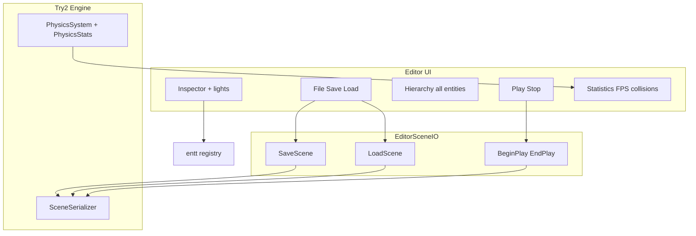

## Key behavior

| Topic | Description |
|-------|-------------|
| **Activation** | ImGui/DX12 init only after **`~`** when `.imgui_on` exists; `WndProc` does not create context on first message |
| **File menu** | Save/Load via `EditorSceneIO` → `Engine::SaveScene` / `LoadScene` → `SceneSerializer` |
| **Play/Stop** | Play writes snapshot; Stop returns to Edit; reload only if `restoreSceneOnStop` (default **off**); **Restore Snapshot** anytime |
| **Inspector** | All core components + **lights**; `Editor_CanEditComponents()` disables editing in Play |
| **Hierarchy** | All entity types (not tag-only) |
| **Statistics** | FPS instant + **1s average**; **collision count** via `PhysicsStats` |
| **Legend** | `Editor_DrawLegend` — shortcuts, gizmo glossary, file paths |

## Remaining gaps

| Item | Notes |
|------|-------|
| ImGui docking | Requires docking-enabled ImGui branch |
| Viewport render-to-texture | Offscreen RT for embedded view |
| Undo/redo, asset browser, material editor | PLACEHOLDER windows |
| Hierarchy parenting | Needs `HierarchyComponent` |
| GPU memory stat | PLACEHOLDER |

See [04-editor-additions.md](04-editor-additions.md) for manual verification steps.

---

*End of Total Overview. Split versions: [README](README.md) · [01](01-project-overview.md) · [02](02-technologies-and-patterns.md) · [03](03-code-structure.md) · [04](04-editor-additions.md)*
