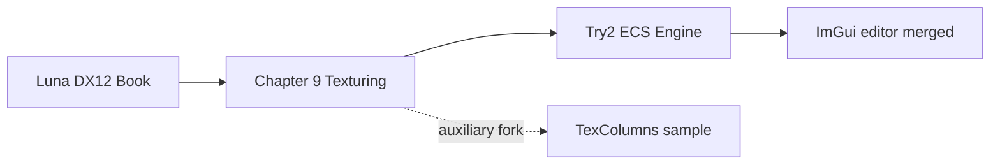

# Try2 — Обзор проекта

## Краткое резюме

**Try2** — игровой движок на Windows с DirectX 12, собранный как единое решение Visual Studio ([`Try2.sln`](../LSEngine/Chapter%209%20Texturing/Try2/Try2.sln)). Он вырос из курса Frank Luna *Introduction to 3D Game Programming with DirectX 12*, но теперь имеет собственную архитектуру:

- **ECS**-мир на EnTT (`World`, компоненты, системы)
- **Адаптер рендерера** — `IRenderAdapter` / `D3DRenderAdapter` изолирует D3D12 от игровой логики
- **Отложенный рендеринг** — geometry pass → lighting pass → resolve pass (`Try2/Shaders/`)
- **ECS-освещение** — компоненты направленного, точечного и прожекторного света управляют отложенным проходом
- **Сцены на данных** — загрузка JSON через `SceneSerializer` с запасным вариантом `DemoScene`
- **Опциональный редактор сцен** — Dear ImGui + ImGuizmo в [`LSEngine/IMGUI_works/`](../LSEngine/IMGUI_works/), интеграция через `ImGuiBridge`
- **Assimp** для загрузки ассетов и лёгкий слой **физики** (AABB, гравитация; только в режиме Play при активном редакторе)
- **Инструменты разработки** — **F5** перезагружает HLSL-шейдеры во время выполнения

Папка **LSEngine** — корень git-репозитория. **Try2** (`Chapter 9 Texturing/Try2/`) — активный продукт; **`IMGUI_works/`** в корне LSEngine содержит редактор (компилируется в Try2); **Common/** — общие заголовки и ассеты; остальные папки глав — исторические примеры.

---

## Происхождение проекта

| Этап | Что это | Связь с Try2 |
|-------|------------|-------------------|
| Основа Luna | `GameTimer`, `MathHelper`, `d3dx12.h` | **Компилируется или подключается** в Try2 |
| Глава 9 | Примеры главы по текстурированию | Исторический контекст |
| **Ядро Try2** | ECS + отложенный конвейер | **Текущий продукт** (`Try2.sln`) |
| Слияние FromScratch | JSON-сцены, свет, F5 reload | **Влито** в Try2 (`Engine`, `RenderSystem`, serializer) |
| ImGui / `FS_w_GUI` | WYSIWYG-редактор в `LSEngine/IMGUI_works/` | **Влито** — опционально через `.imgui_on` |
| TexColumns | Монолитное forward-демо `D3DApp` | **Не в Try2.sln**; переиспользуется `CustomBuffer.h` |
| Будущее | `RenderAPI::Vulkan` | Только заглушка в `Application.h` |

---

## Приложение Try2

### Решение и точка входа

| Свойство | Значение |
|----------|-------|
| Решение | [`Try2.sln`](../LSEngine/Chapter%209%20Texturing/Try2/Try2.sln) — **один проект** |
| Проект | `Try2.vcxproj` (включает исходники `IMGUI_works`) |
| Точка входа | `main()` в `Try2.cpp` |
| Оболочка приложения | `TestApp` → `Application` |
| Ядро движка | `Engine` + `World` + ECS-системы |
| API редактора | Только `ImGuiBridge` (см. [Changes/IMGUI-Editor-System.md](../Changes/IMGUI-Editor-System.md)) |
| Подсистема | Консоль (хостит окно рендера Win32) |
| Стандарт C++ | C++20 |

`TestApp` переопределяет `Update`, `PhysicsUpdate` и `Draw` и передаёт каждый вызов в `Engine`. После `Initialize` в `Try2.cpp` вызывается `ImGuiBridge::SetEngine`.

### Цикл кадра (кратко)

Try2.exe собирается из исходников **Chapter 9** плюс **`LSEngine/IMGUI_works`** (мост, панели, Dear ImGui, ImGuizmo). Во время выполнения движок и редактор — один процесс:

1. Сообщения Win32 → `InputState` (`MsgProc` пересылает в ImGui только если контекст уже есть — **без инициализации ImGui на первом сообщении**)
2. `ImGuiBridge::ProcessInput` — **`~`** переключает видимость и запускает **ленивую** настройку DX12/ImGui при наличии лицензии (`.imgui_on` рядом с exe)
3. Фиксированные шаги физики **60 Гц** — **пропускаются в режиме Edit** (`Editor_IsPhysicsEnabled`)
4. `BeginFrame` → `Update` (камера, **F5** перезагрузка шейдеров) → `Draw` (свет + меши)
5. `ImGuiBridge::BeginFrame` → `RenderEditorUI` (панели в `IMGUI_works/src/Editor/`) → `RenderOverlay` (UI на том же command list)
6. `EndFrame` → present

### Возможности

| Область | Функции |
|------|----------|
| **Ввод** | Состояние клавиатуры/мыши; захват ImGui при видимом UI |
| **ECS** | Transform, mesh, camera, tag, rigidbody, collider, **направленный/точечный/прожекторный свет** |
| **Ассеты** | Меши Assimp, процедурные примитивы, материалы, текстуры |
| **Сцены** | Загрузка при старте `DemoScene.json`; **File → Save/Load** через `Engine::SaveScene` / `LoadScene` |
| **Сериализация** | `SceneSerializer` — сущности, меши, материалы, свет |
| **Рендеринг** | Отложенный G-buffer, ECS-свет, resolve, ленивая загрузка на GPU |
| **Физика** | Гравитация, AABB-коллизии; **счётчик столкновений** за кадр; **только Play** при лицензированном редакторе |
| **UI редактора** | Hierarchy (все сущности), Inspector (вкл. **свет**, отключён в Play), Viewport, Statistics (**FPS среднее за 1 с**), **Legend / Help**, ImGuizmo; нужны `.imgui_on` + **`~`** |
| **I/O редактора** | Save → `Scenes/EditorSave.json`; снимок Play → `Scenes/EditorPlaySnapshot.json`; опциональное восстановление при Stop |
| **Инструменты** | **F5** — `D3DRenderAdapter::ReloadShaders()` |

---

## Прочие материалы в LSEngine

| Расположение | Роль | Связь с Try2 |
|----------|------|-------------------|
| [`LSEngine/IMGUI_works/`](../LSEngine/IMGUI_works/) | ImGui, ImGuizmo, панели редактора | **Компилируется в Try2** через `$(IMGUI_WORKS)` = `../../IMGUI_works` из Try2 |
| [`LSEngine/Common/`](../LSEngine/Common/) | Утилиты Luna + вендорные заголовки | Частично: 3 `.cpp` компилируются; entt/glm/assimp/nlohmann подключаются |
| [`../../Common/obj/`](../LSEngine/Common/obj/) | Примеры мешей | Пути во время выполнения из сцен / `DemoScene` |
| [`../TexColumns/`](../LSEngine/Chapter%209%20Texturing/TexColumns/) | Пример Luna | **Только заголовок:** `CustomBuffer.h` |
| [`../../Shaders/`](../LSEngine/Shaders/) | Дубликат HLSL | Используйте **`Try2/Shaders/`** |
| `Common/d3dApp`, `Camera`, `model`, … | Другой код Luna | Try2 не линкует |

Подробнее о слиянии и редакторе: [Changes/README.md](../Changes/README.md).

---

## В работе и известные пробелы

| Область | Статус |
|------|--------|
| **Vulkan** | Объявлен `RenderAPI::Vulkan`; реализован только DX12 |
| **Лицензия редактора** | UI отключён без `.imgui_on` рядом с исполняемым файлом |
| **Заглушки редактора** | Undo, docking, offscreen viewport RT, панели ассетов/материалов (см. [04-editor-additions.md](04-editor-additions.md)) |
| **I/O редактора** | Save/Load через `Scenes/EditorSave.json`; снимок Play `Scenes/EditorPlaySnapshot.json` |
| **Отладка редактора** | Опциональное **восстановление при Stop** (по умолчанию выкл.); кнопка **Restore Snapshot** в любой момент |
| **Пути сборки** | `Try2.vcxproj` может жёстко задавать include — лучше `$(SolutionDir)..\..\Common` |
| **Связь CustomBuffer** | Заголовок из TexColumns; `CustomBuffer.cpp` не в vcxproj |
| **RenderSystem** | Неиспользуемый член `ResourceManager*` |
| **Кучи дескрипторов** | Движок: индексы 0–899; ImGui: 900–963 на общей CBV/SRV-куче |

---

## Как собрать

1. Откройте **`LSEngine/Chapter 9 Texturing/Try2/Try2.sln`** (не TexColumns).
2. Выберите **Debug | x64**.
3. Положите **`assimp-vc143-mt.lib`** в `Try2/Libs/`.
4. Убедитесь, что **`LSEngine/IMGUI_works/`** существует (рядом с `Chapter 9 Texturing/`, не внутри неё) — требуется vcxproj.
5. Исправьте **`AdditionalIncludeDirectories`** при необходимости для `LSEngine/Common`.
6. Запустите; рабочая директория должна находить `Scenes/DemoScene.json` и пути мешей под `Common/obj/`.
7. Чтобы включить редактор: добавьте **`.imgui_on`** рядом с `Try2.exe`, запустите, нажмите **`~`**.

---

## Что читать дальше

- Технологии и паттерны → [02-technologies-and-patterns.md](02-technologies-and-patterns.md)
- Структура, диаграммы, индекс файлов → [03-code-structure.md](03-code-structure.md)
- Дополнения редактора (пункты 1–10) → [04-editor-additions.md](04-editor-additions.md)
- Базовая интеграция слияния + ImGui → [Changes/README.md](../Changes/README.md)
