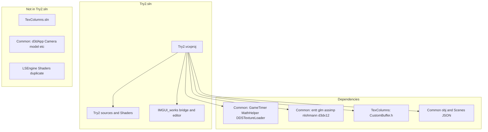
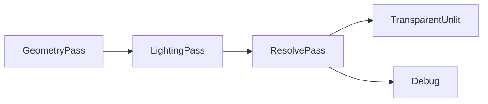

# Try2 — Технологии и паттерны

Стек технологий, зависимости и паттерны проектирования **в проекте Try2** ([`Try2.vcxproj`](../LSEngine/Chapter%209%20Texturing/Try2/Try2.vcxproj)). Модули и диаграммы — в [03-code-structure.md](03-code-structure.md). Подробности слияния и редактора — в [Changes/README.md](../Changes/README.md).

---

## Основной стек (продукт Try2)

| Категория | Технология | Роль в Try2 |
|----------|------------|--------------|
| Язык | C++20 | ECS, контейнеры STL, `std::unique_ptr` |
| Платформа | Win32 API | Окно, цикл сообщений, ввод в `Application` |
| Графический API | Direct3D 12 | `D3DRenderAdapter` — устройство, очереди, PSO, дескрипторы |
| DXGI | DXGI 1.4 | Swap chain и back buffer'ы |
| Шейдеры | HLSL + D3DCompile | **`Try2/Shaders/`**; горячая перезагрузка **F5** через `ReloadShaders()` |
| Математика CPU | GLM | Трансформы ECS, физика, свет, меши |
| Константы GPU | DirectXMath | Структуры `FrameRes.h`, выровненные с HLSL |
| ECS | EnTT | `World::registry`, итерация `view` в системах |
| Ассеты | Assimp + `assimp-vc143-mt.lib` | `ResourceManager::LoadMesh` |
| Сериализация | nlohmann/json | `SceneSerializer` — сцены, материалы, свет |
| UI | Dear ImGui + ImGuizmo | Редактор в `LSEngine/IMGUI_works/`; бэкенды DX12/Win32 |
| COM | WRL `ComPtr` | Время жизни ресурсов D3D12 |
| Сборка | MSBuild / VS 2022 | Решение из одного проекта; toolset `v143` / `v145` |

---

## Уровни зависимостей

Что реально подтягивает [`Try2.vcxproj`](../LSEngine/Chapter%209%20Texturing/Try2/Try2.vcxproj).

### Уровень 1 — код Try2 (компилируется в проекте)

| Модуль | Ответственность |
|--------|----------------|
| `Application` | Цикл Win32, ввод, шаг физики, хуки ImGui, фабрика рендерера |
| `Engine` | Списки систем, загрузка/сохранение сцены, F5 reload, шлюз физики, `GetRegistry` / `GetResources`, `SaveScene` / `LoadScene` |
| `World` | Обёртка `entt::registry` |
| `Commons` | Компоненты (вкл. свет), `IRenderAdapter`, `ISystem`, `FrameContext` |
| `CameraControllerSystem` | FPS-камера; учитывает `ImGuiBridge::WantsCaptureInput` |
| `PhysicsSystem` | Интеграция + коллизии; пары через `PhysicsStats` |
| `RenderSystem` | Камера, **ECS-свет** → `SetLights`, отрисовка мешей |
| `ResourceManager` | CPU-ассеты, Assimp |
| `D3DRenderAdapter` | Рендерер D3D12, `ReloadShaders`, `GetImGuiBindings` |
| `FrameRes` / `d3dUtils` | Кольца CB, компиляция шейдеров, хелперы |
| `SceneFactory`, `DemoScene`, `SceneSerializer` | Настройка уровня и JSON I/O |
| `Try2.cpp` | `main()`, `TestApp`, `ImGuiBridge::SetEngine` |

### Уровень 1b — IMGUI_works (компилируется через `$(IMGUI_WORKS)`)

Путь: `$(SolutionDir)../../IMGUI_works` → [`LSEngine/IMGUI_works/`](../LSEngine/IMGUI_works/) (тот же git-репозиторий, что и Try2; не внутри Chapter 9).

| Модуль | Ответственность |
|--------|----------------|
| `ImGuiBridge` | **Единственный** публичный API Try2 для редактора |
| `ImGuiPlatform` | Проверка лицензии `.imgui_on`, переключение `~` |
| `EditorContext` + панели | Hierarchy, Inspector, Viewport, Statistics, панель gizmo |
| `HierarchyPanel`, `InspectorPanel`, … | UI ECS читает/пишет через `EditorContext` |
| `GizmoController` | `ImGuizmo::Manipulate` в режиме Edit |
| `EditorSceneIO` | Save/Load, снимок Play, опциональное восстановление при Stop |
| `LegendPanel` | Legend / Help, аббревиатуры, документация отладочного восстановления |
| ThirdParty imgui | Ядро + `imgui_impl_win32` + `imgui_impl_dx12` |
| ImGuizmo | Gizmo перемещения / вращения / масштаба |

Try2 **не должен** подключать заголовки ImGui напрямую, кроме как через `ImGuiBridge.h`.

### Уровень 2 — компилируется из `../../Common/`

| Файл | Роль |
|------|------|
| `GameTimer.cpp` | Тайминг кадра в `Application` |
| `MathHelper.cpp` | Матрицы для GPU constant buffer'ов |
| `DDSTextureLoader.cpp` | Загрузка DDS-текстур в рендерере |

### Уровень 3 — только заголовки из `../../Common/`

| Зависимость | Используется |
|------------|---------|
| `entt/entt.hpp` | `World`, системы, редактор |
| `glm/` | Компоненты, физика, меши, свет |
| `assimp/` | `ResourceManager` |
| `nlohmann/json.hpp` | `SceneSerializer` |
| `d3dx12.h` | `d3dUtils`, `D3DRenderAdapter` |

### Уровень 4 — вспомогательный include (не в Try2.sln)

| Файл | Роль |
|------|------|
| `../TexColumns/CustomBuffer.h` | Хелпер G-buffer / render target; используется `D3DRenderAdapter` |

`CustomBuffer.cpp` **не** указан в `Try2.vcxproj` — известный риск связности.

### Не используется сборкой Try2

| Элемент | Примечание |
|------|------|
| `d3dApp`, `Camera`, `GeometryGenerator`, `model` | Только другие решения |
| `TexColumns.sln` | Отдельный вспомогательный пример |
| `LSEngine/Shaders/` | Дубликат; авторитетный набор — **`Try2/Shaders/`** |

---

## Архитектурные паттерны (Try2)

### 1. Адаптер рендерера

`IRenderAdapter` ← `D3DRenderAdapter`. Системы не подключают `d3d12.h` напрямую. Расширен методами `SetLights` и `ReloadShaders`.

### 2. Конвейеры ECS-систем

| Конвейер | Когда | Система |
|----------|------|--------|
| Update | Каждый визуальный кадр | `CameraControllerSystem`; **F5** в `Engine::Update` |
| Physics | Шаги 1/60 с, **только Play** при активном редакторе | `PhysicsSystem` |
| Render | Каждый визуальный кадр | `RenderSystem` (камера, свет, меши) |

### 3. Мост редактора (изоляция)

Весь GUI-код в [`LSEngine/IMGUI_works/`](../LSEngine/IMGUI_works/). Try2 (в Chapter 9) компилирует его через `$(IMGUI_WORKS)` и вызывает только `ImGuiBridge::*`. Опционально во время выполнения через `.imgui_on` рядом с `Try2.exe`.

### 4. Edit vs Play

`EditorContext::mode` управляет физикой и редактированием компонентов:

| Режим | Физика | Inspector / gizmo |
|------|---------|-------------------|
| **Edit** | Выкл. | Полное редактирование через `Editor_CanEditComponents()` |
| **Play** | Вкл. | Inspector отключён; gizmo пропускается |

**Play** записывает `Scenes/EditorPlaySnapshot.json` перед симуляцией. **Stop** возвращает в Edit; перезагружает снимок только если `restoreSceneOnStop` = true (по умолчанию **false**). **Restore Snapshot** вручную перезагружает файл play в любой момент.

### 5. Сцены на данных

`Engine::Init` ищет `DemoScene.json`, загружает через `SceneSerializer::Load(world, resourceManager, path)`, при ошибке или отсутствии — `DemoScene::Build`.

### 6. ECS-освещение

Компоненты света на сущностях → `RenderSystem` строит `SceneLightData` → `IRenderAdapter::SetLights` → constant buffer'ы прохода (лимиты: 1 направленный, 2 точечных, 3 прожектора).

### 7. Контекст кадра

`FrameContext` объединяет `GameTimer`, `InputState` и `physDT` для каждого `ISystem::Update` и панелей редактора.

### 8. Кадры в полёте

2 буфера swap chain, 2 слота `FrameRes`, ожидание fence в `BeginFrame`. Шрифты/текстуры ImGui используют индексы дескрипторов **900–963** на общей shader-visible куче (движок — **0–899**).

### 9. Отложенный G-buffer

Geometry → lighting → resolve; `LightingUtil.hlsl` общий с до 16 источниками света на GPU в CB прохода (лимиты ECS ниже).

### 10. Ленивая загрузка на GPU

`ResourceManager` хранит CPU-меши; `D3DRenderAdapter::UploadMesh` при первом `DrawMesh`.

### 11. Физика с фиксированным шагом

`Application::Run` — аккумулятор 60 Гц, макс. 5 шагов за кадр; блокируется, когда редактор в Edit.

### 12. Оверлей ImGui после 3D

Сначала сцена; `RenderOverlay` рисует UI на том же command list перед present — см. [Changes/IMGUI-Editor-System.md](../Changes/IMGUI-Editor-System.md).

### 13. I/O сцен редактора

`EditorSceneIO` вызывает `Engine::SaveScene` / `LoadScene`, которые делегируют `SceneSerializer`. Меню File и Play/Stop используют пути под `Scenes/` относительно рабочей директории.

### 14. Ленивая инициализация ImGui

При наличии `.imgui_on` ресурсы ImGui/DX12 для шрифтов **не** создаются, пока пользователь не нажмёт **`~`**. `WndProcHandler` пересылает сообщения только после `g_Initialized` = true.

### 15. Редактирование компонентов только в Edit

`Editor_CanEditComponents()` возвращает true только в Edit. Inspector использует `ImGui::BeginDisabled` в Play; gizmo уже пропускается вне Edit.

### 16. Телеметрия физики

`PhysicsStats` в `PhysicsCommons.h` считает пары столкновений за шаг физики. Панель Statistics показывает **Collisions (this frame)** и скользящее **FPS (1s avg)**.

---

## Конвейер шейдеров (`Try2/Shaders/`)

Авторитетное расположение шейдеров. Семь файлов HLSL. **F5** перекомпилирует PSO без перезапуска.

| Шейдер | Роль |
|--------|------|
| `LightingUtil.hlsl` | Общий свет, материалы, Blinn-Phong / Fresnel |
| `GeometryPass.hlsl` | **G-buffer** — albedo, normal, world pos, roughness, velocity |
| `LightingPass.hlsl` | Полноэкранное отложенное освещение (ECS `SceneLightData`) |
| `ResolvePass.hlsl` | Смешивание истории, HDR |
| `Default.hlsl` | Forward-путь (legacy / опционально) |
| `TransparentUnlit.hlsl` | Прозрачный оверлей |
| `Debug.hlsl` | Отладочный вывод текстуры |

---

## Наблюдения по дизайну

### Сильные стороны

- Фокус на одном решении с редактором в `LSEngine/IMGUI_works/` (тот же репозиторий, вне Chapter 9)
- JSON-сцены + ECS-свет объединяют контент и рендеринг
- Тонкий API `ImGuiBridge` ограничивает связность движка и UI

### Связность, которую стоит устранить

| Элемент | Примечания |
|------|-------|
| `CustomBuffer` в TexColumns | Перенести в `Try2/` или `Common/` |
| Жёстко заданные пути include | Макросы `$(SolutionDir)` для Common и IMGUI_works |
| Заглушка `RenderAPI::Vulkan` | Бэкенда пока нет |
| Неиспользуемый `ResourceManager*` в `RenderSystem` | Мелкая уборка |
| Общая куча дескрипторов | Документированное разделение; избегать коллизий индексов при добавлении SRV движка |

---

## Связанная документация

- Обзор проекта → [01-project-overview.md](01-project-overview.md)
- Структура кода → [03-code-structure.md](03-code-structure.md)
- Дополнения редактора → [04-editor-additions.md](04-editor-additions.md)
- Слияние + ImGui (полностью) → [Changes/README.md](../Changes/README.md)
