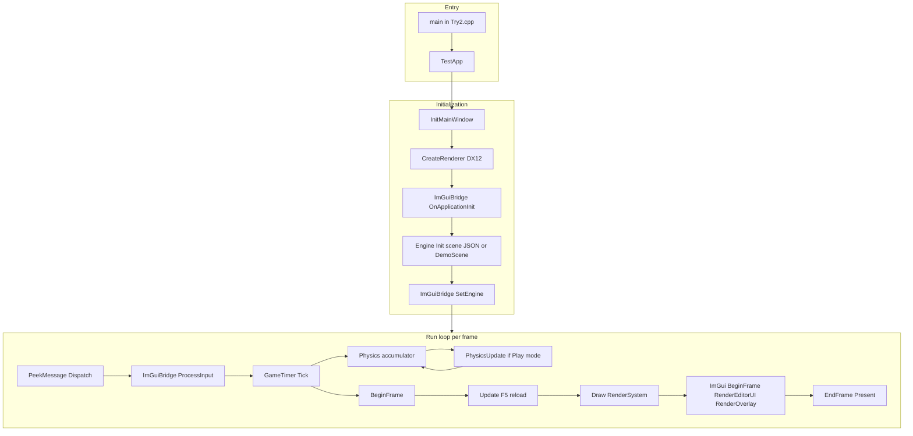
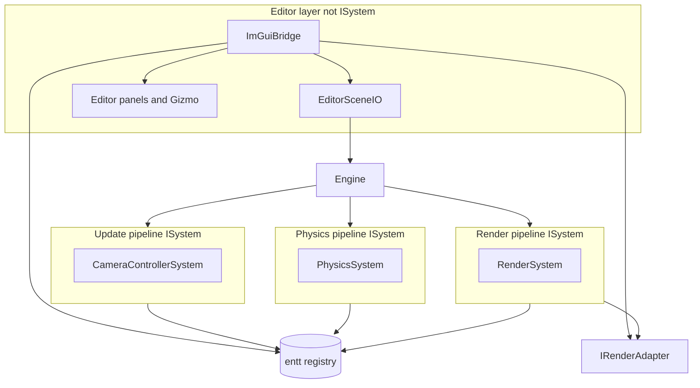
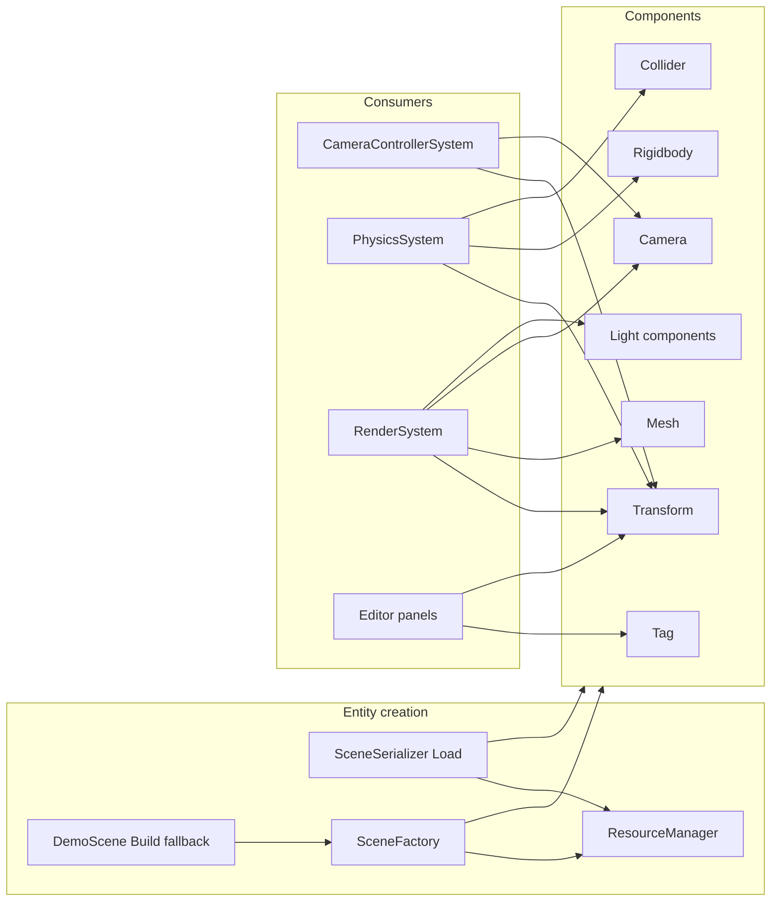
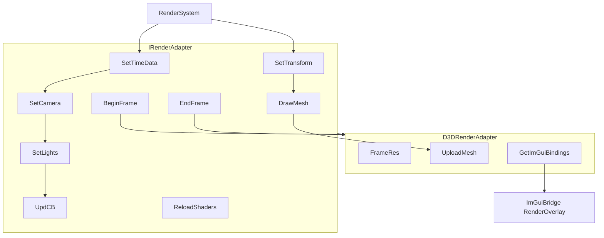
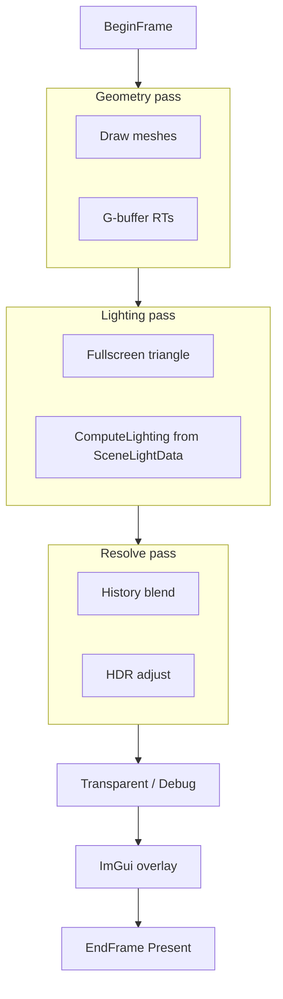
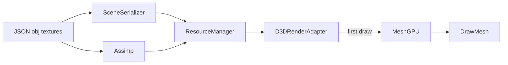
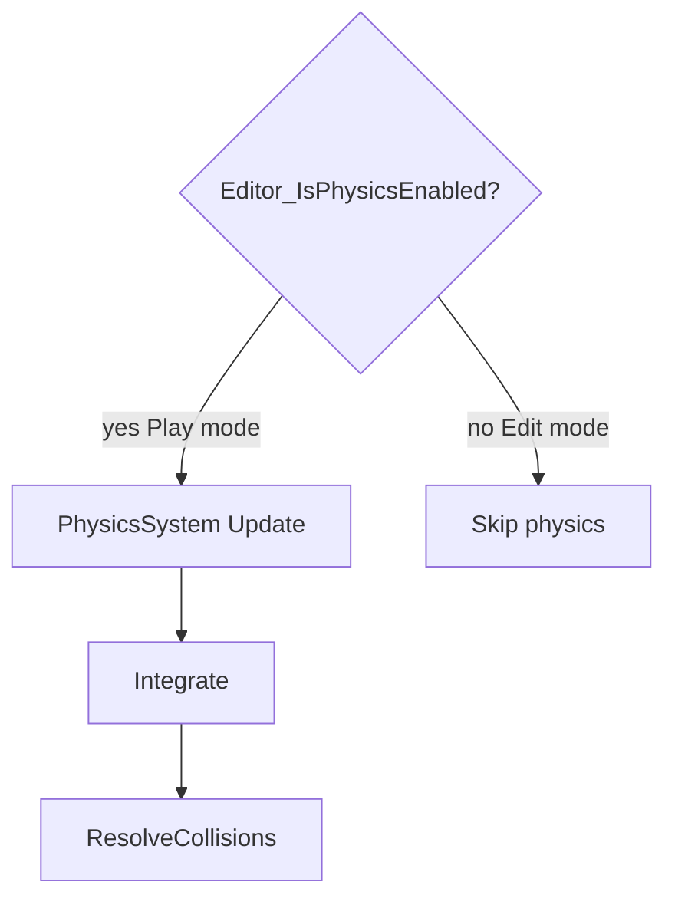
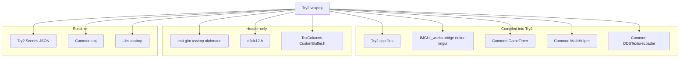
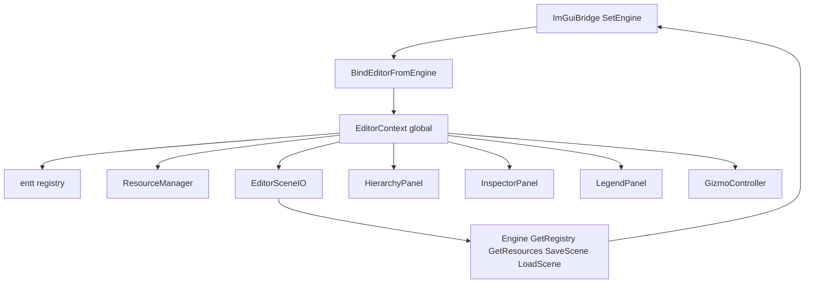
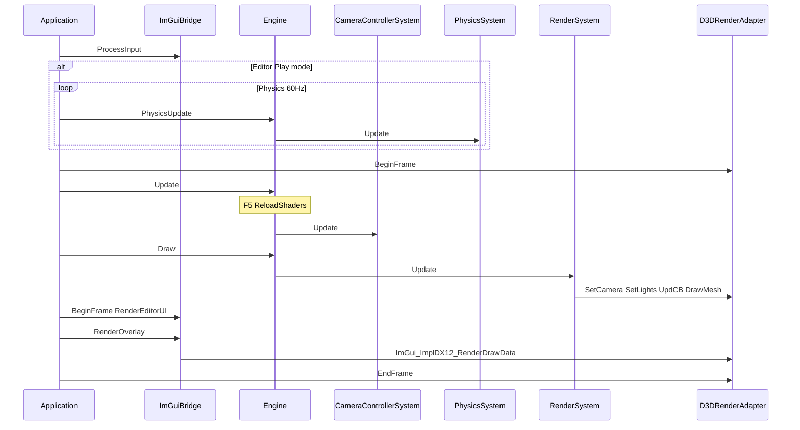

# Try2 — Структура кода

Структурный справочник проекта **Try2**: раскладка, модули, ECS, API, диаграммы Mermaid и многоуровневый индекс исходников. Охват — [`Try2.sln`](../LSEngine/Chapter%209%20Texturing/Try2/Try2.sln), если не помечено как вспомогательное.

- Обзор → [01-project-overview.md](01-project-overview.md)
- Технологии → [02-technologies-and-patterns.md](02-technologies-and-patterns.md)
- Дополнения редактора → [04-editor-additions.md](04-editor-additions.md)
- Слияние + ImGui → [Changes/README.md](../Changes/README.md)

---

## Раскладка проекта Try2

```
LSEngine/                                 # Корень git-репозитория
├── IMGUI_works/                          # Редактор + Dear ImGui + ImGuizmo (компилируется в Try2)
│   ├── src/ImGuiBridge.*, ImGuiPlatform.*
│   ├── src/Editor/                      # Панели, EditorContext, Gizmo
│   └── ThirdParty/imgui, ImGuizmo
├── Common/                               # GameTimer, EnTT, GLM, obj-ассеты
└── Chapter 9 Texturing/Try2/            # Корень продукта — открывайте Try2.sln здесь
    ├── Try2.sln
    ├── Try2.vcxproj                     # IMGUI_WORKS = ../../IMGUI_works
    ├── Try2.cpp, Application.*, Engine.*, ...
    ├── Scenes/DemoScene.json            # Сцена по умолчанию на данных
    ├── Shaders/                         # Авторитетные HLSL (7 файлов)
    ├── Libs/assimp-vc143-mt.lib
    │
    │  Компилируется из ../../Common/:
    │    GameTimer, MathHelper, DDSTextureLoader
    │
    └── Header include из ../TexColumns/:
          CustomBuffer.h
```

**Рантайм-ассеты:** `../../Common/obj/`, JSON сцен под `Scenes/`.

---

## Таблица ответственности модулей

### Код Try2

| Модуль | Ответственность |
|--------|----------------|
| `Try2.cpp` / `TestApp` | Точка входа; `ImGuiBridge::SetEngine` после init |
| `Application` | Цикл Win32, жизненный цикл ImGui, оверлей после `Draw` |
| `Engine` | Системы, JSON load/save, F5 reload, шлюз физики, `SaveScene`/`LoadScene`, доступ для редактора |
| `World` | Держатель `entt::registry` |
| `Commons.h` | Компоненты (вкл. свет), `SceneLightData`, `IRenderAdapter` |
| `CameraControllerSystem` | FPS-камера; пропуск при захвате ввода ImGui |
| `PhysicsSystem` | Интеграция + AABB; подсчёт `PhysicsStats` |
| `RenderSystem` | Камера, **сбор ECS-света**, отрисовка мешей |
| `PhysicsCommons.h` | Математика коллайдеров + пространство имён `PhysicsStats` |
| `ResourceManager` | CPU-ассеты, Assimp |
| `D3DRenderAdapter` | D3D12, отложенные проходы, `ReloadShaders`, `GetImGuiBindings` |
| `FrameRes` / `d3dUtils` | Кольца CB, компиляция шейдеров |
| `SceneFactory` / `DemoScene` | Рецепты сущностей; процедурный запасной уровень |
| `SceneSerializer` | JSON load/save с мешами, материалами, светом |

### LSEngine/IMGUI_works (компилируется в Try2)

| Модуль | Ответственность |
|--------|----------------|
| `ImGuiBridge` | Публичный API: init, frame, overlay, `WantsCaptureInput`, `SetEngine`; ленивый init на `~` |
| `ImGuiPlatform` | Проверка `.imgui_on`, переключение `~` |
| `EditorContext` | Registry/resources, выделение, Edit/Play, `statusMessage`, `restoreSceneOnStop`, переключатели панелей |
| `EditorSceneIO` | File Save/Load, снимок Play, `RestorePlaySnapshot` |
| `EditorUI` | Меню (File), панель (Play/Stop), строка статуса, оркестрация панелей |
| `HierarchyPanel` | Список **всех** сущностей (tag, mesh, camera, свет, физика) |
| `InspectorPanel` | Transform, tag, mesh, rigidbody, collider, **свет**; отключён в Play |
| `ViewportPanel` | Оформление viewport (сцена рисуется под UI) |
| `StatisticsPanel` | Мгновенный FPS + среднее за 1 с, число сущностей, коллизии |
| `LegendPanel` | Legend / Help — горячие клавиши, глоссарий gizmo, пути файлов |
| `GizmoController` | ImGuizmo в режиме Edit |

### Связано из Common

| Модуль | Ответственность |
|--------|----------------|
| `GameTimer` | Тайминг кадра |
| `MathHelper` | Матрицы GPU |
| `DDSTextureLoader` | Текстуры DDS |

### Вспомогательный заголовок

| Модуль | Ответственность |
|--------|----------------|
| `CustomBuffer` (TexColumns) | Хелперы G-buffer RT в `D3DRenderAdapter` |

### Хуки Try2 для редактора (минимальная поверхность)

| Файл | Хук |
|------|------|
| `Application.cpp` | init/shutdown/resize `ImGuiBridge`; оверлей в цикле; пересылка `WndProc` |
| `Try2.cpp` | `SetEngine` |
| `Engine.cpp` | `Editor_IsPhysicsEnabled()` в `PhysicsUpdate`; `SaveScene`/`LoadScene` |
| `EditorSceneIO` (через меню) | Вызовы `Engine::SaveScene` / `LoadScene` |
| `CameraControllerSystem.cpp` | Ранний выход при `WantsCaptureInput()` |
| `D3DRenderAdapter` | `Dx12ImGuiBindings`, поддиапазон дескрипторов для ImGui |

---

## Компоненты ECS

| Компонент | Поля (кратко) | Используется |
|-----------|------------------|---------|
| `TransformComponent` | `position`, `rotation`, `scale` | Все системы; мировая матрица |
| `MeshComponent` | `meshID` | `RenderSystem` |
| `CameraComponent` | `fov`, planes, `aspectRatio`, кэш матриц | Камера + рендер |
| `TagComponent` | `tag` | Serializer, панель Hierarchy |
| `RigidbodyComponent` | `type`, `velocity`, `mass`, `useGravity` | `PhysicsSystem`, Inspector |
| `ColliderComponent` | AABB/sphere, restitution, friction | `PhysicsSystem`, Inspector |
| `DirectionalLightComponent` | `color`, `intensity`, `direction`, `enabled` | `RenderSystem` |
| `PointLightComponent` | color, intensity, falloff, `enabled` | `RenderSystem` (нужен `Transform`) |
| `SpotLightComponent` | color, direction, spot power, falloff, `enabled` | `RenderSystem` (нужен `Transform`) |

**Лимиты GPU** (`Commons.h`): `RenderDirectionalLightCount` = 1, `RenderPointLightCount` = 2, `RenderSpotLightCount` = 3.

### Типичные сущности

| Тип | Компоненты |
|------|------------|
| Статический пол | `Transform`, `Mesh`, `Tag`, `Rigidbody`(Static), `Collider` |
| Динамическое тело | `Transform`, `Mesh`, `Tag`, `Rigidbody`(Dynamic), `Collider` |
| Камера | `Transform`, `Camera`, `Tag` |
| Направленный свет | `DirectionalLight` (опционально `Tag`) |
| Точечный свет | `Transform`, `PointLight`, `Tag` |
| Прожектор | `Transform`, `SpotLight`, `Tag` |

---

## Диаграмма A — Жизненный цикл приложения Try2



---

## Диаграмма B — Системы движка Try2 и слой редактора



| Фаза | Частота | Компонент |
|-------|-----------|-----------|
| `Update` | 1× / кадр | `CameraControllerSystem`; F5 обрабатывает `Engine` |
| `PhysicsUpdate` | 0–5× / 60 Гц | `PhysicsSystem` если `Editor_IsPhysicsEnabled()` |
| `Draw` | 1× / кадр | `RenderSystem` |
| UI редактора | 1× / кадр после `Draw` | `ImGuiBridge` → `Editor_*` |

---

## Диаграмма C — Поток сущностей ECS Try2



---

## Диаграмма D — Контракт адаптера рендеринга Try2



| Метод | Вызывающий | Назначение |
|--------|--------|---------|
| `SetLights` | `RenderSystem` | Загрузка `SceneLightData` из ECS light view |
| `ReloadShaders` | `Engine::Update` по F5 | Пересборка PSO из `Try2/Shaders/` |
| `GetImGuiBindings` | `ImGuiBridge` (ленивый init) | Device, queue, command list, срез SRV-кучи |
| `BeginFrame` / `EndFrame` | `Application` | Синхронизация кадра и present |

---

## Диаграмма E — Отложенные GPU-проходы Try2



---

## Диаграмма F — Путь ресурсов Try2



---

## Диаграмма G — Цикл физики Try2



---

## Диаграмма H — Зависимости сборки Try2



---

## Диаграмма I — Связка редактора и ECS



---

## Последовательность за кадр (Try2)



---

## Краткий справочник классов и API

### Application и мост

| Класс / API | Ключевые члены |
|-------------|-------------|
| `Application` | `Run`, `Initialize`, `MsgProc`, хуки ImGui |
| `TestApp` | Делегирует в `mEngine` |
| `ImGuiBridge` | `SetEngine`, `OnApplicationInit`, `RenderOverlay`, `WantsCaptureInput`, `IsLicensed` |

### Ядро движка

| Класс | Ключевой API |
|-------|---------|
| `Engine` | `Init`, `Update`, `PhysicsUpdate`, `Draw`, `GetRegistry`, `GetResources`, `GetWorld`, `SaveScene`, `LoadScene` |
| `World` | `registry` |
| `FrameContext` | `timer`, `input`, `physDT` |

### Системы

| Класс | Роль |
|-------|------|
| `CameraControllerSystem` | FPS-камера; шлюз ввода ImGui |
| `PhysicsSystem` | Интеграция + коллизии |
| `RenderSystem` | Свет + камера + меши |

### Редактор (IMGUI_works)

| API | Роль |
|-----|------|
| `Editor_SetContext` / `Editor_GetContext` | Глобальное состояние редактора |
| `Editor_IsPhysicsEnabled` | Play vs Edit |
| `Editor_CanEditComponents` | Редактирование Inspector/gizmo только в Edit |
| `Editor_BeginFrame` / `Editor_RenderUI` | Проход панелей |
| `Editor_RenderGizmo` | ImGuizmo |
| `Editor_DrawLegend` | Окно Legend / Help |
| `EditorSceneIO` | Save, Load, BeginPlay, EndPlay, RestorePlaySnapshot |

### Рендеринг

| Класс | Ключевой API |
|-------|---------|
| `IRenderAdapter` | `SetLights`, `ReloadShaders`, кадр, отрисовка |
| `D3DRenderAdapter` | `GetImGuiBindings`, `BuildPSOs`, `UploadMesh` |
| `Dx12ImGuiBindings` | POD GPU-дескрипторы для бэкенда ImGui |

---

## Индекс исходных файлов

### Уровень 1 — исходники проекта Try2

| Файл | Роль |
|------|------|
| `Try2.cpp` | `main()`, `TestApp`, `SetEngine` |
| `Application.cpp/h` | Цикл, Win32, интеграция ImGui |
| `Engine.cpp/h` | Системы, load/save сцены, F5, шлюз физики |
| `PhysicsCommons.h` | Математика коллайдеров, `PhysicsStats` |
| `World.cpp/h` | Registry |
| `Commons.cpp/h` | Компоненты, свет, интерфейсы |
| `CameraControllerSystem.cpp/h` | Камера + захват ImGui |
| `PhysicsSystem.cpp/h` | Физика |
| `RenderSystem.cpp/h` | Свет, камера, отрисовка |
| `ResourceManager.cpp/h` | Ассеты |
| `D3DRenderAdapter.cpp/h` | Рендерер, привязки ImGui, reload |
| `FrameRes.cpp/h`, `d3dUtils.cpp/h` | GPU-хелперы |
| `SceneFactory.cpp/h`, `DemoScene.cpp/h` | Настройка уровня |
| `SceneSerializer.cpp/h` | JSON I/O |

**Данные:** `Scenes/DemoScene.json`

**Шейдеры:** `Try2/Shaders/` (7 файлов HLSL)

### Уровень 1b — IMGUI_works (компилируется Try2)

| Файл | Роль |
|------|------|
| `src/ImGuiBridge.cpp/h` | Публичный API |
| `src/ImGuiPlatform.cpp/h` | Лицензия + переключение |
| `src/Editor/EditorContext.cpp/h` | Состояние редактора, `statusMessage`, `restoreSceneOnStop` |
| `src/Editor/EditorSceneIO.cpp/h` | I/O save/load/снимок play |
| `src/Editor/EditorUI.cpp` | Меню, панель, статус |
| `src/Editor/HierarchyPanel.cpp` | Список всех сущностей |
| `src/Editor/InspectorPanel.cpp` | Компоненты + свет |
| `src/Editor/ViewportPanel.cpp` | UI viewport |
| `src/Editor/StatisticsPanel.cpp` | Среднее FPS, коллизии |
| `src/Editor/LegendPanel.cpp` | Legend / Help |
| `src/Editor/GizmoController.cpp` | ImGuizmo |
| ThirdParty | ядро imgui + бэкенды, ImGuizmo (без построчного списка) |

### Уровень 2 — Common (компилируется)

| Файл | Роль |
|------|------|
| `GameTimer.cpp/h` | Тайминг |
| `MathHelper.cpp/h` | Матрицы |
| `DDSTextureLoader.cpp/h` | DDS |

### Уровень 3 — Вспомогательное

| Элемент | Примечание |
|------|------|
| `TexColumns/CustomBuffer.*` | Используется заголовок; `.cpp` не в vcxproj |
| `TexColumns.sln` | Не сборка продукта |
| `LSEngine/Shaders/` | Дубликат `Try2/Shaders/` |

---

## Ключевые функции (Try2)

| Подсистема | Функции |
|-----------|-----------|
| `Engine::Init` | Регистрация систем; `SceneSerializer::Load` или `DemoScene::Build` |
| `Engine::Update` | Update-системы; **F5** → `ReloadShaders()` |
| `Engine::PhysicsUpdate` | No-op в Edit при лицензированном редакторе |
| `Engine::SaveScene` / `LoadScene` | JSON I/O во время выполнения для меню File |
| `RenderSystem::Update` | Сбор light view → `SetLights`; отрисовка мешей |
| `SceneSerializer::Load` | Десериализация world + общий `ResourceManager` |
| `EditorSceneIO::BeginPlay` | Снимок в `EditorPlaySnapshot.json`, mode = Play |
| `PhysicsStats::AddCollision` | Инкремент за пару столкновений в физике |
| `ImGuiBridge::SetEngine` | Привязка registry/resources к `EditorContext` |

---

## Порядок чтения (для контрибьюторов Try2)

1. `Try2.cpp`
2. `Application.cpp` — цикл, порядок оверлея ImGui
3. `Engine.cpp` — загрузка сцены, F5, шлюз физики
4. `RenderSystem.h` — ECS-свет
5. `D3DRenderAdapter.cpp` — отложенные проходы, привязки ImGui
6. [`IMGUI_works/src/ImGuiBridge.h`](../LSEngine/IMGUI_works/src/ImGuiBridge.h) — поверхность API редактора
7. [04-editor-additions.md](04-editor-additions.md) — save/load, снимок Play, статистика, ленивый init
8. [Changes/IMGUI-Editor-System.md](../Changes/IMGUI-Editor-System.md) — базовая интеграция ImGui
9. `Try2/Shaders/GeometryPass.hlsl` + `LightingPass.hlsl`
