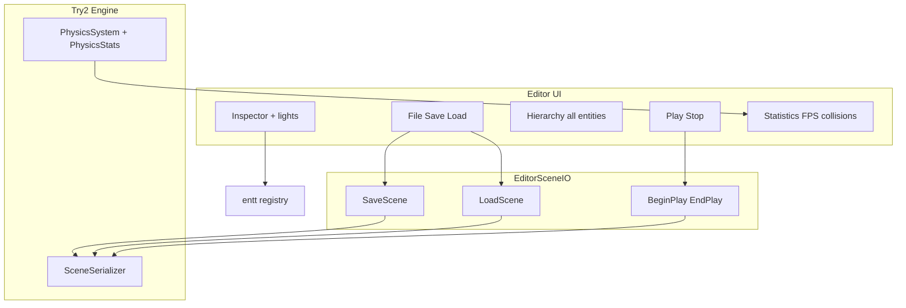
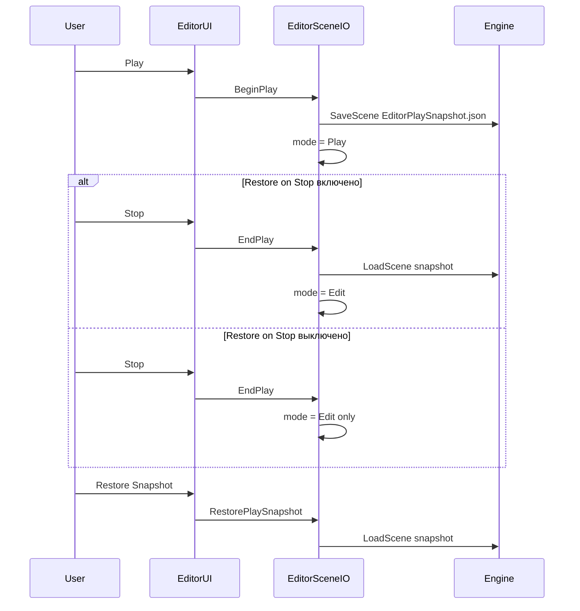
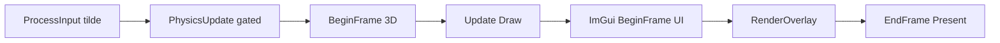

# Дополнения редактора (пункты 1–10)

Документация по десяти улучшениям редактора после ревью. Источник плана: [Tasks/Editor-Additions-Plan.md](../Tasks/Editor-Additions-Plan.md).

---

## Сводка

| № | Функция | Статус |
|---|---------|--------|
| 1 | File → Save / Load | Готово — `Scenes/EditorSave.json` |
| 2 | Снимок Play / восстановление при Stop | Готово — `Scenes/EditorPlaySnapshot.json` |
| 3 | Inspector + gizmo заблокированы в Play | Готово |
| 4 | Компоненты света в Inspector | Готово |
| 5 | Счётчик коллизий в Statistics | Готово |
| 6 | Среднее FPS за 1 секунду | Готово |
| 7 | Ленивая инициализация ImGui (только при видимости) | Готово |
| 8 | Hierarchy показывает все сущности | Готово |
| 9 | Окно Legend / Help + расширенные подписи | Готово |
| 10 | Отладка: опциональное восстановление при Stop + кнопка Restore Snapshot | Готово |

---

## Архитектура после изменений

---

## 1. File → Save / Load

**Меню:** File → Save Scene / Load Scene (пути показаны в подписи пункта меню).

**Пути:** `Scenes/EditorSave.json` (относительно рабочей директории процесса, как при загрузке сцены при старте в [`Engine.cpp`](../LSEngine/Chapter%209%20Texturing/Try2/Engine.cpp)).

**Реализация:**

| Часть | Расположение |
|-------|----------|
| API движка | [`Engine::SaveScene` / `LoadScene`](../LSEngine/Chapter%209%20Texturing/Try2/Engine.h) |
| Сериализатор | [`SceneSerializer::Save` / `Load`](../LSEngine/Chapter%209%20Texturing/Try2/SceneSerializer.h) |
| Связка UI | [`EditorSceneIO::SaveScene` / `LoadScene`](../LSEngine/IMGUI_works/src/Editor/EditorSceneIO.cpp) |
| Меню | [`EditorUI.cpp`](../LSEngine/IMGUI_works/src/Editor/EditorUI.cpp) |

Load очищает registry, затем перезагружает с живым `ResourceManager`, чтобы ID мешей оставались валидными.

**Примечание:** Save сериализует сущности с `TagComponent` и `TransformComponent` (контракт сериализатора). Объекты без тега могут не попасть в JSON.

**Строка статуса:** На панели инструментов показывается `EditorContext::statusMessage` после ошибок или успеха save/load.

---

## 2. Снимок Play, Stop и элементы восстановления

| Шаг | Действие |
|------|--------|
| **Play** | Записывает [`Scenes/EditorPlaySnapshot.json`](../LSEngine/IMGUI_works/src/Editor/EditorSceneIO.h), затем `EditorMode::Play` |
| **Stop** | Всегда возврат в `Edit`. Загрузка снимка **только если** `EditorContext::restoreSceneOnStop` = true (по умолчанию **false**) |
| **Restore Snapshot** | [`EditorSceneIO::RestorePlaySnapshot`](../LSEngine/IMGUI_works/src/Editor/EditorSceneIO.cpp) — ручная перезагрузка; работает в Play или Edit |

### UI отладки

| Элемент | Расположение |
|---------|----------|
| **Restore scene on Stop** | Чекбокс в меню Debug; чекбокс на панели Play (`restoreSceneOnStop`) |
| **Restore Play Snapshot Now** | Пункт меню Debug |
| **Restore Snapshot** | Кнопка на панели инструментов в режиме Play |

Поле: [`EditorContext::restoreSceneOnStop`](../LSEngine/IMGUI_works/src/Editor/EditorContext.h) — по умолчанию `false`.

---

## 3. Редактирование компонентов только в Edit

**Хелпер:** `Editor_CanEditComponents()` в [`EditorContext.cpp`](../LSEngine/IMGUI_works/src/Editor/EditorContext.cpp) — true только в режиме `Edit`.

| UI | Поведение в Play |
|----|----------------|
| **Inspector** | `ImGui::BeginDisabled()` + подсказка |
| **Gizmo** | Уже пропускается при `mode != Edit` ([`GizmoController.cpp`](../LSEngine/IMGUI_works/src/Editor/GizmoController.cpp)) |

Физика в Play работает при лицензированном редакторе ([`Editor_IsPhysicsEnabled`](../LSEngine/IMGUI_works/src/Editor/EditorContext.cpp)).

---

## 4. Inspector — компоненты света

Редактируются при выборе и в режиме Edit:

| Компонент | Поля |
|-----------|--------|
| `DirectionalLightComponent` | enabled, color, intensity, direction |
| `PointLightComponent` | enabled, color, intensity, falloff start/end |
| `SpotLightComponent` | enabled, color, intensity, direction, falloff, spot power |

См. [`InspectorPanel.cpp`](../LSEngine/IMGUI_works/src/Editor/InspectorPanel.cpp). Предпросмотр в реальном времени: [`RenderSystem`](../LSEngine/Chapter%209%20Texturing/Try2/RenderSystem.h) собирает ECS-свет каждый кадр.

---

## 5. Статистика коллизий

**API:** `PhysicsStats` в [`PhysicsCommons.h`](../LSEngine/Chapter%209%20Texturing/Try2/PhysicsCommons.h):

- `ResetFrameCollisionCount()` — в начале `PhysicsSystem::Update`
- `AddCollision()` — каждая пара столкновений в `ResolveCollisions`
- `GetFrameCollisionCount()` — отображается в панели Statistics

**Отображение:** `Collisions (this frame): N` в [`StatisticsPanel.cpp`](../LSEngine/IMGUI_works/src/Editor/StatisticsPanel.cpp).

Счёт — пары за шаг физики (может превышать «уникальные контакты» при нескольких подшагах).

---

## 6. FPS — среднее за 1 секунду

[`StatisticsPanel.cpp`](../LSEngine/IMGUI_works/src/Editor/StatisticsPanel.cpp) хранит скользящее окно сэмплов `DeltaTime` (~1 с суммарно). Показывает:

- **FPS (instant)** — `1 / dt`
- **FPS (1s avg)** — `sampleCount / totalSeconds` по окну

Соответствует шагу 8 TaskIMGUI (сглаженный FPS).

---

## 7. Ленивая инициализация ImGui

**Было:** `WndProcHandler` вызывал `EnsureInitialized()` при наличии `.imgui_on` — ImGui стартовал на первом сообщении Windows, даже если UI скрыт.

**Стало** ([`ImGuiBridge.cpp`](../LSEngine/IMGUI_works/src/ImGuiBridge.cpp)):

| Событие | Поведение |
|-------|----------|
| `WndProcHandler` | Пересылка в ImGui только если `g_Initialized` |
| `ProcessInput` (`~` вкл.) | Видимость + `EnsureInitialized()` |
| `BeginFrame` | По-прежнему вызывает `EnsureInitialized()` как запасной вариант |

Контекст ImGui и загрузка шрифтов DX12 не создаются, пока пользователь не откроет оверлей клавишей `~`.

---

## 8. Hierarchy — все сущности

[`HierarchyPanel.cpp`](../LSEngine/IMGUI_works/src/Editor/HierarchyPanel.cpp) строит уникальный набор из view:

- Tag, Transform, Mesh, Camera  
- Directional / Point / Spot light  
- Rigidbody, Collider  

**Подписи:** имя тега, роль («Camera», «Point Light», …) или `Entity {id}`.

Счётчик сущностей вверху панели. Панель Statistics использует то же объединение для общего числа сущностей.

---

## Цикл кадра (порядок без изменений)

---

## Изменённые файлы (индекс)

### Try2 (`LSEngine/Chapter 9 Texturing/Try2/`)

| Файл | Изменение |
|------|--------|
| `Engine.h` / `Engine.cpp` | `SaveScene`, `LoadScene` |
| `PhysicsCommons.h` | Пространство имён `PhysicsStats` |
| `PhysicsSystem.cpp` | Сброс/подсчёт коллизий |
| `Try2.vcxproj` | Компиляция `EditorSceneIO.cpp` |

### LSEngine/IMGUI_works

| Файл | Изменение |
|------|--------|
| `Editor/EditorSceneIO.h` / `.cpp` | **Новый** — save/load/снимок play |
| `Editor/EditorContext.h` / `.cpp` | `statusMessage`, `Editor_CanEditComponents` |
| `Editor/EditorUI.cpp` | Меню, Play/Stop, статус |
| `Editor/InspectorPanel.cpp` | Свет, отключение в Play |
| `Editor/HierarchyPanel.cpp` | Список всех сущностей |
| `Editor/StatisticsPanel.cpp` | Среднее FPS, коллизии |
| `ImGuiBridge.cpp` | Ленивая инициализация |

### Документация

| Файл | Изменение |
|------|--------|
| `Tasks/Editor-Additions-Plan.md` | План (эта работа) |
| `ORu/04-editor-additions.md` | Этот документ |

---

## Как проверить (вручную)

1. Сборка Debug | x64; положите `.imgui_on` рядом с `Try2.exe`.
2. Нажмите `~` — UI появляется (до `~` ImGui нет).
3. **File → Save** — проверьте `Scenes/EditorSave.json` в cwd (часто каталог проекта или `x64/Debug`).
4. Сдвиньте сущность; **Load** — transform возвращается к сохранённому файлу.
5. **Play** — физика работает; Inspector для редактирования отключён.
6. **Stop** — сцена совпадает со снимком до Play.
7. Выберите сущность-свет — измените color/intensity в Inspector.
8. **Statistics** — счётчик коллизий > 0 при пересечении объектов в Play; среднее FPS стабилизируется.

---

## 10. Элементы отладочного восстановления (опционально при Stop)

См. §2 выше. Используйте, когда нужно сохранить результат физики после Stop, но вручную перезагрузить файл до Play.

---

## 9. Окно Legend и расширенные подписи

**Окно:** `Legend / Help` (по умолчанию включено; переключатель в меню View).

**Файл:** [`LegendPanel.cpp`](../LSEngine/IMGUI_works/src/Editor/LegendPanel.cpp)

**Разделы:**

- Быстрый старт (`.imgui_on`, `~`, выделение)
- Edit vs Play и поведение снимка
- Описание окон меню View
- Панель gizmo (Translate / Rotate / Scale / Local space) с подсказками
- Пути меню File
- Таблица аббревиатур (ECS, FPS, WYSIWYG, PLACEHOLDER, …)
- Глоссарий полей Inspector

**Обновления подписей:** Scene Hierarchy, Inspector — Component Properties, Viewport — 3D Preview Info, Statistics — Performance, полные имена кнопок gizmo, индикатор режима на панели инструментов.

---

## Оставшиеся пробелы (не в пунктах 1–8)

| Элемент | Примечания |
|------|-------|
| ImGui docking | Нужна ветка ImGui с docking |
| Viewport render-to-texture | Offscreen RT для встроенного вида |
| Undo/redo, браузер ассетов, редактор материалов | Окна PLACEHOLDER |
| Восстановление Play при отсутствии файла снимка | Ошибка в строке статуса |
| Статистика памяти GPU | PLACEHOLDER |
| Иерархия родитель-потомок | Нужен `HierarchyComponent` |

См. также [Changes/IMGUI-Editor-System.md](../Changes/IMGUI-Editor-System.md) для базовой интеграции.
