# Движок Try2 — полный обзор

Единый объединённый справочник по движку **Try2** DirectX 12 ([`Try2.sln`](../LSEngine/Chapter%209%20Texturing/Try2/Try2.sln)). Документ объединяет [README.md](README.md), [01-project-overview.md](01-project-overview.md), [02-technologies-and-patterns.md](02-technologies-and-patterns.md), [03-code-structure.md](03-code-structure.md) и сжатую [04-editor-additions.md](04-editor-additions.md).

Подробнее о слиянии и ImGui: [Changes/README.md](../Changes/README.md).

---

## Содержание

### Вводная часть

| Раздел | Описание |
|---------|-------------|
| [Карта документов](#карта-документов) | Связь этого файла с раздельными документами ORu и Changes |
| [Область охвата](#область-охвата) | В области и вне области документации Try2 |
| [Краткая сборка](#краткая-сборка) | Открытие решения, зависимости, опциональный редактор `.imgui_on` |

### Часть 1 — Обзор проекта

| Раздел | Описание |
|---------|-------------|
| [Краткое резюме](#краткое-резюме) | Что такое Try2: ECS, отложенный рендеринг, редактор, JSON-сцены |
| [Происхождение проекта](#происхождение-проекта) | Luna → Try2; влитые ветки FromScratch и ImGui |
| [Приложение Try2](#приложение-try2) | Решение, точка входа, цикл кадра, матрица возможностей |
| [Прочие материалы в LSEngine](#прочие-материалы-в-lsengine) | IMGUI_works, Common, TexColumns, дубликат шейдеров |
| [В работе и известные пробелы](#в-работе-и-известные-пробелы) | Заглушка Vulkan, пробелы редактора, связность |
| [Как собрать](#как-собрать) | Пошаговая сборка и запуск |

### Часть 2 — Технологии и паттерны

| Раздел | Описание |
|---------|-------------|
| [Основной стек](#основной-стек-продукт-try2) | C++20, D3D12, EnTT, Assimp, ImGui, nlohmann/json |
| [Уровни зависимостей](#уровни-зависимостей) | Try2, IMGUI_works, Common compiled/headers, вспомогательное |
| [Архитектурные паттерны](#архитектурные-паттерны-try2) | Адаптер, конвейеры ECS, мост редактора, Edit/Play, освещение |
| [Конвейер шейдеров](#конвейер-шейдеров-try2shaders) | Семь файлов HLSL и поток GPU-проходов |
| [Наблюдения по дизайну](#наблюдения-по-дизайну) | Сильные стороны и технический долг |

### Часть 3 — Структура кода

| Раздел | Описание |
|---------|-------------|
| [Раскладка проекта Try2](#раскладка-проекта-try2) | Дерево каталогов: Try2, IMGUI_works, Common, Scenes |
| [Таблица ответственности модулей](#таблица-ответственности-модулей) | Все основные модули и файлы-хуки редактора |
| [Компоненты ECS](#компоненты-ecs) | Transform, mesh, camera, свет, физика, теги |
| [Диаграммы A–I](#диаграмма-a--жизненный-цикл-приложения-try2) | Жизненный цикл, системы, ECS, рендеринг, физика, сборка, редактор |
| [Последовательность за кадр](#последовательность-за-кадр-try2) | Диаграмма последовательности одного кадра |
| [Краткий справочник классов и API](#краткий-справочник-классов-и-api) | Application, Engine, системы, редактор, рендерер |
| [Индекс исходных файлов](#индекс-исходных-файлов) | Многоуровневый список: Try2, IMGUI_works, Common, вспомогательное |
| [Ключевые функции](#ключевые-функции-try2) | Engine, RenderSystem, serializer, EditorSceneIO, ImGuiBridge |
| [Порядок чтения](#порядок-чтения-для-контрибьюторов-try2) | Рекомендуемый путь онбординга по кодовой базе |

### Часть 4 — Дополнения редактора

| Раздел | Описание |
|---------|-------------|
| [Сводка](#сводка) | Таблица статуса пунктов 1–10 |
| [Архитектура](#архитектура) | Поток EditorSceneIO → Engine → serializer |
| [Ключевое поведение](#ключевое-поведение) | Ленивый init, save/load, снимок Play, Inspector, статистика |
| [Оставшиеся пробелы](#оставшиеся-пробелы) | Docking, viewport RT, undo, заглушки |

---

## Карта документов

| Ресурс | Когда использовать |
|----------|----------|
| **Этот файл (`TotalOverview.md`)** | Полная архитектура в одном месте |
| [README.md](README.md) | Краткий указатель на раздельные документы |
| [01-project-overview.md](01-project-overview.md) | Только повествование |
| [02-technologies-and-patterns.md](02-technologies-and-patterns.md) | Только стек и паттерны |
| [03-code-structure.md](03-code-structure.md) | Только диаграммы и индекс файлов |
| [04-editor-additions.md](04-editor-additions.md) | Пункты редактора 1–10 — проверка и пути к файлам |
| [Changes/README.md](../Changes/README.md) | Детали слияния, внутренности ImGui |

---

## Область охвата

| В области | Вне области |
|----------|--------------|
| **Продукт:** [`Try2/`](../LSEngine/Chapter%209%20Texturing/Try2/) и [`Try2.sln`](../LSEngine/Chapter%209%20Texturing/Try2/Try2.sln) | Приложение TexColumns (`TexColumns.sln`) |
| **GUI (компилируется):** [`LSEngine/IMGUI_works/`](../LSEngine/IMGUI_works/) через `Try2.vcxproj` | Внутренности вендоров Dear ImGui / ImGuizmo |
| **Сцены:** [`Try2/Scenes/`](../LSEngine/Chapter%209%20Texturing/Try2/Scenes/) (напр. `DemoScene.json`) | |
| **Скомпилированные зависимости:** `../../Common/` — `GameTimer`, `MathHelper`, `DDSTextureLoader` | Неиспользуемые модули Luna в Common (`d3dApp`, `Camera`, `model`, …) |
| **Заголовочные зависимости:** EnTT, GLM, Assimp, nlohmann, `d3dx12.h` | Внутренности вендорных библиотек |
| **Вспомогательный include:** `../TexColumns/CustomBuffer.h` | Дублирующее дерево `LSEngine/Shaders/` |

---

## Краткая сборка

1. Откройте **`LSEngine/Chapter 9 Texturing/Try2/Try2.sln`** в Visual Studio 2022.
2. Конфигурация: **Debug | x64**.
3. Убедитесь, что `Try2/Libs/assimp-vc143-mt.lib` на месте.
4. Убедитесь, что **`LSEngine/IMGUI_works/`** существует (корень LSEngine, рядом с `Chapter 9 Texturing/`).
5. Задайте `AdditionalIncludeDirectories` = `$(SolutionDir)..\..\Common`, если жёсткий путь в `Try2.vcxproj` не подходит вашей машине.
6. **Опциональный редактор:** создайте **`.imgui_on`** рядом с `Try2.exe`. Нажмите **`~`**, чтобы переключить UI (ленивая инициализация ImGui).

---

# Часть 1 — Обзор проекта

## Краткое резюме

**Try2** — игровой движок на Windows с DirectX 12, собранный как единое решение Visual Studio ([`Try2.sln`](../LSEngine/Chapter%209%20Texturing/Try2/Try2.sln)). Он вырос из курса Frank Luna *Introduction to 3D Game Programming with DirectX 12*, но теперь имеет собственную архитектуру:

- **ECS**-мир на EnTT (`World`, компоненты, системы)
- **Адаптер рендерера** — `IRenderAdapter` / `D3DRenderAdapter` изолирует D3D12 от игровой логики
- **Отложенный рендеринг** — geometry pass → lighting pass → resolve pass (`Try2/Shaders/`)
- **ECS-освещение** — компоненты направленного, точечного и прожекторного света управляют отложенным проходом
- **Сцены на данных** — загрузка JSON через `SceneSerializer` с запасным вариантом `DemoScene`
- **Опциональный редактор сцен** — Dear ImGui + ImGuizmo в [`LSEngine/IMGUI_works/`](../LSEngine/IMGUI_works/), интеграция через `ImGuiBridge`
- **Assimp** для загрузки ассетов и лёгкий слой **физики** (AABB, гравитация; только в режиме Play при активном редакторе)
- **Инструменты разработки** — **F5** перезагружает HLSL-шейдеры во время выполнения

Папка **LSEngine** — корень git-репозитория. **Try2** (`Chapter 9 Texturing/Try2/`) — активный продукт; **`IMGUI_works/`** в корне LSEngine содержит редактор (компилируется в Try2); **Common/** — общие заголовки и ассеты; остальные папки глав — исторические примеры.

---

## Происхождение проекта

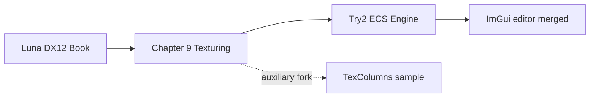

| Этап | Что это | Связь с Try2 |
|-------|------------|-------------------|
| Основа Luna | `GameTimer`, `MathHelper`, `d3dx12.h` | **Компилируется или подключается** в Try2 |
| Глава 9 | Примеры главы по текстурированию | Исторический контекст |
| **Ядро Try2** | ECS + отложенный конвейер | **Текущий продукт** (`Try2.sln`) |
| Слияние FromScratch | JSON-сцены, свет, F5 reload | **Влито** в Try2 (`Engine`, `RenderSystem`, serializer) |
| ImGui / `FS_w_GUI` | WYSIWYG-редактор в `LSEngine/IMGUI_works/` | **Влито** — опционально через `.imgui_on` |
| TexColumns | Монолитное forward-демо `D3DApp` | **Не в Try2.sln**; переиспользуется `CustomBuffer.h` |
| Будущее | `RenderAPI::Vulkan` | Только заглушка в `Application.h` |

---

## Приложение Try2

### Решение и точка входа

| Свойство | Значение |
|----------|-------|
| Решение | [`Try2.sln`](../LSEngine/Chapter%209%20Texturing/Try2/Try2.sln) — **один проект** |
| Проект | `Try2.vcxproj` (включает исходники `IMGUI_works`) |
| Точка входа | `main()` в `Try2.cpp` |
| Оболочка приложения | `TestApp` → `Application` |
| Ядро движка | `Engine` + `World` + ECS-системы |
| API редактора | Только `ImGuiBridge` (см. [Changes/IMGUI-Editor-System.md](../Changes/IMGUI-Editor-System.md)) |
| Подсистема | Консоль (хостит окно рендера Win32) |
| Стандарт C++ | C++20 |

`TestApp` переопределяет `Update`, `PhysicsUpdate` и `Draw` и передаёт каждый вызов в `Engine`. После `Initialize` в `Try2.cpp` вызывается `ImGuiBridge::SetEngine`.

### Цикл кадра (кратко)

Try2.exe собирается из исходников **Chapter 9** плюс **`LSEngine/IMGUI_works`** (мост, панели, Dear ImGui, ImGuizmo). Во время выполнения движок и редактор — один процесс:

1. Сообщения Win32 → `InputState` (`MsgProc` пересылает в ImGui только если контекст уже есть — **без инициализации ImGui на первом сообщении**)
2. `ImGuiBridge::ProcessInput` — **`~`** переключает видимость и запускает **ленивую** настройку DX12/ImGui при наличии лицензии (`.imgui_on` рядом с exe)
3. Фиксированные шаги физики **60 Гц** — **пропускаются в режиме Edit** (`Editor_IsPhysicsEnabled`)
4. `BeginFrame` → `Update` (камера, **F5** перезагрузка шейдеров) → `Draw` (свет + меши)
5. `ImGuiBridge::BeginFrame` → `RenderEditorUI` (панели в `IMGUI_works/src/Editor/`) → `RenderOverlay` (UI на том же command list)
6. `EndFrame` → present

### Возможности

| Область | Функции |
|------|----------|
| **Ввод** | Состояние клавиатуры/мыши; захват ImGui при видимом UI |
| **ECS** | Transform, mesh, camera, tag, rigidbody, collider, **направленный/точечный/прожекторный свет** |
| **Ассеты** | Меши Assimp, процедурные примитивы, материалы, текстуры |
| **Сцены** | Загрузка при старте `DemoScene.json`; **File → Save/Load** через `Engine::SaveScene` / `LoadScene` |
| **Сериализация** | `SceneSerializer` — сущности, меши, материалы, свет |
| **Рендеринг** | Отложенный G-buffer, ECS-свет, resolve, ленивая загрузка на GPU |
| **Физика** | Гравитация, AABB-коллизии; **счётчик столкновений** за кадр; **только Play** при лицензированном редакторе |
| **UI редактора** | Hierarchy (все сущности), Inspector (вкл. **свет**, отключён в Play), Viewport, Statistics (**FPS среднее за 1 с**), **Legend / Help**, ImGuizmo; нужны `.imgui_on` + **`~`** |
| **I/O редактора** | Save → `Scenes/EditorSave.json`; снимок Play → `Scenes/EditorPlaySnapshot.json`; опциональное восстановление при Stop |
| **Инструменты** | **F5** — `D3DRenderAdapter::ReloadShaders()` |

---

## Прочие материалы в LSEngine

| Расположение | Роль | Связь с Try2 |
|----------|------|-------------------|
| [`LSEngine/IMGUI_works/`](../LSEngine/IMGUI_works/) | ImGui, ImGuizmo, панели редактора | **Компилируется в Try2** через `$(IMGUI_WORKS)` = `../../IMGUI_works` из Try2 |
| [`LSEngine/Common/`](../LSEngine/Common/) | Утилиты Luna + вендорные заголовки | Частично: 3 `.cpp` компилируются; entt/glm/assimp/nlohmann подключаются |
| [`../../Common/obj/`](../LSEngine/Common/obj/) | Примеры мешей | Пути во время выполнения из сцен / `DemoScene` |
| [`../TexColumns/`](../LSEngine/Chapter%209%20Texturing/TexColumns/) | Пример Luna | **Только заголовок:** `CustomBuffer.h` |
| [`../../Shaders/`](../LSEngine/Shaders/) | Дубликат HLSL | Используйте **`Try2/Shaders/`** |
| `Common/d3dApp`, `Camera`, `model`, … | Другой код Luna | Try2 не линкует |

Подробнее о слиянии и редакторе: [Changes/README.md](../Changes/README.md).

---

## В работе и известные пробелы

| Область | Статус |
|------|--------|
| **Vulkan** | Объявлен `RenderAPI::Vulkan`; реализован только DX12 |
| **Лицензия редактора** | UI отключён без `.imgui_on` рядом с исполняемым файлом |
| **Заглушки редактора** | Undo, docking, offscreen viewport RT, панели ассетов/материалов (см. [04-editor-additions.md](04-editor-additions.md)) |
| **I/O редактора** | Save/Load через `Scenes/EditorSave.json`; снимок Play `Scenes/EditorPlaySnapshot.json` |
| **Отладка редактора** | Опциональное **восстановление при Stop** (по умолчанию выкл.); кнопка **Restore Snapshot** в любой момент |
| **Пути сборки** | `Try2.vcxproj` может жёстко задавать include — лучше `$(SolutionDir)..\..\Common` |
| **Связь CustomBuffer** | Заголовок из TexColumns; `CustomBuffer.cpp` не в vcxproj |
| **RenderSystem** | Неиспользуемый член `ResourceManager*` |
| **Кучи дескрипторов** | Движок: индексы 0–899; ImGui: 900–963 на общей CBV/SRV-куче |

---

## Как собрать

1. Откройте **`LSEngine/Chapter 9 Texturing/Try2/Try2.sln`** (не TexColumns).
2. Выберите **Debug | x64**.
3. Положите **`assimp-vc143-mt.lib`** в `Try2/Libs/`.
4. Убедитесь, что **`LSEngine/IMGUI_works/`** существует (рядом с `Chapter 9 Texturing/`, не внутри неё) — требуется vcxproj.
5. Исправьте **`AdditionalIncludeDirectories`** при необходимости для `LSEngine/Common`.
6. Запустите; рабочая директория должна находить `Scenes/DemoScene.json` и пути мешей под `Common/obj/`.
7. Чтобы включить редактор: добавьте **`.imgui_on`** рядом с `Try2.exe`, запустите, нажмите **`~`**.

---

## Что читать дальше

- Технологии и паттерны → [02-technologies-and-patterns.md](02-technologies-and-patterns.md)
- Структура, диаграммы, индекс файлов → [03-code-structure.md](03-code-structure.md)
- Дополнения редактора (пункты 1–10) → [04-editor-additions.md](04-editor-additions.md)
- Базовая интеграция слияния + ImGui → [Changes/README.md](../Changes/README.md)

---

# Часть 2 — Технологии и паттерны

Стек технологий, зависимости и паттерны проектирования **в проекте Try2** ([`Try2.vcxproj`](../LSEngine/Chapter%209%20Texturing/Try2/Try2.vcxproj)). Модули и диаграммы — в [03-code-structure.md](03-code-structure.md). Подробности слияния и редактора — в [Changes/README.md](../Changes/README.md).

---

## Основной стек (продукт Try2)

| Категория | Технология | Роль в Try2 |
|----------|------------|--------------|
| Язык | C++20 | ECS, контейнеры STL, `std::unique_ptr` |
| Платформа | Win32 API | Окно, цикл сообщений, ввод в `Application` |
| Графический API | Direct3D 12 | `D3DRenderAdapter` — устройство, очереди, PSO, дескрипторы |
| DXGI | DXGI 1.4 | Swap chain и back buffer'ы |
| Шейдеры | HLSL + D3DCompile | **`Try2/Shaders/`**; горячая перезагрузка **F5** через `ReloadShaders()` |
| Математика CPU | GLM | Трансформы ECS, физика, свет, меши |
| Константы GPU | DirectXMath | Структуры `FrameRes.h`, выровненные с HLSL |
| ECS | EnTT | `World::registry`, итерация `view` в системах |
| Ассеты | Assimp + `assimp-vc143-mt.lib` | `ResourceManager::LoadMesh` |
| Сериализация | nlohmann/json | `SceneSerializer` — сцены, материалы, свет |
| UI | Dear ImGui + ImGuizmo | Редактор в `LSEngine/IMGUI_works/`; бэкенды DX12/Win32 |
| COM | WRL `ComPtr` | Время жизни ресурсов D3D12 |
| Сборка | MSBuild / VS 2022 | Решение из одного проекта; toolset `v143` / `v145` |

---

## Уровни зависимостей

Что реально подтягивает [`Try2.vcxproj`](../LSEngine/Chapter%209%20Texturing/Try2/Try2.vcxproj).

### Уровень 1 — код Try2 (компилируется в проекте)

| Модуль | Ответственность |
|--------|----------------|
| `Application` | Цикл Win32, ввод, шаг физики, хуки ImGui, фабрика рендерера |
| `Engine` | Списки систем, загрузка/сохранение сцены, F5 reload, шлюз физики, `GetRegistry` / `GetResources`, `SaveScene` / `LoadScene` |
| `World` | Обёртка `entt::registry` |
| `Commons` | Компоненты (вкл. свет), `IRenderAdapter`, `ISystem`, `FrameContext` |
| `CameraControllerSystem` | FPS-камера; учитывает `ImGuiBridge::WantsCaptureInput` |
| `PhysicsSystem` | Интеграция + коллизии; пары через `PhysicsStats` |
| `RenderSystem` | Камера, **ECS-свет** → `SetLights`, отрисовка мешей |
| `ResourceManager` | CPU-ассеты, Assimp |
| `D3DRenderAdapter` | Рендерер D3D12, `ReloadShaders`, `GetImGuiBindings` |
| `FrameRes` / `d3dUtils` | Кольца CB, компиляция шейдеров, хелперы |
| `SceneFactory`, `DemoScene`, `SceneSerializer` | Настройка уровня и JSON I/O |
| `Try2.cpp` | `main()`, `TestApp`, `ImGuiBridge::SetEngine` |

### Уровень 1b — IMGUI_works (компилируется через `$(IMGUI_WORKS)`)

Путь: `$(SolutionDir)../../IMGUI_works` → [`LSEngine/IMGUI_works/`](../LSEngine/IMGUI_works/) (тот же git-репозиторий, что и Try2; не внутри Chapter 9).

| Модуль | Ответственность |
|--------|----------------|
| `ImGuiBridge` | **Единственный** публичный API Try2 для редактора |
| `ImGuiPlatform` | Проверка лицензии `.imgui_on`, переключение `~` |
| `EditorContext` + панели | Hierarchy, Inspector, Viewport, Statistics, панель gizmo |
| `HierarchyPanel`, `InspectorPanel`, … | UI ECS читает/пишет через `EditorContext` |
| `GizmoController` | `ImGuizmo::Manipulate` в режиме Edit |
| `EditorSceneIO` | Save/Load, снимок Play, опциональное восстановление при Stop |
| `LegendPanel` | Legend / Help, аббревиатуры, документация отладочного восстановления |
| ThirdParty imgui | Ядро + `imgui_impl_win32` + `imgui_impl_dx12` |
| ImGuizmo | Gizmo перемещения / вращения / масштаба |

Try2 **не должен** подключать заголовки ImGui напрямую, кроме как через `ImGuiBridge.h`.

### Уровень 2 — компилируется из `../../Common/`

| Файл | Роль |
|------|------|
| `GameTimer.cpp` | Тайминг кадра в `Application` |
| `MathHelper.cpp` | Матрицы для GPU constant buffer'ов |
| `DDSTextureLoader.cpp` | Загрузка DDS-текстур в рендерере |

### Уровень 3 — только заголовки из `../../Common/`

| Зависимость | Используется |
|------------|---------|
| `entt/entt.hpp` | `World`, системы, редактор |
| `glm/` | Компоненты, физика, меши, свет |
| `assimp/` | `ResourceManager` |
| `nlohmann/json.hpp` | `SceneSerializer` |
| `d3dx12.h` | `d3dUtils`, `D3DRenderAdapter` |

### Уровень 4 — вспомогательный include (не в Try2.sln)

| Файл | Роль |
|------|------|
| `../TexColumns/CustomBuffer.h` | Хелпер G-buffer / render target; используется `D3DRenderAdapter` |

`CustomBuffer.cpp` **не** указан в `Try2.vcxproj` — известный риск связности.

### Не используется сборкой Try2

| Элемент | Примечание |
|------|------|
| `d3dApp`, `Camera`, `GeometryGenerator`, `model` | Только другие решения |
| `TexColumns.sln` | Отдельный вспомогательный пример |
| `LSEngine/Shaders/` | Дубликат; авторитетный набор — **`Try2/Shaders/`** |

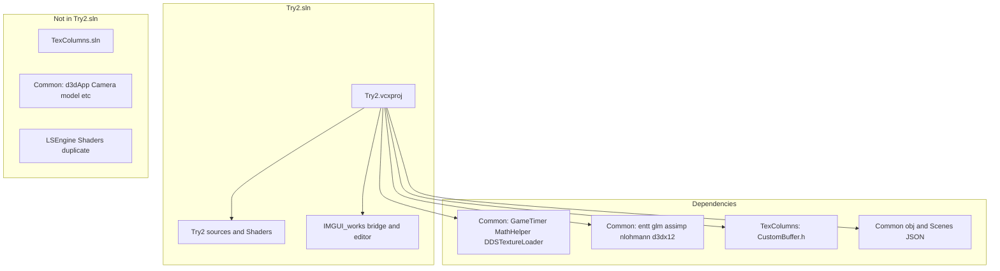

---

## Архитектурные паттерны (Try2)

### 1. Адаптер рендерера

`IRenderAdapter` ← `D3DRenderAdapter`. Системы не подключают `d3d12.h` напрямую. Расширен методами `SetLights` и `ReloadShaders`.

### 2. Конвейеры ECS-систем

| Конвейер | Когда | Система |
|----------|------|--------|
| Update | Каждый визуальный кадр | `CameraControllerSystem`; **F5** в `Engine::Update` |
| Physics | Шаги 1/60 с, **только Play** при активном редакторе | `PhysicsSystem` |
| Render | Каждый визуальный кадр | `RenderSystem` (камера, свет, меши) |

### 3. Мост редактора (изоляция)

Весь GUI-код в [`LSEngine/IMGUI_works/`](../LSEngine/IMGUI_works/). Try2 (в Chapter 9) компилирует его через `$(IMGUI_WORKS)` и вызывает только `ImGuiBridge::*`. Опционально во время выполнения через `.imgui_on` рядом с `Try2.exe`.

### 4. Edit vs Play

`EditorContext::mode` управляет физикой и редактированием компонентов:

| Режим | Физика | Inspector / gizmo |
|------|---------|-------------------|
| **Edit** | Выкл. | Полное редактирование через `Editor_CanEditComponents()` |
| **Play** | Вкл. | Inspector отключён; gizmo пропускается |

**Play** записывает `Scenes/EditorPlaySnapshot.json` перед симуляцией. **Stop** возвращает в Edit; перезагружает снимок только если `restoreSceneOnStop` = true (по умолчанию **false**). **Restore Snapshot** вручную перезагружает файл play в любой момент.

### 5. Сцены на данных

`Engine::Init` ищет `DemoScene.json`, загружает через `SceneSerializer::Load(world, resourceManager, path)`, при ошибке или отсутствии — `DemoScene::Build`.

### 6. ECS-освещение

Компоненты света на сущностях → `RenderSystem` строит `SceneLightData` → `IRenderAdapter::SetLights` → constant buffer'ы прохода (лимиты: 1 направленный, 2 точечных, 3 прожектора).

### 7. Контекст кадра

`FrameContext` объединяет `GameTimer`, `InputState` и `physDT` для каждого `ISystem::Update` и панелей редактора.

### 8. Кадры в полёте

2 буфера swap chain, 2 слота `FrameRes`, ожидание fence в `BeginFrame`. Шрифты/текстуры ImGui используют индексы дескрипторов **900–963** на общей shader-visible куче (движок — **0–899**).

### 9. Отложенный G-buffer

Geometry → lighting → resolve; `LightingUtil.hlsl` общий с до 16 источниками света на GPU в CB прохода (лимиты ECS ниже).

### 10. Ленивая загрузка на GPU

`ResourceManager` хранит CPU-меши; `D3DRenderAdapter::UploadMesh` при первом `DrawMesh`.

### 11. Физика с фиксированным шагом

`Application::Run` — аккумулятор 60 Гц, макс. 5 шагов за кадр; блокируется, когда редактор в Edit.

### 12. Оверлей ImGui после 3D

Сначала сцена; `RenderOverlay` рисует UI на том же command list перед present — см. [Changes/IMGUI-Editor-System.md](../Changes/IMGUI-Editor-System.md).

### 13. I/O сцен редактора

`EditorSceneIO` вызывает `Engine::SaveScene` / `LoadScene`, которые делегируют `SceneSerializer`. Меню File и Play/Stop используют пути под `Scenes/` относительно рабочей директории.

### 14. Ленивая инициализация ImGui

При наличии `.imgui_on` ресурсы ImGui/DX12 для шрифтов **не** создаются, пока пользователь не нажмёт **`~`**. `WndProcHandler` пересылает сообщения только после `g_Initialized` = true.

### 15. Редактирование компонентов только в Edit

`Editor_CanEditComponents()` возвращает true только в Edit. Inspector использует `ImGui::BeginDisabled` в Play; gizmo уже пропускается вне Edit.

### 16. Телеметрия физики

`PhysicsStats` в `PhysicsCommons.h` считает пары столкновений за шаг физики. Панель Statistics показывает **Collisions (this frame)** и скользящее **FPS (1s avg)**.

---

## Конвейер шейдеров (`Try2/Shaders/`)

Авторитетное расположение шейдеров. Семь файлов HLSL. **F5** перекомпилирует PSO без перезапуска.

| Шейдер | Роль |
|--------|------|
| `LightingUtil.hlsl` | Общий свет, материалы, Blinn-Phong / Fresnel |
| `GeometryPass.hlsl` | **G-buffer** — albedo, normal, world pos, roughness, velocity |
| `LightingPass.hlsl` | Полноэкранное отложенное освещение (ECS `SceneLightData`) |
| `ResolvePass.hlsl` | Смешивание истории, HDR |
| `Default.hlsl` | Forward-путь (legacy / опционально) |
| `TransparentUnlit.hlsl` | Прозрачный оверлей |
| `Debug.hlsl` | Отладочный вывод текстуры |

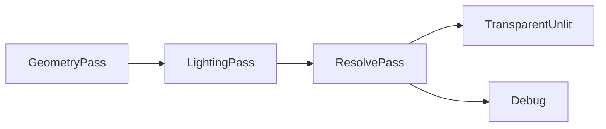

---

## Наблюдения по дизайну

### Сильные стороны

- Фокус на одном решении с редактором в `LSEngine/IMGUI_works/` (тот же репозиторий, вне Chapter 9)
- JSON-сцены + ECS-свет объединяют контент и рендеринг
- Тонкий API `ImGuiBridge` ограничивает связность движка и UI

### Связность, которую стоит устранить

| Элемент | Примечания |
|------|-------|
| `CustomBuffer` в TexColumns | Перенести в `Try2/` или `Common/` |
| Жёстко заданные пути include | Макросы `$(SolutionDir)` для Common и IMGUI_works |
| Заглушка `RenderAPI::Vulkan` | Бэкенда пока нет |
| Неиспользуемый `ResourceManager*` в `RenderSystem` | Мелкая уборка |
| Общая куча дескрипторов | Документированное разделение; избегать коллизий индексов при добавлении SRV движка |

---

## Связанная документация

- Обзор проекта → [01-project-overview.md](01-project-overview.md)
- Структура кода → [03-code-structure.md](03-code-structure.md)
- Дополнения редактора → [04-editor-additions.md](04-editor-additions.md)
- Слияние + ImGui (полностью) → [Changes/README.md](../Changes/README.md)

---

# Часть 3 — Структура кода

Структурный справочник проекта **Try2**: раскладка, модули, ECS, API, диаграммы Mermaid и многоуровневый индекс исходников. Охват — [`Try2.sln`](../LSEngine/Chapter%209%20Texturing/Try2/Try2.sln), если не помечено как вспомогательное.

- Обзор → [01-project-overview.md](01-project-overview.md)
- Технологии → [02-technologies-and-patterns.md](02-technologies-and-patterns.md)
- Дополнения редактора → [04-editor-additions.md](04-editor-additions.md)
- Слияние + ImGui → [Changes/README.md](../Changes/README.md)

---

## Раскладка проекта Try2

```
LSEngine/                                 # Корень git-репозитория
├── IMGUI_works/                          # Редактор + Dear ImGui + ImGuizmo (компилируется в Try2)
│   ├── src/ImGuiBridge.*, ImGuiPlatform.*
│   ├── src/Editor/                      # Панели, EditorContext, Gizmo
│   └── ThirdParty/imgui, ImGuizmo
├── Common/                               # GameTimer, EnTT, GLM, obj-ассеты
└── Chapter 9 Texturing/Try2/            # Корень продукта — открывайте Try2.sln здесь
    ├── Try2.sln
    ├── Try2.vcxproj                     # IMGUI_WORKS = ../../IMGUI_works
    ├── Try2.cpp, Application.*, Engine.*, ...
    ├── Scenes/DemoScene.json            # Сцена по умолчанию на данных
    ├── Shaders/                         # Авторитетные HLSL (7 файлов)
    ├── Libs/assimp-vc143-mt.lib
    │
    │  Компилируется из ../../Common/:
    │    GameTimer, MathHelper, DDSTextureLoader
    │
    └── Header include из ../TexColumns/:
          CustomBuffer.h
```

**Рантайм-ассеты:** `../../Common/obj/`, JSON сцен под `Scenes/`.

---

## Таблица ответственности модулей

### Код Try2

| Модуль | Ответственность |
|--------|----------------|
| `Try2.cpp` / `TestApp` | Точка входа; `ImGuiBridge::SetEngine` после init |
| `Application` | Цикл Win32, жизненный цикл ImGui, оверлей после `Draw` |
| `Engine` | Системы, JSON load/save, F5 reload, шлюз физики, `SaveScene`/`LoadScene`, доступ для редактора |
| `World` | Держатель `entt::registry` |
| `Commons.h` | Компоненты (вкл. свет), `SceneLightData`, `IRenderAdapter` |
| `CameraControllerSystem` | FPS-камера; пропуск при захвате ввода ImGui |
| `PhysicsSystem` | Интеграция + AABB; подсчёт `PhysicsStats` |
| `RenderSystem` | Камера, **сбор ECS-света**, отрисовка мешей |
| `PhysicsCommons.h` | Математика коллайдеров + пространство имён `PhysicsStats` |
| `ResourceManager` | CPU-ассеты, Assimp |
| `D3DRenderAdapter` | D3D12, отложенные проходы, `ReloadShaders`, `GetImGuiBindings` |
| `FrameRes` / `d3dUtils` | Кольца CB, компиляция шейдеров |
| `SceneFactory` / `DemoScene` | Рецепты сущностей; процедурный запасной уровень |
| `SceneSerializer` | JSON load/save с мешами, материалами, светом |

### LSEngine/IMGUI_works (компилируется в Try2)

| Модуль | Ответственность |
|--------|----------------|
| `ImGuiBridge` | Публичный API: init, frame, overlay, `WantsCaptureInput`, `SetEngine`; ленивый init на `~` |
| `ImGuiPlatform` | Проверка `.imgui_on`, переключение `~` |
| `EditorContext` | Registry/resources, выделение, Edit/Play, `statusMessage`, `restoreSceneOnStop`, переключатели панелей |
| `EditorSceneIO` | File Save/Load, снимок Play, `RestorePlaySnapshot` |
| `EditorUI` | Меню (File), панель (Play/Stop), строка статуса, оркестрация панелей |
| `HierarchyPanel` | Список **всех** сущностей (tag, mesh, camera, свет, физика) |
| `InspectorPanel` | Transform, tag, mesh, rigidbody, collider, **свет**; отключён в Play |
| `ViewportPanel` | Оформление viewport (сцена рисуется под UI) |
| `StatisticsPanel` | Мгновенный FPS + среднее за 1 с, число сущностей, коллизии |
| `LegendPanel` | Legend / Help — горячие клавиши, глоссарий gizmo, пути файлов |
| `GizmoController` | ImGuizmo в режиме Edit |

### Связано из Common

| Модуль | Ответственность |
|--------|----------------|
| `GameTimer` | Тайминг кадра |
| `MathHelper` | Матрицы GPU |
| `DDSTextureLoader` | Текстуры DDS |

### Вспомогательный заголовок

| Модуль | Ответственность |
|--------|----------------|
| `CustomBuffer` (TexColumns) | Хелперы G-buffer RT в `D3DRenderAdapter` |

### Хуки Try2 для редактора (минимальная поверхность)

| Файл | Хук |
|------|------|
| `Application.cpp` | init/shutdown/resize `ImGuiBridge`; оверлей в цикле; пересылка `WndProc` |
| `Try2.cpp` | `SetEngine` |
| `Engine.cpp` | `Editor_IsPhysicsEnabled()` в `PhysicsUpdate`; `SaveScene`/`LoadScene` |
| `EditorSceneIO` (через меню) | Вызовы `Engine::SaveScene` / `LoadScene` |
| `CameraControllerSystem.cpp` | Ранний выход при `WantsCaptureInput()` |
| `D3DRenderAdapter` | `Dx12ImGuiBindings`, поддиапазон дескрипторов для ImGui |

---

## Компоненты ECS

| Компонент | Поля (кратко) | Используется |
|-----------|------------------|---------|
| `TransformComponent` | `position`, `rotation`, `scale` | Все системы; мировая матрица |
| `MeshComponent` | `meshID` | `RenderSystem` |
| `CameraComponent` | `fov`, planes, `aspectRatio`, кэш матриц | Камера + рендер |
| `TagComponent` | `tag` | Serializer, панель Hierarchy |
| `RigidbodyComponent` | `type`, `velocity`, `mass`, `useGravity` | `PhysicsSystem`, Inspector |
| `ColliderComponent` | AABB/sphere, restitution, friction | `PhysicsSystem`, Inspector |
| `DirectionalLightComponent` | `color`, `intensity`, `direction`, `enabled` | `RenderSystem` |
| `PointLightComponent` | color, intensity, falloff, `enabled` | `RenderSystem` (нужен `Transform`) |
| `SpotLightComponent` | color, direction, spot power, falloff, `enabled` | `RenderSystem` (нужен `Transform`) |

**Лимиты GPU** (`Commons.h`): `RenderDirectionalLightCount` = 1, `RenderPointLightCount` = 2, `RenderSpotLightCount` = 3.

### Типичные сущности

| Тип | Компоненты |
|------|------------|
| Статический пол | `Transform`, `Mesh`, `Tag`, `Rigidbody`(Static), `Collider` |
| Динамическое тело | `Transform`, `Mesh`, `Tag`, `Rigidbody`(Dynamic), `Collider` |
| Камера | `Transform`, `Camera`, `Tag` |
| Направленный свет | `DirectionalLight` (опционально `Tag`) |
| Точечный свет | `Transform`, `PointLight`, `Tag` |
| Прожектор | `Transform`, `SpotLight`, `Tag` |

---

## Диаграмма A — Жизненный цикл приложения Try2

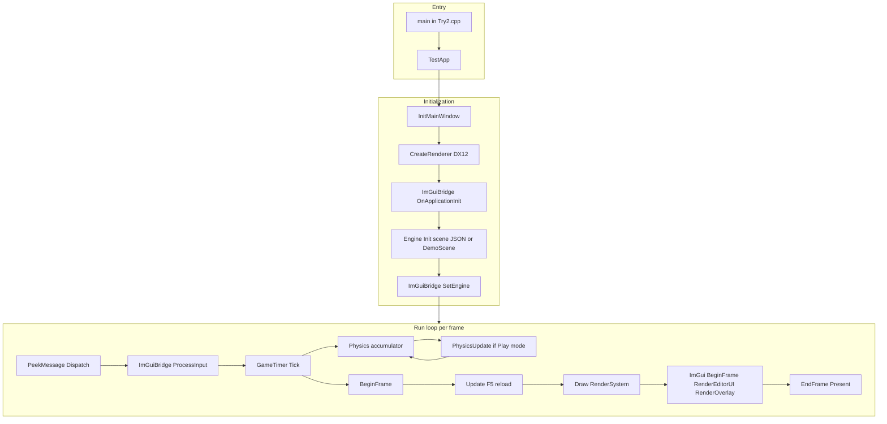

---

## Диаграмма B — Системы движка Try2 и слой редактора

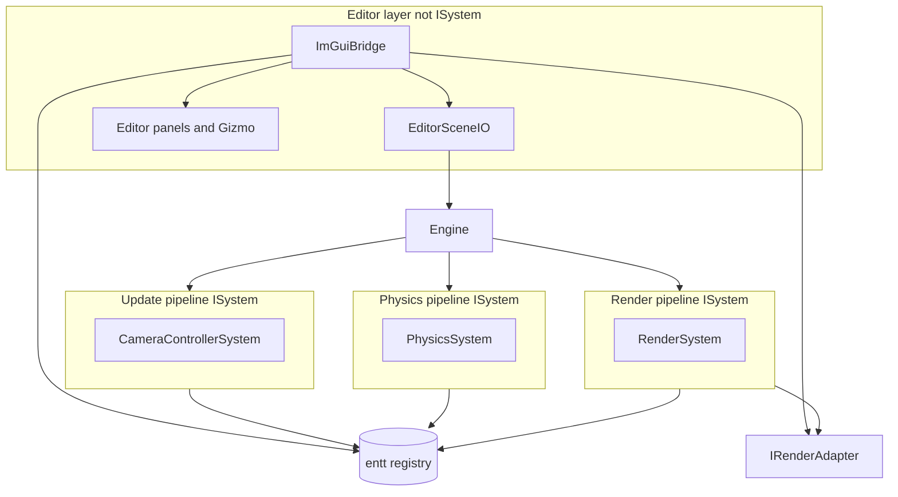

| Фаза | Частота | Компонент |
|-------|-----------|-----------|
| `Update` | 1× / кадр | `CameraControllerSystem`; F5 обрабатывает `Engine` |
| `PhysicsUpdate` | 0–5× / 60 Гц | `PhysicsSystem` если `Editor_IsPhysicsEnabled()` |
| `Draw` | 1× / кадр | `RenderSystem` |
| UI редактора | 1× / кадр после `Draw` | `ImGuiBridge` → `Editor_*` |

---

## Диаграмма C — Поток сущностей ECS Try2

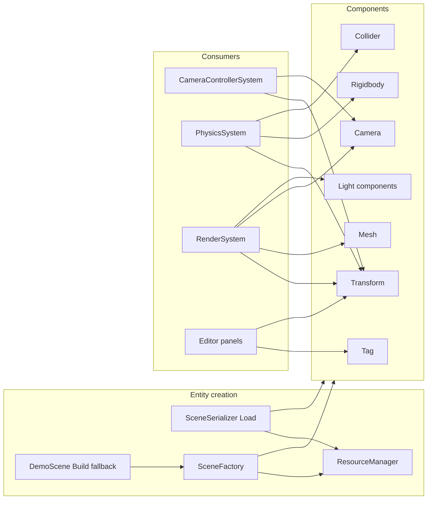

---

## Диаграмма D — Контракт адаптера рендеринга Try2

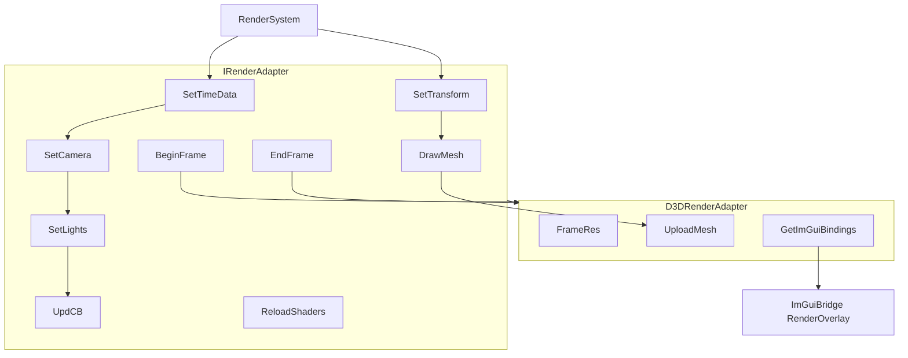

| Метод | Вызывающий | Назначение |
|--------|--------|---------|
| `SetLights` | `RenderSystem` | Загрузка `SceneLightData` из ECS light view |
| `ReloadShaders` | `Engine::Update` по F5 | Пересборка PSO из `Try2/Shaders/` |
| `GetImGuiBindings` | `ImGuiBridge` (ленивый init) | Device, queue, command list, срез SRV-кучи |
| `BeginFrame` / `EndFrame` | `Application` | Синхронизация кадра и present |

---

## Диаграмма E — Отложенные GPU-проходы Try2

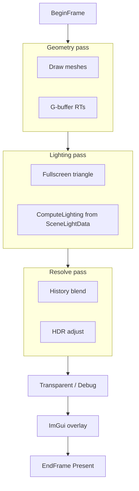

---

## Диаграмма F — Путь ресурсов Try2

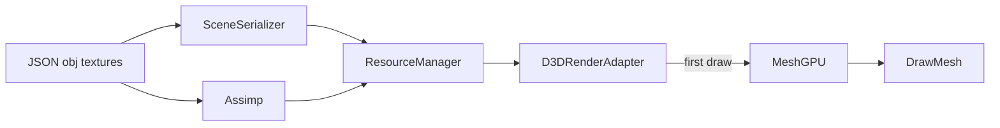

---

## Диаграмма G — Цикл физики Try2

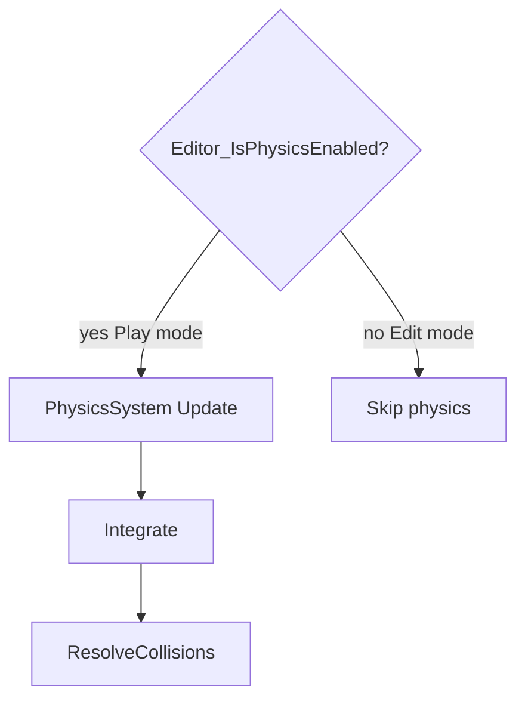

---

## Диаграмма H — Зависимости сборки Try2

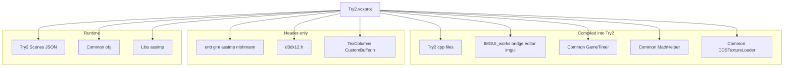

---

## Диаграмма I — Связка редактора и ECS

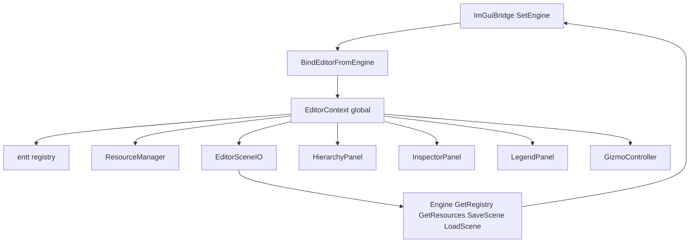

---

## Последовательность за кадр (Try2)

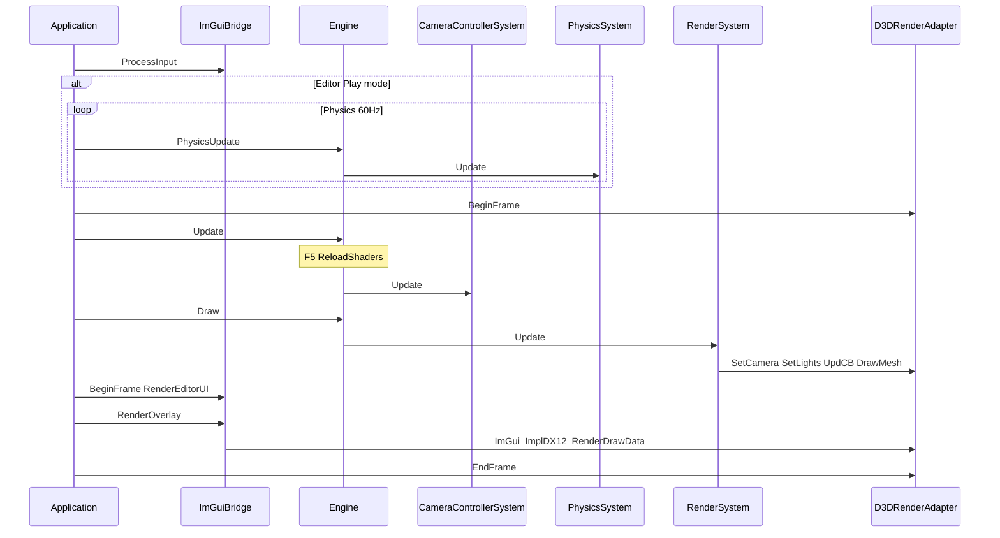

---

## Краткий справочник классов и API

### Application и мост

| Класс / API | Ключевые члены |
|-------------|-------------|
| `Application` | `Run`, `Initialize`, `MsgProc`, хуки ImGui |
| `TestApp` | Делегирует в `mEngine` |
| `ImGuiBridge` | `SetEngine`, `OnApplicationInit`, `RenderOverlay`, `WantsCaptureInput`, `IsLicensed` |

### Ядро движка

| Класс | Ключевой API |
|-------|---------|
| `Engine` | `Init`, `Update`, `PhysicsUpdate`, `Draw`, `GetRegistry`, `GetResources`, `GetWorld`, `SaveScene`, `LoadScene` |
| `World` | `registry` |
| `FrameContext` | `timer`, `input`, `physDT` |

### Системы

| Класс | Роль |
|-------|------|
| `CameraControllerSystem` | FPS-камера; шлюз ввода ImGui |
| `PhysicsSystem` | Интеграция + коллизии |
| `RenderSystem` | Свет + камера + меши |

### Редактор (IMGUI_works)

| API | Роль |
|-----|------|
| `Editor_SetContext` / `Editor_GetContext` | Глобальное состояние редактора |
| `Editor_IsPhysicsEnabled` | Play vs Edit |
| `Editor_CanEditComponents` | Редактирование Inspector/gizmo только в Edit |
| `Editor_BeginFrame` / `Editor_RenderUI` | Проход панелей |
| `Editor_RenderGizmo` | ImGuizmo |
| `Editor_DrawLegend` | Окно Legend / Help |
| `EditorSceneIO` | Save, Load, BeginPlay, EndPlay, RestorePlaySnapshot |

### Рендеринг

| Класс | Ключевой API |
|-------|---------|
| `IRenderAdapter` | `SetLights`, `ReloadShaders`, кадр, отрисовка |
| `D3DRenderAdapter` | `GetImGuiBindings`, `BuildPSOs`, `UploadMesh` |
| `Dx12ImGuiBindings` | POD GPU-дескрипторы для бэкенда ImGui |

---

## Индекс исходных файлов

### Уровень 1 — исходники проекта Try2

| Файл | Роль |
|------|------|
| `Try2.cpp` | `main()`, `TestApp`, `SetEngine` |
| `Application.cpp/h` | Цикл, Win32, интеграция ImGui |
| `Engine.cpp/h` | Системы, load/save сцены, F5, шлюз физики |
| `PhysicsCommons.h` | Математика коллайдеров, `PhysicsStats` |
| `World.cpp/h` | Registry |
| `Commons.cpp/h` | Компоненты, свет, интерфейсы |
| `CameraControllerSystem.cpp/h` | Камера + захват ImGui |
| `PhysicsSystem.cpp/h` | Физика |
| `RenderSystem.cpp/h` | Свет, камера, отрисовка |
| `ResourceManager.cpp/h` | Ассеты |
| `D3DRenderAdapter.cpp/h` | Рендерер, привязки ImGui, reload |
| `FrameRes.cpp/h`, `d3dUtils.cpp/h` | GPU-хелперы |
| `SceneFactory.cpp/h`, `DemoScene.cpp/h` | Настройка уровня |
| `SceneSerializer.cpp/h` | JSON I/O |

**Данные:** `Scenes/DemoScene.json`

**Шейдеры:** `Try2/Shaders/` (7 файлов HLSL)

### Уровень 1b — IMGUI_works (компилируется Try2)

| Файл | Роль |
|------|------|
| `src/ImGuiBridge.cpp/h` | Публичный API |
| `src/ImGuiPlatform.cpp/h` | Лицензия + переключение |
| `src/Editor/EditorContext.cpp/h` | Состояние редактора, `statusMessage`, `restoreSceneOnStop` |
| `src/Editor/EditorSceneIO.cpp/h` | I/O save/load/снимок play |
| `src/Editor/EditorUI.cpp` | Меню, панель, статус |
| `src/Editor/HierarchyPanel.cpp` | Список всех сущностей |
| `src/Editor/InspectorPanel.cpp` | Компоненты + свет |
| `src/Editor/ViewportPanel.cpp` | UI viewport |
| `src/Editor/StatisticsPanel.cpp` | Среднее FPS, коллизии |
| `src/Editor/LegendPanel.cpp` | Legend / Help |
| `src/Editor/GizmoController.cpp` | ImGuizmo |
| ThirdParty | ядро imgui + бэкенды, ImGuizmo (без построчного списка) |

### Уровень 2 — Common (компилируется)

| Файл | Роль |
|------|------|
| `GameTimer.cpp/h` | Тайминг |
| `MathHelper.cpp/h` | Матрицы |
| `DDSTextureLoader.cpp/h` | DDS |

### Уровень 3 — Вспомогательное

| Элемент | Примечание |
|------|------|
| `TexColumns/CustomBuffer.*` | Используется заголовок; `.cpp` не в vcxproj |
| `TexColumns.sln` | Не сборка продукта |
| `LSEngine/Shaders/` | Дубликат `Try2/Shaders/` |

---

## Ключевые функции (Try2)

| Подсистема | Функции |
|-----------|-----------|
| `Engine::Init` | Регистрация систем; `SceneSerializer::Load` или `DemoScene::Build` |
| `Engine::Update` | Update-системы; **F5** → `ReloadShaders()` |
| `Engine::PhysicsUpdate` | No-op в Edit при лицензированном редакторе |
| `Engine::SaveScene` / `LoadScene` | JSON I/O во время выполнения для меню File |
| `RenderSystem::Update` | Сбор light view → `SetLights`; отрисовка мешей |
| `SceneSerializer::Load` | Десериализация world + общий `ResourceManager` |
| `EditorSceneIO::BeginPlay` | Снимок в `EditorPlaySnapshot.json`, mode = Play |
| `PhysicsStats::AddCollision` | Инкремент за пару столкновений в физике |
| `ImGuiBridge::SetEngine` | Привязка registry/resources к `EditorContext` |

---

## Порядок чтения (для контрибьюторов Try2)

1. `Try2.cpp`
2. `Application.cpp` — цикл, порядок оверлея ImGui
3. `Engine.cpp` — загрузка сцены, F5, шлюз физики
4. `RenderSystem.h` — ECS-свет
5. `D3DRenderAdapter.cpp` — отложенные проходы, привязки ImGui
6. [`IMGUI_works/src/ImGuiBridge.h`](../LSEngine/IMGUI_works/src/ImGuiBridge.h) — поверхность API редактора
7. [04-editor-additions.md](04-editor-additions.md) — save/load, снимок Play, статистика, ленивый init
8. [Changes/IMGUI-Editor-System.md](../Changes/IMGUI-Editor-System.md) — базовая интеграция ImGui
9. `Try2/Shaders/GeometryPass.hlsl` + `LightingPass.hlsl`

---

# Часть 4 — Дополнения редактора

Сжатый справочник по улучшениям редактора **пункты 1–10**. Полные детали, шаги проверки и пути к файлам: [04-editor-additions.md](04-editor-additions.md).

## Сводка

| № | Функция | Статус |
|---|---------|--------|
| 1 | File → Save / Load | Готово — `Scenes/EditorSave.json` |
| 2 | Снимок Play / восстановление при Stop | Готово — `Scenes/EditorPlaySnapshot.json` |
| 3 | Inspector + gizmo заблокированы в Play | Готово |
| 4 | Компоненты света в Inspector | Готово |
| 5 | Счётчик коллизий в Statistics | Готово |
| 6 | Среднее FPS за 1 секунду | Готово |
| 7 | Ленивая инициализация ImGui (только при видимости) | Готово |
| 8 | Hierarchy показывает все сущности | Готово |
| 9 | Окно Legend / Help | Готово |
| 10 | Отладка: опциональное восстановление при Stop + Restore Snapshot | Готово |

## Архитектура

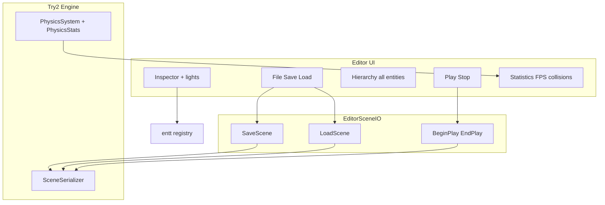

## Ключевое поведение

| Тема | Описание |
|-------|-------------|
| **Активация** | ImGui/DX12 init только после **`~`** при наличии `.imgui_on`; `WndProc` не создаёт контекст на первом сообщении |
| **Меню File** | Save/Load через `EditorSceneIO` → `Engine::SaveScene` / `LoadScene` → `SceneSerializer` |
| **Play/Stop** | Play пишет снимок; Stop возвращает в Edit; перезагрузка только если `restoreSceneOnStop` (по умолчанию **выкл.**); **Restore Snapshot** в любой момент |
| **Inspector** | Все основные компоненты + **свет**; `Editor_CanEditComponents()` отключает редактирование в Play |
| **Hierarchy** | Все типы сущностей (не только с тегом) |
| **Statistics** | Мгновенный FPS + **среднее за 1 с**; **счётчик коллизий** через `PhysicsStats` |
| **Legend** | `Editor_DrawLegend` — горячие клавиши, глоссарий gizmo, пути файлов |

## Оставшиеся пробелы

| Элемент | Примечания |
|------|-------|
| ImGui docking | Нужна ветка ImGui с docking |
| Viewport render-to-texture | Offscreen RT для встроенного вида |
| Undo/redo, браузер ассетов, редактор материалов | Окна PLACEHOLDER |
| Иерархия родитель-потомок | Нужен `HierarchyComponent` |
| Статистика памяти GPU | PLACEHOLDER |

См. [04-editor-additions.md](04-editor-additions.md) для ручной проверки.

---

*Конец полного обзора. Раздельные версии: [README](README.md) · [01](01-project-overview.md) · [02](02-technologies-and-patterns.md) · [03](03-code-structure.md) · [04](04-editor-additions.md)*
